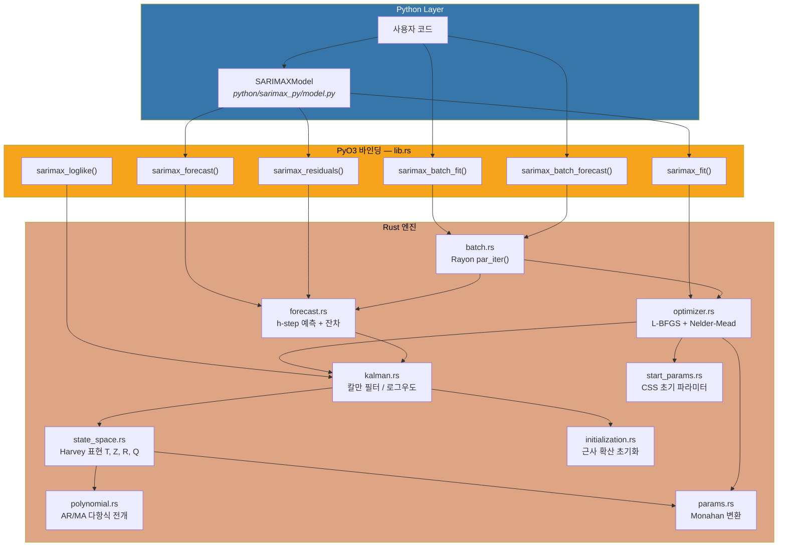
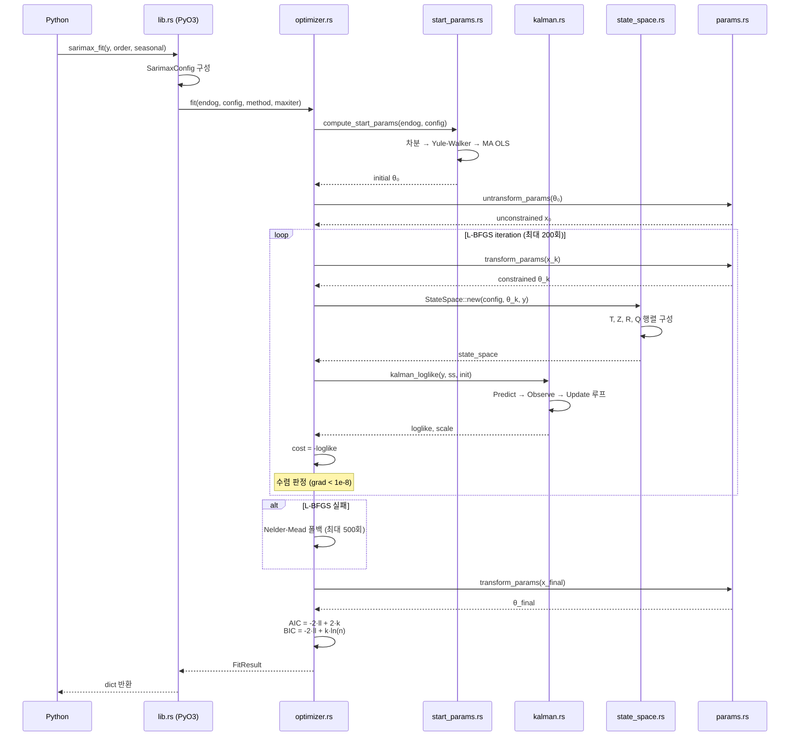
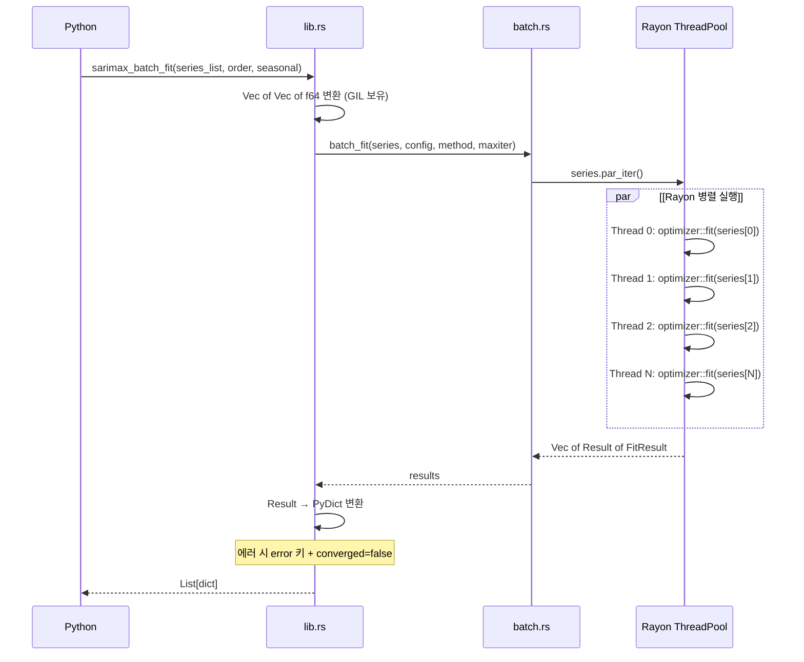
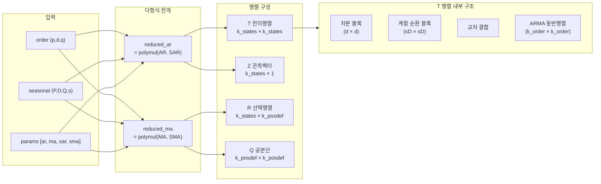

# sarimax-rs

Rust로 구현한 고성능 SARIMAX 엔진. PyO3를 통해 Python에서 직접 호출 가능하며, statsmodels 대비 동일한 수치 정확도를 유지하면서 네이티브 속도로 동작한다.

## 왜 필요한가

Python의 `statsmodels.tsa.SARIMAX`는 시계열 분석의 사실상 표준이지만, 순수 Python + NumPy 기반이라 구조적 한계가 있다.

| 문제 | 원인 | 영향 |
|------|------|------|
| Kalman 필터 루프가 느림 | Python `for` 루프에서 행렬 연산 반복 | 긴 시계열 또는 고차 모델에서 수 초~수십 초 |
| MLE 최적화 오버헤드 | 매 iteration마다 Python 콜스택 경유 | 수백 회 반복 시 누적 지연 |
| 배치 처리 비효율 | GIL로 인한 병렬화 제한 | 수천 시계열 동시 fitting 불가 |
| 메모리 단편화 | Python 객체 오버헤드 | 대규모 상태공간에서 불필요한 할당 |

**sarimax-rs**는 이 병목을 Rust 네이티브 코드로 대체한다:

- Kalman 필터 루프: Rust `for` + nalgebra → Python 루프 대비 **제로 인터프리터 오버헤드**
- 최적화: argmin 크레이트의 L-BFGS/Nelder-Mead → 순수 Rust 내에서 수백 회 반복
- 배치 병렬: Rayon work-stealing 스레드 풀 → N개 시계열 **동시 fitting/forecast**
- 메모리: 스택 할당 + 연속 메모리 레이아웃 → 캐시 친화적
- Python 연동: PyO3 + NumPy 바인딩 → `import sarimax_rs`로 즉시 사용

## 지원 모델

```
SARIMA(p, d, q)(P, D, Q, s)
```

- **p**: AR 차수 (자기회귀)
- **d**: 차분 차수
- **q**: MA 차수 (이동평균)
- **P**: 계절 AR 차수
- **D**: 계절 차분 차수 (0 또는 1)
- **Q**: 계절 MA 차수
- **s**: 계절 주기 (예: 12=월별, 4=분기별)

## 설치

```bash
# 요구사항: Rust 1.83+, Python 3.10+, maturin 1.7+
cd Rust-python-arima/sarimax_rs

# 방법 1: maturin develop (개발용)
pip install maturin
maturin develop --release

# 방법 2: uv 사용 (권장)
uv sync --extra dev
CARGO_TARGET_DIR=target_wheel uv run maturin build --out /tmp/wheels
uv pip install --force-reinstall /tmp/wheels/sarimax_rs-*.whl
```

---

## 빠른 시작

### Low-level API (sarimax_rs 직접 사용)

```python
import numpy as np
import sarimax_rs

# 시계열 데이터
y = np.random.randn(200).cumsum()

# 1. 모델 적합
result = sarimax_rs.sarimax_fit(y, order=(1, 1, 1), seasonal=(0, 0, 0, 0))
print(f"수렴: {result['converged']}, AIC: {result['aic']:.2f}")

# 2. 10-step 예측
fc = sarimax_rs.sarimax_forecast(
    y, order=(1, 1, 1), seasonal=(0, 0, 0, 0),
    params=np.array(result["params"]), steps=10
)
print(f"예측: {fc['mean'][:5]}")

# 3. 잔차 진단
res = sarimax_rs.sarimax_residuals(
    y, order=(1, 1, 1), seasonal=(0, 0, 0, 0),
    params=np.array(result["params"])
)
```

### High-level API (SARIMAXModel — statsmodels 호환)

```python
import sys; sys.path.insert(0, "python")
from sarimax_py import SARIMAXModel

model = SARIMAXModel(y, order=(1, 1, 1), seasonal_order=(0, 0, 0, 0))
result = model.fit()

print(result.summary())
print(f"AIC: {result.aic:.2f}, BIC: {result.bic:.2f}")

# 예측
fcast = result.forecast(steps=10, alpha=0.05)
print(fcast.predicted_mean)
ci = fcast.conf_int()  # (10, 2) array [lower, upper]

# 잔차
residuals = result.resid
```

### 배치 병렬 처리

```python
# 100개 시계열 동시 fitting (Rayon 멀티스레드)
series_list = [np.random.randn(200) for _ in range(100)]

results = sarimax_rs.sarimax_batch_fit(
    series_list, order=(1, 0, 0), seasonal=(0, 0, 0, 0)
)

for i, r in enumerate(results):
    print(f"시계열 {i}: 수렴={r['converged']}, AIC={r['aic']:.2f}")
```

---

## 아키텍처

### 시스템 구조



### 모델 Fitting 실행 흐름



### Forecast 실행 흐름


### 배치 병렬 처리 흐름



### 상태공간 행렬 구성



---

## Python API

### Low-level 함수 (sarimax_rs)

#### `sarimax_rs.sarimax_loglike`

주어진 파라미터에서 로그우도(log-likelihood)를 계산한다.

```python
import numpy as np
import sarimax_rs

y = np.array([...])  # 시계열 데이터

ll = sarimax_rs.sarimax_loglike(
    y,
    order=(1, 1, 1),           # (p, d, q)
    seasonal=(1, 1, 1, 12),    # (P, D, Q, s)
    params=np.array([0.5, 0.3, 0.2, -0.4]),  # [ar, ma, sar, sma]
    concentrate_scale=True,    # sigma2를 우도에서 집중 추정
)
```

#### `sarimax_rs.sarimax_fit`

최대우도추정(MLE)으로 모델을 적합한다.

```python
result = sarimax_rs.sarimax_fit(
    y,
    order=(1, 0, 1),
    seasonal=(0, 0, 0, 0),
    enforce_stationarity=True,   # AR 정상성 제약
    enforce_invertibility=True,  # MA 가역성 제약
    method="lbfgs",              # "lbfgs" | "nelder_mead"
    maxiter=500,
)

print(result["params"])     # 추정된 파라미터
print(result["loglike"])    # 최종 로그우도
print(result["aic"])        # AIC
print(result["bic"])        # BIC
print(result["converged"])  # 수렴 여부
```

**반환값** (dict):

| 키 | 타입 | 설명 |
|----|------|------|
| `params` | `list[float]` | 추정된 파라미터 벡터 `[ar..., ma..., sar..., sma...]` |
| `loglike` | `float` | 최종 로그우도 |
| `scale` | `float` | 추정된 분산 (sigma2) |
| `aic` | `float` | Akaike 정보량 기준 |
| `bic` | `float` | Bayesian 정보량 기준 |
| `n_obs` | `int` | 관측치 수 |
| `n_params` | `int` | 추정 파라미터 수 (sigma2 포함) |
| `n_iter` | `int` | 최적화 반복 횟수 |
| `converged` | `bool` | 수렴 여부 |
| `method` | `str` | 사용된 최적화 방법 |

#### `sarimax_rs.sarimax_forecast`

적합된 파라미터로 h-step ahead 예측을 수행한다.

```python
fc = sarimax_rs.sarimax_forecast(
    y,
    order=(1, 0, 0),
    seasonal=(0, 0, 0, 0),
    params=np.array([0.65]),
    steps=10,          # 예측 스텝 수
    alpha=0.05,        # 95% 신뢰구간
)

print(fc["mean"])       # 예측 평균 (list[float])
print(fc["ci_lower"])   # 신뢰구간 하한
print(fc["ci_upper"])   # 신뢰구간 상한
print(fc["variance"])   # 예측 분산
```

#### `sarimax_rs.sarimax_residuals`

잔차 및 표준화 잔차를 계산한다.

```python
res = sarimax_rs.sarimax_residuals(
    y,
    order=(1, 0, 1),
    seasonal=(0, 0, 0, 0),
    params=np.array([0.5, 0.3]),
)

print(res["residuals"])                # 혁신(innovation) v_t
print(res["standardized_residuals"])   # v_t / sqrt(F_t * sigma2)
```

#### `sarimax_rs.sarimax_batch_fit`

N개 시계열을 Rayon 스레드 풀로 **병렬 fitting**한다.

```python
series_list = [np.random.randn(200) for _ in range(100)]

results = sarimax_rs.sarimax_batch_fit(
    series_list,
    order=(1, 0, 0),
    seasonal=(0, 0, 0, 0),
    enforce_stationarity=True,
    enforce_invertibility=True,
    method="lbfgs",
    maxiter=500,
)
# returns: list[dict] — 각 dict는 sarimax_fit과 동일한 키
# 실패한 시계열은 {"error": "...", "converged": false} 반환
```

#### `sarimax_rs.sarimax_batch_forecast`

N개 시계열을 **병렬 forecast**한다. 각 시계열은 자체 파라미터를 사용.

```python
params_list = [np.array(r["params"]) for r in results]

forecasts = sarimax_rs.sarimax_batch_forecast(
    series_list,
    order=(1, 0, 0),
    seasonal=(0, 0, 0, 0),
    params_list=params_list,
    steps=10,
    alpha=0.05,
)
# returns: list[dict] — 각 dict에 mean, variance, ci_lower, ci_upper
```

### High-level 클래스 (sarimax_py)

statsmodels 호환 Python 래퍼. 내부에서 `sarimax_rs` Rust 엔진을 호출한다.

#### `SARIMAXModel`

```python
from sarimax_py import SARIMAXModel

model = SARIMAXModel(
    endog=y,                        # 시계열 데이터
    order=(1, 1, 1),                # ARIMA(p, d, q)
    seasonal_order=(1, 0, 0, 12),   # (P, D, Q, s)
    enforce_stationarity=True,
    enforce_invertibility=True,
)
```

#### `SARIMAXResult`

`model.fit()`이 반환하는 결과 객체.

```python
result = model.fit(method="lbfgs", maxiter=500)

# 속성
result.params          # np.ndarray — 추정된 파라미터
result.llf             # float — 로그우도
result.aic             # float — AIC
result.bic             # float — BIC
result.scale           # float — sigma2
result.nobs            # int — 관측치 수
result.converged       # bool — 수렴 여부
result.method          # str — 최적화 방법
result.resid           # np.ndarray — 표준화 잔차 (lazy 계산)

# 메서드
result.forecast(steps=10, alpha=0.05)     # → ForecastResult
result.get_forecast(steps=10, alpha=0.05) # forecast() 별칭 (statsmodels 호환)
result.summary()                          # → str (모델 요약)
```

#### `ForecastResult`

```python
fcast = result.forecast(steps=10)

fcast.predicted_mean   # np.ndarray — 예측 평균
fcast.variance         # np.ndarray — 예측 분산
fcast.ci_lower         # np.ndarray — 신뢰구간 하한
fcast.ci_upper         # np.ndarray — 신뢰구간 상한
fcast.conf_int()       # np.ndarray (steps, 2) — [lower, upper]
```

---

## 핵심 알고리즘 상세

### 1. 상태공간 구성 (`state_space.rs`)

SARIMA(p,d,q)(P,D,Q,s) 모델을 Harvey(1989) 표현으로 변환한다.

**상태 방정식:**
```
alpha_{t+1} = T * alpha_t + c_t + R * eta_t,    eta_t ~ N(0, Q)
y_t         = Z' * alpha_t + d_t + eps_t,        eps_t ~ N(0, H), H=0
```

상태 벡터 `alpha`의 크기는 `k_states = k_states_diff + k_order`이며:
- `k_states_diff = d + s*D` (차분 상태)
- `k_order = max(p + s*P, q + s*Q + 1)` (ARMA 동반행렬 차원)

**전이행렬 T** (`k_states x k_states`)는 5개 블록으로 구성된다:

```
T = ┌──────────┬────────────────┬──────────┐
    │ 차분블록  │  교차결합       │ 0        │
    │ (d x d)  │  (d → ARMA)    │          │
    ├──────────┼────────────────┤          │
    │ 0        │ 계절순환블록    │ → ARMA   │
    │          │ (s*D x s*D)    │          │
    ├──────────┼────────────────┼──────────┤
    │ 0        │ 0              │ ARMA     │
    │          │                │ 동반행렬  │
    └──────────┴────────────────┴──────────┘
```

- **차분 블록**: 상삼각 1 행렬 (누적 차분기)
- **계절 순환 블록**: D개의 s x s 순환이동 행렬
- **교차 결합**: 정규 차분 → 계절 마지막 상태, 차분 → ARMA 첫 상태
- **ARMA 동반행렬**: `reduced_ar = polymul(AR_poly, seasonal_AR_poly)`의 계수를 첫 열에, 초대각선에 1

**관측벡터 Z**: 차분 상태 + 계절 마지막 상태 + ARMA 첫 상태에 1

**선택행렬 R**: `reduced_ma = polymul(MA_poly, seasonal_MA_poly)`의 계수

예시 — SARIMA(1,1,1)(1,1,1,12): `k_states = 27`, `k_states_diff = 13`, `k_order = 14`

### 2. 칼만 필터 (`kalman.rs`)

표준 Harvey 형식의 칼만 필터로 로그우도를 계산한다.

```
각 시점 t = 0, ..., n-1에 대해:
  1. 혁신(innovation):  v_t = y_t - Z' * a_{t|t-1} - d_t
  2. 혁신 분산:          F_t = Z' * P_{t|t-1} * Z
  3. 칼만 이득:          K_t = P_{t|t-1} * Z / F_t
  4. 상태 갱신:          a_{t|t} = a_{t|t-1} + K_t * v_t
  5. 공분산 갱신 (Joseph): P_{t|t} = (I - K*Z') * P * (I - K*Z')'
  6. 예측:              a_{t+1|t} = T * a_{t|t} + c_t
  7. 공분산 예측:        P_{t+1|t} = T * P_{t|t} * T' + R*Q*R'
```

**집중 우도 (concentrate_scale=true):**
```
sigma2_hat = (1/n_eff) * SUM(v_t^2 / F_t)
loglike = -n_eff/2 * ln(2*pi) - n_eff/2 * ln(sigma2_hat)
          - n_eff/2 - 0.5 * SUM(ln(F_t))
```

두 가지 모드를 제공한다:
- `kalman_loglike()` — 최적화용: 상태 히스토리 미저장, loglike + scale만 반환
- `kalman_filter()` — 예측/잔차용: 최종 상태(filtered_state, filtered_cov) + 혁신 시퀀스 전체 저장

**구현 세부사항:**
- **초기화**: 근사 확산 초기화 `a_0 = 0, P_0 = kappa * I` (kappa = 1e6)
- **번인**: 처음 `k_states`개 관측치는 우도 누적에서 제외
- **수치 안정성**: Joseph 형식 공분산 갱신으로 양정치성 보장

### 3. 파라미터 변환 (`params.rs`)

최적화는 비제약 공간에서 수행하고, 평가 시 제약 공간으로 역변환한다.

**정상성 제약 (AR)** — Monahan(1984)/Jones(1980) 알고리즘:
```
비제약 → PACF:    r_k = x_k / sqrt(1 + x_k^2)
PACF → AR계수:    Levinson-Durbin 재귀
AR계수 → 제약:    constrained = -y[n-1][:]
```

모든 제약된 AR 계수는 정상성 영역 내에 있음을 보장한다. MA의 가역성 제약도 동일 알고리즘에 부호를 뒤집어 적용.

### 4. 최적화 (`optimizer.rs`)

음의 로그우도를 목적함수로 최소화한다.

```
목적함수:  f(theta) = -loglike(transform(theta))
그래디언트: 중심차분 (eps = 1e-7)
```

**전략:**
1. **초기값**: CSS(조건부 제곱합) 기반 추정 또는 사용자 제공 (`start_params.rs`)
2. **L-BFGS**: MoreThuente 선탐색, 허용오차 `grad=1e-8, cost=1e-12`
3. **Nelder-Mead 폴백**: L-BFGS 실패 시 자동 전환, 5% 스케일 심플렉스
4. **정보량 기준**: `AIC = -2*ll + 2*k`, `BIC = -2*ll + k*ln(n)`

### 5. 예측 (`forecast.rs`)

칼만 필터의 최종 상태에서 h-step ahead 예측을 수행한다.

```
각 예측 스텝 h = 1, ..., steps에 대해:
  y_hat_h = Z' * a_h                    (예측 평균)
  F_h     = Z' * P_h * Z * sigma2       (예측 분산)
  CI_h    = y_hat_h ± z_{alpha/2} * sqrt(F_h)
  a_{h+1} = T * a_h                     (상태 전파)
  P_{h+1} = T * P_h * T' + R*Q*R'       (공분산 전파)
```

- `z_score()`: Abramowitz & Stegun 26.2.23 근사식으로 역정규 CDF 계산
- 예측 분산은 스텝이 증가할수록 단조 증가하며, 신뢰구간은 대칭이다.

### 6. 배치 병렬 처리 (`batch.rs`)

Rayon의 `par_iter()`를 사용하여 N개 시계열을 work-stealing 스레드 풀에서 병렬 처리한다.

- 모든 시계열이 동일한 `SarimaxConfig`를 공유 (Clone, Send + Sync)
- 각 시계열은 독립적으로 `StateSpace::new()` → `fit()` / `forecast_pipeline()` 실행
- 실패한 시계열이 다른 시계열에 영향 주지 않음 (`Vec<Result<T>>` 반환)
- 3가지 배치 연산: `batch_loglike`, `batch_fit`, `batch_forecast`

### 7. 초기 파라미터 추정 (`start_params.rs`)

CSS(Conditional Sum of Squares) 기반으로 최적화 초기값을 추정한다.

```
1. 차분 적용: d회 정규차분 + D회 계절차분
2. Yule-Walker: 표본 자기공분산 → Levinson-Durbin → AR 계수
3. MA 추정: AR 잔차에 대한 OLS 회귀 → MA 계수
4. 폴백: 추정 실패 시 영벡터 반환
```

---

## 수치 검증

statsmodels의 SARIMAX 결과를 기준(ground truth)으로 사용하여 검증한다.

### 최근 재검증 (2026-02-21)

검증 환경: macOS arm64, Python 3.14.3, `sarimax_rs 0.1.0`

실행 명령:

```bash
uv run python -m pytest python_tests/test_multi_order_accuracy.py -q
uv run python -m pytest python_tests/test_multi_order_accuracy.py::test_comprehensive_accuracy_report -s -q
uv run python python_tests/bench_comparison.py
```

유사도(정확도) 요약:

- `test_multi_order_accuracy.py`: `20 passed`
- 19개 모델 리포트 기준 1개 예외(ARMA(2,2), 과모수/다중해 가능성)
- ARMA(2,2) 제외 시 최대 오차:
  - `max_param_err <= 0.001800`
  - `loglike_err <= 0.0029`
  - `aic_err <= 0.0058`

속도 요약(`bench_comparison.py`, best-of-repeat):

| 시나리오 | Rust (ms) | statsmodels (ms) | 속도비 |
|------|:----------:|:----------------:|:------:|
| AR(1) single fit (n=200) | 0.6 | 3.3 | 5.5x 빠름 |
| ARIMA(1,1,1) single fit (n=300) | 12.5 | 11.2 | 0.9x |
| SARIMA(1,1,1)(1,1,1,12) single fit (n=300) | 3496.6 | 343.1 | 0.1x |
| AR(1) batch fit (100 x n=200) | 6.3 | 314.3 | 50.1x 빠름 |

참고: 단일 모델 속도는 차수/데이터/제약조건/하드웨어에 따라 크게 달라질 수 있으며, 배치 처리에서는 Rust 병렬화 이점이 크게 나타난다.

---

## 프로젝트 구조

```
sarimax_rs/
├── Cargo.toml                      # Rust 의존성 및 빌드 설정
├── pyproject.toml                   # Python 패키지 설정 (maturin)
│
├── src/                             # Rust 엔진 (12 모듈, ~4,300 LOC)
│   ├── lib.rs                       # PyO3 모듈 진입점 (7개 Python 함수)
│   ├── types.rs                     # SarimaxOrder, SarimaxConfig, Trend, FitResult
│   ├── error.rs                     # SarimaxError (thiserror 기반)
│   ├── params.rs                    # 파라미터 구조체 + Monahan/Jones 변환
│   ├── polynomial.rs                # AR/MA 다항식 전개 (polymul, reduced_ar/ma)
│   ├── state_space.rs               # Harvey 상태공간 T, Z, R, Q 구성
│   ├── initialization.rs            # 근사 확산 초기화 (a₀=0, P₀=κI)
│   ├── kalman.rs                    # 칼만 필터 (loglike + full filter)
│   ├── start_params.rs              # CSS 기반 초기 파라미터 추정
│   ├── optimizer.rs                 # L-BFGS + Nelder-Mead MLE 최적화
│   ├── forecast.rs                  # h-step 예측 + 잔차 + z_score
│   └── batch.rs                     # Rayon 기반 배치 병렬 처리
│
├── python/
│   └── sarimax_py/                  # Python Orchestration Layer
│       ├── __init__.py              # 패키지 export
│       └── model.py                 # SARIMAXModel, SARIMAXResult, ForecastResult
│
├── python_tests/                    # Python 통합 테스트 (44개)
│   ├── conftest.py                  # pytest fixtures
│   ├── generate_fixtures.py         # statsmodels 참조 데이터 생성
│   ├── test_smoke.py                # import/version (2)
│   ├── test_loglike.py              # 로그우도 검증 (4)
│   ├── test_fit.py                  # fitting 검증 (9)
│   ├── test_forecast.py             # 예측 검증 (9)
│   ├── test_input_validation.py     # 입력 검증 (5)
│   ├── test_batch.py                # 배치 처리 (6)
│   └── test_model.py                # Python 모델 클래스 (9)
│
├── tests/fixtures/                  # statsmodels 참조 데이터 (JSON)
│   ├── statsmodels_reference.json         # 로그우도 참조
│   ├── statsmodels_fit_reference.json     # fitting 참조
│   └── statsmodels_forecast_reference.json # 예측 참조
│
└── benches/                         # Criterion 벤치마크
    ├── bench_kalman.rs              # Kalman loglike 성능
    └── bench_fit.rs                 # 단일/배치 fit 성능
```

## 의존성

### Rust (Cargo.toml)

| 크레이트 | 버전 | 용도 |
|---------|------|------|
| nalgebra | 0.34 | 동적 크기 행렬/벡터 연산 (DMatrix, DVector) |
| argmin | 0.11 | L-BFGS, Nelder-Mead 최적화 프레임워크 |
| argmin-math | 0.5 | nalgebra 연동 (argmin 수학 연산) |
| finitediff | 0.2 | 수치 미분 (그래디언트 중심차분) |
| statrs | 0.18 | 통계 분포 |
| rayon | 1.10 | 데이터 병렬처리 (work-stealing 스레드 풀) |
| pyo3 | 0.28 | Python C-API 바인딩 |
| numpy | 0.28 | NumPy 배열 제로카피 전달 |
| thiserror | 2 | 에러 타입 매크로 |
| serde / serde_json | 1 | 테스트 fixture JSON 직렬화 |

### Python (pyproject.toml)

| 패키지 | 용도 |
|--------|------|
| numpy >= 1.24 | 배열 연산 (런타임 의존) |
| pytest >= 7.0 | 테스트 프레임워크 (dev) |
| statsmodels >= 0.14 | 참조 결과 생성 (dev) |
| scipy >= 1.10 | 통계 유틸 (dev) |
| maturin >= 1.7 | Rust → Python 휠 빌드 (dev) |

## 개발

```bash
# Rust 단위 테스트 (89개)
cargo test --all-targets

# Python 통합 테스트 (44개)
CARGO_TARGET_DIR=target_wheel uv run maturin build --out /tmp/wheels
uv pip install --force-reinstall /tmp/wheels/sarimax_rs-*.whl
.venv/bin/python -m pytest python_tests/ -v

# 벤치마크
cargo bench

# statsmodels 참조 데이터 재생성
.venv/bin/python python_tests/generate_fixtures.py
```

## 테스트 현황

| 카테고리 | 테스트 수 | 대상 |
|---------|:--------:|------|
| Rust 단위 테스트 | 89 | types, params, polynomial, state_space, initialization, kalman, start_params, optimizer, forecast, batch |
| Python smoke | 2 | import, version |
| Python loglike | 4 | AR(1), ARMA(1,1), ARIMA(1,1,1) vs statsmodels |
| Python fit | 9 | fitting, AIC/BIC, 수렴, start_params, Nelder-Mead |
| Python forecast | 9 | 예측 평균, CI, 잔차 vs statsmodels |
| Python validation | 5 | 파라미터 길이, seasonal D/s, exog 미지원 |
| Python batch | 6 | 배치 fit/forecast, 병렬 성능, 에러 격리 |
| Python model | 9 | SARIMAXModel, 속성, summary, conf_int |
| **합계** | **133** | |

## 제한사항

- 계절 차분 `D > 1`은 미지원 (`D = 0` 또는 `1`만 가능)
- 외생변수(`exog`)는 미구현 (전달 시 `NotImplementedError`)
- Trend 파라미터는 Rust 내부에서만 지원, Python API 미노출
- 정보 행렬(Hessian) 미구현 — 파라미터 표준오차 미제공
- 예측 스텝 상한 10,000, `alpha`는 (0, 1) 범위만 허용

## 라이선스

MIT
