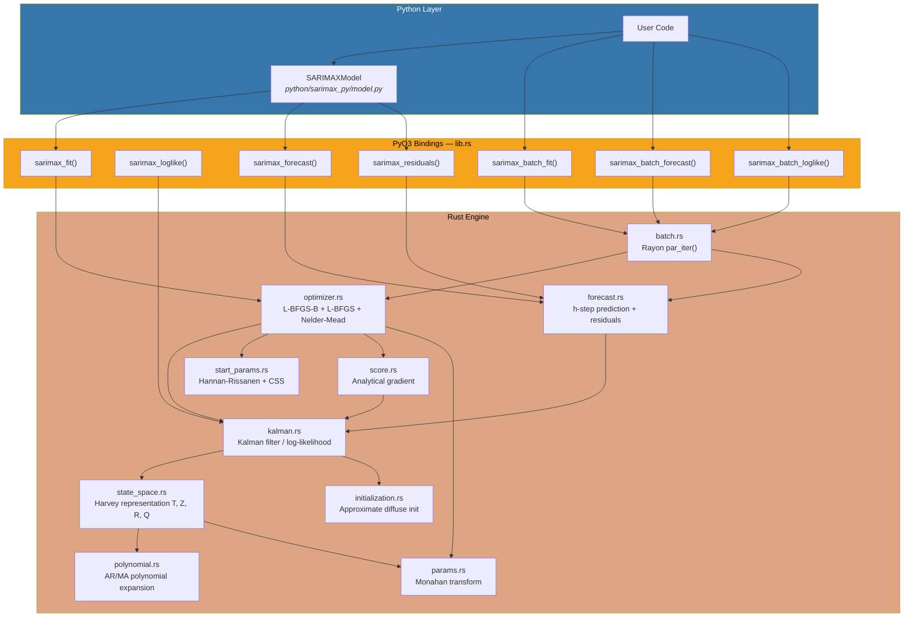
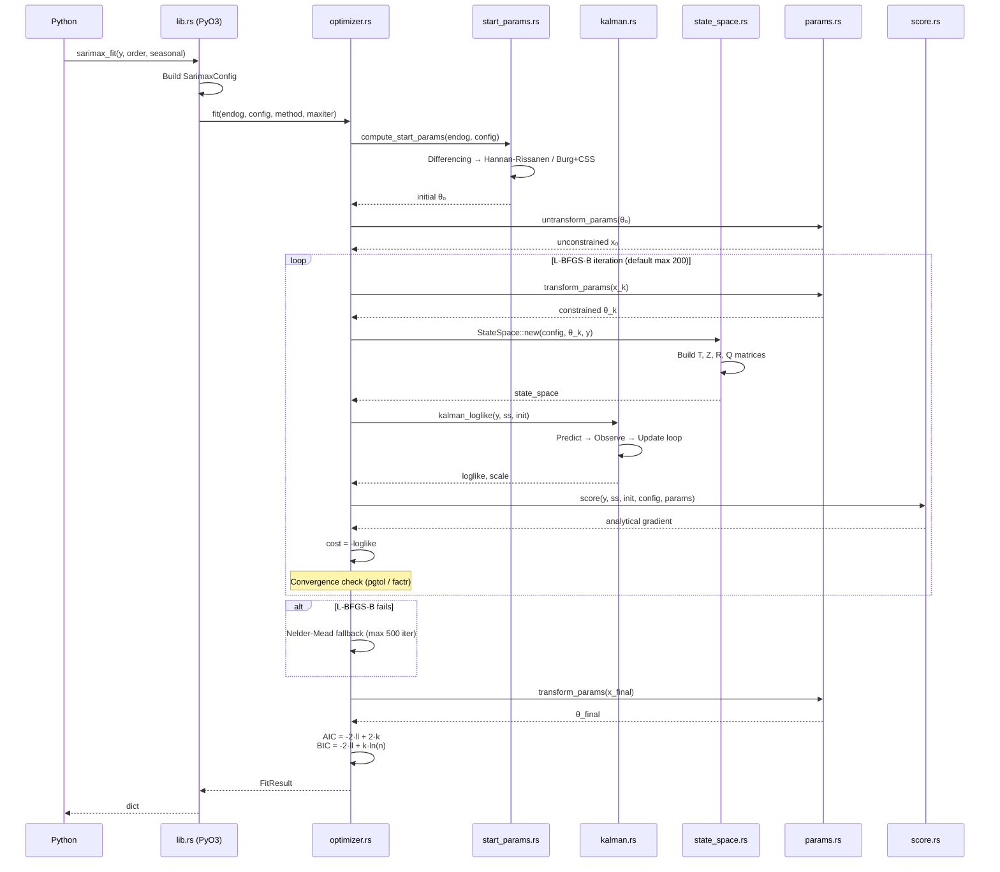
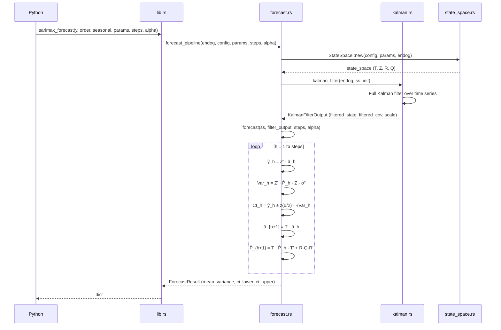
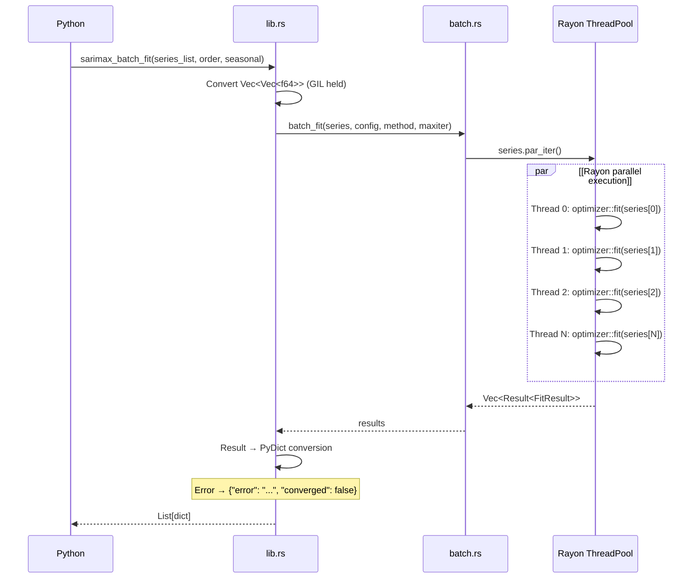
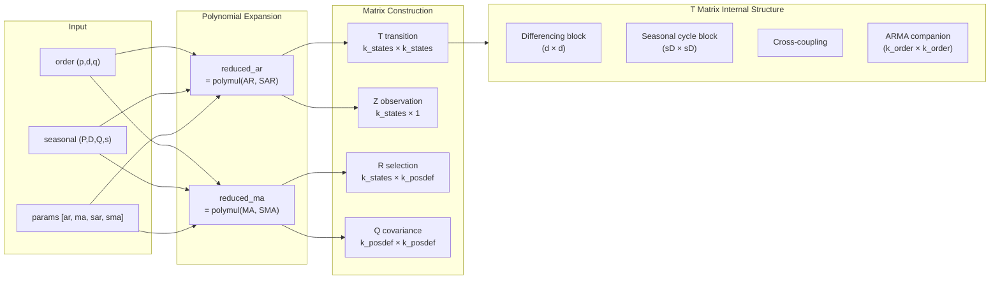

# sarimax-rs

PyO3를 통해 Python에서 호출할 수 있도록 Rust로 작성한 고성능 SARIMAX(외생 회귀변수를 포함한 계절 ARIMA) 엔진입니다. statsmodels와 동등한 수치 정확도를 유지하면서 네이티브 컴파일 속도를 제공하며, 대규모 시계열 워크로드를 위해 Rayon 기반 병렬 배치 처리를 지원합니다.

## 개발 동기

Python의 `statsmodels.tsa.SARIMAX`는 SARIMA 모델링의 사실상 표준이지만, 순수 Python + NumPy 구현 특성상 구조적 병목이 있습니다.

| 병목 | 근본 원인 | 영향 |
|------------|-----------|--------|
| 느린 칼만 필터 루프 | 행렬 연산 위의 Python `for` 루프 | 긴 시계열 또는 고차 모델에서 수초~수십초 소요 |
| MLE 최적화 오버헤드 | 매 반복마다 Python 호출 스택 경유 | 수백 회 반복 시 지연 누적 |
| 실질적 병렬성 부재 | GIL로 인해 배치 적합 멀티스레딩 제한 | 수천 개 시계열 동시 적합 불가 |
| 메모리 단편화 | 할당마다 Python 객체 오버헤드 | 큰 상태공간에서 불필요한 힙 압박 |

**sarimax-rs**는 이 병목을 네이티브 Rust로 대체합니다.

- **칼만 필터**: Rust `for` + nalgebra 밀집 행렬 연산(인터프리터 오버헤드 없음)
- **최적화**: L-BFGS-B(기본), L-BFGS, Nelder-Mead를 Rust 내부에서 수행하며 analytical score vector(sparse 탄젠트-선형 칼만 필터 + steady-state 최적화) 지원
- **배치 병렬성**: Rayon work-stealing 스레드 풀로 N개 시계열 동시 적합/예측
- **메모리**: 스택 할당 + 연속적인 column-major 레이아웃으로 캐시 친화적
- **Python 연동**: PyO3 + numpy 바인딩으로 `import sarimax_rs`

## 지원 모델

```
SARIMA(p, d, q)(P, D, Q, s) + 외생 회귀변수
```

| 파라미터 | 의미 | 범위 |
|-----------|---------|-------|
| `p` | AR 차수(자기회귀) | 0–20 |
| `d` | 차분 차수 | 0–3 |
| `q` | MA 차수(이동평균) | 0–20 |
| `P` | 계절 AR 차수 | 0–4 |
| `D` | 계절 차분 차수 | 0–1 |
| `Q` | 계절 MA 차수 | 0–4 |
| `s` | 계절 주기(예: 12=월별, 4=분기별) | 2–365 |
| `exog` | 외생 회귀변수 | n_obs × n_exog 행렬 |

## 설치

```bash
# 요구사항: Rust 1.83+, Python 3.10+, maturin 1.7+
cd sarimax_rs

# 옵션 1: maturin develop (개발용)
pip install maturin
maturin develop --release

# 옵션 2: uv (권장)
uv sync --extra dev
CARGO_TARGET_DIR=target_wheel uv run maturin build --out /tmp/wheels
uv pip install --force-reinstall /tmp/wheels/sarimax_rs-*.whl
```

## 빠른 시작

### 저수준 API (`sarimax_rs`)

```python
import numpy as np
import sarimax_rs

y = np.random.randn(200).cumsum()

# 1. 모델 적합
result = sarimax_rs.sarimax_fit(y, order=(1, 1, 1), seasonal=(0, 0, 0, 0))
print(f"Converged: {result['converged']}, AIC: {result['aic']:.2f}")

# 2. 10스텝 앞 예측
fc = sarimax_rs.sarimax_forecast(
    y, order=(1, 1, 1), seasonal=(0, 0, 0, 0),
    params=np.array(result["params"]), steps=10
)
print(f"Forecast: {fc['mean'][:5]}")

# 3. 잔차 진단
res = sarimax_rs.sarimax_residuals(
    y, order=(1, 1, 1), seasonal=(0, 0, 0, 0),
    params=np.array(result["params"])
)
```

### 고수준 API (`SARIMAXModel` — statsmodels 호환)

```python
import sys; sys.path.insert(0, "python")
from sarimax_py import SARIMAXModel

model = SARIMAXModel(y, order=(1, 1, 1), seasonal_order=(0, 0, 0, 0))
result = model.fit()

# 파라미터 테이블 요약 (빠름, 추론 통계 없음)
print(result.summary())

# Hessian 기반 추론 포함 요약 (std err, z, p-value, CI)
print(result.summary(inference="hessian"))

# Hessian vs statsmodels 추론을 나란히 비교
print(result.summary(inference="both"))

# 기계가 읽기 쉬운 파라미터 요약
ps = result.parameter_summary(alpha=0.05, inference="hessian")
print(ps["name"])       # ['ar.L1', 'ma.L1']
print(ps["std_err"])    # 수치 Hessian 기반 표준오차
print(ps["p_value"])    # 양측 p-value

print(f"AIC: {result.aic:.2f}, BIC: {result.bic:.2f}")

# 신뢰구간 포함 예측
fcast = result.forecast(steps=10, alpha=0.05)
print(fcast.predicted_mean)
ci = fcast.conf_int()          # (10, 2) 배열 [lower, upper]
ci_90 = fcast.conf_int(0.10)   # 다른 alpha로 재계산

# 표준화 잔차
residuals = result.resid
```

### 외생 회귀변수 사용

```python
import numpy as np

X_train = np.column_stack([np.arange(200), np.random.randn(200)])  # (200, 2)
X_future = np.column_stack([np.arange(200, 210), np.random.randn(10)])  # (10, 2)

model = SARIMAXModel(y, order=(1, 0, 1), seasonal_order=(0, 0, 0, 0), exog=X_train)
result = model.fit()
fcast = result.forecast(steps=10, exog=X_future)
```

### 배치 병렬 처리

```python
# 100개 시계열을 동시에 적합 (Rayon 멀티스레드)
series_list = [np.random.randn(200) for _ in range(100)]

results = sarimax_rs.sarimax_batch_fit(
    series_list, order=(1, 0, 0), seasonal=(0, 0, 0, 0)
)

for i, r in enumerate(results):
    print(f"Series {i}: converged={r['converged']}, AIC={r['aic']:.2f}")

# 시계열별 파라미터로 배치 예측
params_list = [np.array(r["params"]) for r in results]
forecasts = sarimax_rs.sarimax_batch_forecast(
    series_list, order=(1, 0, 0), seasonal=(0, 0, 0, 0),
    params_list=params_list, steps=10, alpha=0.05,
)
```

---

## 아키텍처

### 시스템 개요



### 모델 적합 흐름



### 예측 흐름



### 배치 병렬 처리 흐름



### 상태공간 행렬 구성



---

## Python API 레퍼런스

### 저수준 함수 (`sarimax_rs`)

#### `sarimax_rs.sarimax_loglike`

주어진 파라미터에서 로그우도를 계산합니다.

```python
ll = sarimax_rs.sarimax_loglike(
    y,
    order=(1, 1, 1),           # (p, d, q)
    seasonal=(1, 1, 1, 12),    # (P, D, Q, s)
    params=np.array([0.5, 0.3, 0.2, -0.4]),  # [ar, ma, sar, sma]
    concentrate_scale=True,    # 우도에서 sigma2를 집중화
)
```

#### `sarimax_rs.sarimax_fit`

MLE로 모델을 적합합니다.

```python
result = sarimax_rs.sarimax_fit(
    y,
    order=(1, 0, 1),
    seasonal=(0, 0, 0, 0),
    enforce_stationarity=True,   # AR 정상성 제약
    enforce_invertibility=True,  # MA 가역성 제약
    method="lbfgsb",             # "lbfgsb" | "lbfgsb-multi" | "lbfgs" | "nelder-mead"
    maxiter=500,
)
```

**반환 dict:**

| Key | Type | 설명 |
|-----|------|-------------|
| `params` | `list[float]` | 추정 파라미터 `[ar..., ma..., sar..., sma...]` |
| `loglike` | `float` | 최종 로그우도 |
| `scale` | `float` | 추정 분산(sigma2) |
| `aic` | `float` | AIC |
| `bic` | `float` | BIC |
| `n_obs` | `int` | 관측치 개수 |
| `n_params` | `int` | 추정 파라미터 개수(sigma2 포함) |
| `n_iter` | `int` | 옵티마이저 반복 수(L-BFGS, NM) 또는 함수 평가 수(L-BFGS-B) |
| `converged` | `bool` | maxiter 도달이 아니라 실제 수렴 여부 |
| `method` | `str` | 사용된 최적화 방법 |

#### `sarimax_rs.sarimax_forecast`

신뢰구간과 함께 h-step 앞 예측을 수행합니다.

```python
fc = sarimax_rs.sarimax_forecast(
    y,
    order=(1, 0, 0),
    seasonal=(0, 0, 0, 0),
    params=np.array([0.65]),
    steps=10,          # 예측 구간
    alpha=0.05,        # 95% 신뢰구간
    exog=X_train,      # 모델이 exog를 쓰는 경우 과거 exog
    future_exog=X_future,  # 예측 기간 미래 exog
)

print(fc["mean"])       # 점예측 (list[float])
print(fc["ci_lower"])   # 하한
print(fc["ci_upper"])   # 상한
print(fc["variance"])   # 예측 분산
```

#### `sarimax_rs.sarimax_residuals`

잔차와 표준화 잔차를 계산합니다.

```python
res = sarimax_rs.sarimax_residuals(
    y,
    order=(1, 0, 1),
    seasonal=(0, 0, 0, 0),
    params=np.array([0.5, 0.3]),
)

print(res["residuals"])                # 혁신항 v_t
print(res["standardized_residuals"])   # v_t / sqrt(F_t * sigma2)
```

#### `sarimax_rs.sarimax_batch_fit`

Rayon 스레드 풀을 이용해 N개 시계열을 병렬 적합합니다.

```python
results = sarimax_rs.sarimax_batch_fit(
    series_list,
    order=(1, 0, 0),
    seasonal=(0, 0, 0, 0),
    enforce_stationarity=True,
    method="lbfgsb",
    maxiter=500,
)
# 반환: list[dict] — sarimax_fit과 동일 키
# 실패한 시계열: {"error": "...", "converged": false}
```

#### `sarimax_rs.sarimax_batch_forecast`

N개 시계열(각기 다른 파라미터)을 병렬 예측합니다.

```python
params_list = [np.array(r["params"]) for r in results]

forecasts = sarimax_rs.sarimax_batch_forecast(
    series_list,
    order=(1, 0, 0),
    seasonal=(0, 0, 0, 0),
    params_list=params_list,
    steps=10,
    alpha=0.05,
)
# 반환: mean, variance, ci_lower, ci_upper를 포함한 list[dict]
```

### 고수준 클래스 (`sarimax_py`)

Rust 엔진을 사용하는 statsmodels 호환 Python 래퍼입니다.

#### `SARIMAXModel`

```python
from sarimax_py import SARIMAXModel

model = SARIMAXModel(
    endog=y,                        # 시계열 데이터
    order=(1, 1, 1),                # ARIMA(p, d, q)
    seasonal_order=(1, 0, 0, 12),   # (P, D, Q, s)
    exog=X,                         # 선택: 외생 회귀변수
    enforce_stationarity=True,
    enforce_invertibility=True,
)
```

#### `SARIMAXResult`

`model.fit()`의 반환 객체입니다.

```python
result = model.fit(method="lbfgsb", maxiter=500)

# 속성
result.params          # np.ndarray — 추정 파라미터
result.param_names     # list[str] — 파라미터 이름 (예: ['ar.L1', 'ma.L1'])
result.llf             # float — 로그우도
result.aic             # float — AIC
result.bic             # float — BIC
result.scale           # float — sigma2
result.nobs            # int — 관측치 개수
result.converged       # bool — 수렴 상태
result.method          # str — 최적화 방법
result.resid           # np.ndarray — 표준화 잔차(지연 계산)

# 메서드
result.forecast(steps=10, alpha=0.05)     # → ForecastResult
result.forecast(steps=10, exog=X_future)  # 미래 exog 포함
result.get_forecast(steps=10, alpha=0.05) # alias (statsmodels 호환)
result.summary()                          # → str (기본 파라미터 테이블)
result.summary(inference="hessian")       # → str (std err / z / p / CI 포함)
result.summary(inference="statsmodels")   # → str (statsmodels 추론값 차용)
result.summary(inference="both")          # → str (양쪽 비교)

# 파라미터 요약(기계 친화 dict)
ps = result.parameter_summary(alpha=0.05, inference="hessian")
# 반환 키:
#   name: list[str]         — 파라미터 이름
#   coef: np.ndarray        — 계수 추정치
#   std_err: np.ndarray     — 수치 Hessian 기반 표준오차
#   z: np.ndarray           — z 통계량 (coef / std_err)
#   p_value: np.ndarray     — 양측 p-value
#   ci_lower: np.ndarray    — 신뢰구간 하한
#   ci_upper: np.ndarray    — 신뢰구간 상한
#   inference_status: str   — "ok" | "skipped" | "failed" | "partial"
#   inference_message: str  — 진단 메시지(상태가 "ok"가 아닐 때)
```

**파라미터 이름 규칙** (statsmodels와 일치):

| 구성 요소 | 이름 |
|-----------|-------|
| 외생 회귀변수 | `x1`, `x2`, ..., `xk` |
| AR | `ar.L1`, `ar.L2`, ..., `ar.Lp` |
| MA | `ma.L1`, `ma.L2`, ..., `ma.Lq` |
| 계절 AR | `ar.S.L{s}`, `ar.S.L{2s}`, ..., `ar.S.L{Ps}` |
| 계절 MA | `ma.S.L{s}`, `ma.S.L{2s}`, ..., `ma.S.L{Qs}` |
| 분산 | `sigma2` (`concentrate_scale=False`인 경우에만) |

추론 통계는 집중 로그우도의 수치 Hessian(중심차분)으로 계산됩니다. 관측 정보행렬 `I = -H`를 역행렬화해 분산-공분산 행렬을 구합니다. 역행렬이 실패하면 `pinv()`를 사용하고, 이마저 실패하면 `inference_status="failed"`와 함께 `NaN`을 반환합니다.

#### `ForecastResult`

```python
fcast = result.forecast(steps=10)

fcast.predicted_mean   # np.ndarray — 점예측
fcast.variance         # np.ndarray — 예측 분산
fcast.ci_lower         # np.ndarray — 신뢰구간 하한
fcast.ci_upper         # np.ndarray — 신뢰구간 상한

fcast.conf_int()       # np.ndarray (steps, 2) — 원래 alpha 기준 [lower, upper]
fcast.conf_int(0.10)   # 다른 유의수준으로 재계산
```

---

## 핵심 알고리즘

### 1. 상태공간 표현 (`state_space.rs`)

SARIMA(p,d,q)(P,D,Q,s)를 Harvey (1989) 표현으로 변환합니다.

**상태 방정식:**
```
alpha_{t+1} = T * alpha_t + c_t + R * eta_t,    eta_t ~ N(0, Q)
y_t         = Z' * alpha_t + d_t + eps_t,        eps_t ~ N(0, H), H=0
```

상태벡터 `alpha`의 차원은 `k_states = k_states_diff + k_order`이며,
- `k_states_diff = d + s*D` (차분 상태)
- `k_order = max(p + s*P, q + s*Q + 1)` (ARMA companion 행렬 차원)

**전이행렬 T** (`k_states × k_states`)는 5개 블록으로 구성됩니다.

```
T = ┌──────────────┬─────────────────┬────────────┐
    │ Diff block   │ Cross-coupling  │ 0          │
    │ (d × d)      │ (d → ARMA)      │            │
    ├──────────────┼─────────────────┤            │
    │ 0            │ Seasonal cycle  │ → ARMA     │
    │              │ (s*D × s*D)     │            │
    ├──────────────┼─────────────────┼────────────┤
    │ 0            │ 0               │ ARMA       │
    │              │                 │ companion  │
    └──────────────┴─────────────────┴────────────┘
```

예시 — SARIMA(1,1,1)(1,1,1,12): `k_states = 27`, `k_states_diff = 13`, `k_order = 14`

### 2. 칼만 필터 (`kalman.rs`)

로그우도 평가를 위한 표준 Harvey-form 칼만 필터입니다.

```
For each t = 0, ..., n-1:
  1. Innovation:           v_t = y_t - Z' * a_{t|t-1} - d_t
  2. Innovation variance:  F_t = Z' * P_{t|t-1} * Z
  3. Kalman gain:          K_t = P_{t|t-1} * Z / F_t
  4. State update:         a_{t|t} = a_{t|t-1} + K_t * v_t
  5. Covariance update:    P_{t|t} = (I - K*Z') * P * (I - K*Z')'  [Joseph form]
  6. Prediction:           a_{t+1|t} = T * a_{t|t} + c_t
  7. Covariance prediction: P_{t+1|t} = T * P_{t|t} * T' + R*Q*R'
```

**집중 로그우도** (`concentrate_scale=true`, 기본):
```
σ²_hat = (1/n_eff) * Σ(v_t² / F_t)
loglike = -n_eff/2 * ln(2π) - n_eff/2 * ln(σ²_hat) - n_eff/2 - 0.5 * Σ ln(F_t)
```

두 가지 모드:
- `kalman_loglike()` — 최적화용: 상태 이력 저장 없이 loglike + scale만 반환
- `kalman_filter()` — 예측/잔차용: 필터링 상태 + 혁신항 시퀀스 전체 저장

구현 세부:
- **초기화**: 근사 diffuse `a_0 = 0, P_0 = κ·I` (κ = 1e6)
- **burn-in**: 처음 `k_states` 관측은 우도 누적에서 제외
- **수치 안정성**: Joseph form 공분산 업데이트로 양의 정부호 성질 유지

### 3. 해석적 Score 벡터 (`score.rs`)

탄젠트-선형 칼만 필터(Kitagawa, 2020)를 통해 ∂loglike/∂θ를 한 번의 전방 패스로 계산하여 수치 미분의 O(n_params + 1) 비용을 피합니다.

각 파라미터 θ_i에 대해 시스템 행렬 미분(∂T/∂θ, ∂R·Q·R'/∂θ)을 미리 계산하고 칼만 재귀를 통해 ∂v_t/∂θ, ∂F_t/∂θ를 전파한 뒤 아래 식으로 score를 조립합니다.

```
∂ll_c/∂θ_i = -(1/σ²)·Σ(v/F)·∂v/∂θ + (1/2σ²)·Σ(v²/F²)·∂F/∂θ - (1/2)·Σ(1/F)·∂F/∂θ
```

**성능 최적화:**
- **Sparse T**: `dP_{t+1|t} = T·dP·T'` 연산에서 companion matrix T의 sparsity를 활용해 O(k³) → O(nnz×k)로 감소 (k=27에서 ~23x 가속)
- **Steady-state 감지**: P가 수렴하면 dP/dpz/dF를 동결하고 da/dv만 업데이트하여 수렴 이후 timestep에서 O(k³×np) 연산을 완전 스킵

### 4. 파라미터 변환 (`params.rs`)

최적화는 unconstrained 공간에서 수행하고, 평가 시 constrained 공간으로 변환합니다.

**정상성 제약(AR)** — Monahan (1984) / Jones (1980):
```
Unconstrained → PACF:  r_k = x_k / sqrt(1 + x_k²)
PACF → AR coefficients: Levinson-Durbin recursion
```

모든 constrained AR 계수는 정상성 영역 내부로 보장됩니다. MA 가역성은 부호 반전을 적용한 동일 알고리즘을 사용합니다.

### 5. 최적화 (`optimizer.rs`)

음의 로그우도를 최소화합니다.

```
Objective:  f(θ) = -loglike(transform(θ))
Gradient:   Analytical score (default) or center-difference (eps = 1e-7)
```

**전략:**
1. **초기값**: Hannan-Rissanen(계절) 또는 CSS 기반 추정, 또는 사용자 제공값(`start_params.rs`)
2. **L-BFGS-B**(기본): 경계 제약 + analytical gradient, `pgtol=1e-5`, `factr=1e7`
3. **L-BFGS-B multi-start**: 강건성 확보를 위해 초기값 섭동 3회 재시작
4. **L-BFGS**: MoreThuente line search, `grad_tol=1e-8, cost_tol=1e-12`
5. **Nelder-Mead fallback**: L-BFGS 실패 시 자동 전환, 5% 스케일 simplex
6. **정보 기준**: `AIC = -2·ll + 2·k`, `BIC = -2·ll + k·ln(n)`

**수렴 보고**: `converged=true`는 옵티마이저 고유 수렴 기준(gradient tolerance 또는 function value tolerance)을 만족할 때만 반환합니다. `maxiter` 도달만으로는 `converged=false`입니다.

### 6. 예측 (`forecast.rs`)

칼만 필터의 최종 상태에서 h-step 앞 예측을 수행합니다.

```
For each forecast step h = 1, ..., steps:
  ŷ_h = Z' · â_h                   (point forecast)
  F_h = Z' · P̂_h · Z · σ²          (forecast variance)
  CI_h = ŷ_h ± z_{α/2} · √F_h      (confidence interval)
  â_{h+1} = T · â_h                 (state propagation)
  P̂_{h+1} = T · P̂_h · T' + R·Q·R'  (covariance propagation)
```

- `z_score()`: 역정규 CDF를 위한 Abramowitz & Stegun 26.2.23 유리근사
- 예측 분산은 단조 비감소, 신뢰구간은 대칭

### 7. 배치 병렬 처리 (`batch.rs`)

Rayon `par_iter()`를 사용해 N개 시계열을 work-stealing 방식으로 병렬 처리합니다.

- 모든 시계열은 동일한 `SarimaxConfig`를 공유(Clone, Send + Sync)
- 각 시계열은 `StateSpace::new()` → `fit()` / `forecast_pipeline()`를 독립 수행
- 실패한 시계열이 다른 시계열에 영향 주지 않음(`Vec<Result<T>>`)
- 배치 연산 3종: `batch_loglike`, `batch_fit`, `batch_forecast`

### 8. 초기 파라미터 추정 (`start_params.rs`)

옵티마이저 초기화를 위한 하이브리드 추정입니다.

**계절 MA 모델 (Q>0, s>0) — Hannan-Rissanen (1982):**
```
1. Apply differencing: d regular + D seasonal differences
2. Long AR(K) fit via Burg method (K = max(10, 3*(p+q+P*s+Q*s)))
3. Generate residual proxies from long AR model
4. OLS regression: y_t ~ AR lags + MA residual lags + seasonal AR/MA lags
5. Ridge regularization (λ=1e-8) for numerical stability
6. Coefficient clamping to (-0.99, 0.99) for stationarity/invertibility
7. Fallback: per-component estimation on failure
```

**비계절/순수 AR 모델 — CSS 기반:**
```
1. Apply differencing: d regular + D seasonal differences
2. Burg AR: reflection coefficients → AR parameters
3. MA estimation: innovation algorithm on AR residuals
4. Fallback: zero vector on estimation failure
```

---

## 벤치마크

모든 벤치마크는 macOS 15.1 (Apple Silicon arm64), Python 3.14, sarimax_rs 0.1.0 vs statsmodels 0.14.6 기준입니다.

```bash
.venv/bin/python python_tests/bench_readme.py
```

### statsmodels 대비 정확도

두 엔진 모두 `enforce_stationarity=True`, `enforce_invertibility=True`, `concentrate_scale=True`, `trend='n'` 조건에서 동일 데이터에 적합했습니다. 표는 sarimax_rs와 statsmodels 간 파라미터 추정치, 로그우도, AIC의 최대 절대차를 보여줍니다.

| Model | n | k | Max \|Δparam\| | \|Δloglike\| | \|ΔAIC\| |
|-------|:-:|:-:|:-----------:|:----------:|:------:|
| AR(1) | 200 | 1 | 0.000124 | 0.0000 | 0.0000 |
| AR(2) | 300 | 2 | 0.001902 | 0.0007 | 0.0013 |
| MA(1) | 200 | 1 | 0.003862 | 0.0015 | 0.0031 |
| ARMA(1,1) | 300 | 2 | 0.004170 | 0.0048 | 0.0096 |
| ARIMA(1,1,1) | 300 | 2 | 0.026525 | 0.0011 | 0.0022 |
| ARIMA(2,1,1) | 400 | 3 | 0.833380 | 0.4884 | 0.9768 |
| SARIMA(1,0,0)(1,0,0,4) | 200 | 2 | 0.002865 | 0.0014 | 0.0028 |
| SARIMA(0,1,1)(0,1,1,12) | 300 | 2 | 0.054174 | 1.1886 | 2.3771 |
| SARIMA(1,1,1)(1,1,1,12) | 300 | 4 | 0.006335 | 0.0012 | 0.0025 |

대부분 모델에서 파라미터 정확도는 0.006 이내, 로그우도 차이는 0.005 이내입니다. ARIMA(2,1,1)은 고차 모델의 다중 최적점(Wheeler & Ionides, 2024)으로 인해 큰 차이를 보입니다. SARIMA(0,1,1)(0,1,1,12)는 Hannan-Rissanen 시작값에 의한 다른 수렴 경로 때문에 로그우도 오프셋(~1.2)이 있으나, 이는 양쪽 모두 유효한 최적점입니다.

### 속도 — 단일 적합

best-of-5 wall clock 시간(작을수록 좋음):

| Model | sarimax_rs | statsmodels | Speedup |
|-------|:----------:|:-----------:|:-------:|
| AR(1) n=200 | 0.2 ms | 2.9 ms | **12.6x** |
| AR(2) n=300 | 0.4 ms | 4.8 ms | **12.2x** |
| MA(1) n=200 | 0.3 ms | 3.6 ms | **11.5x** |
| ARMA(1,1) n=300 | 1.2 ms | 15.7 ms | **12.5x** |
| ARIMA(1,1,1) n=300 | 1.4 ms | 12.4 ms | **8.9x** |
| ARIMA(2,1,1) n=400 | 0.6 ms | 38.4 ms | **68.4x** |
| SARIMA(1,0,0)(1,0,0,4) n=200 | 1.0 ms | 7.8 ms | **8.2x** |
| SARIMA(0,1,1)(0,1,1,12) n=300 | 62.7 ms | 128.8 ms | **2.1x** |
| SARIMA(1,1,1)(1,1,1,12) n=300 | 161.8 ms | 279.4 ms | **1.7x** |

**모든 모델에서 statsmodels를 상회합니다.** 비계절 모델은 **9~68배**, 고차 계절 SARIMA 모델도 **1.7~2.1배** 빠릅니다. 핵심 최적화: Hannan-Rissanen 시작값 추정, score steady-state 최적화, sparse companion matrix 활용.

### 속도 — 배치 적합 (Rayon 병렬)

AR(1) n=200/series, best-of-3:

| Batch Size | sarimax_rs | statsmodels | Speedup |
|:----------:|:----------:|:-----------:|:-------:|
| 10 series | 1.5 ms | 31.0 ms | **21x** |
| 100 series | 9.6 ms | 388.3 ms | **41x** |
| 500 series | 39.5 ms | 2,527 ms | **64x** |

배치 처리에서는 Rust + Rayon 병렬화 이점이 가장 큽니다. 시계열 수가 늘수록 Rayon이 가용 CPU 코어에 작업을 분배해 속도 이점이 커집니다.

### 속도 — 예측

ARIMA(1,1,1) 10-step 예측(적합 후), best-of-20:

| | sarimax_rs | statsmodels | Speedup |
|-|:----------:|:-----------:|:-------:|
| Forecast | 0.01 ms | 0.39 ms | **31x** |

---

## 프로젝트 구조

```
sarimax_rs/
├── Cargo.toml                      # Rust 의존성 및 빌드 설정
├── pyproject.toml                   # Python 패키지 설정(maturin)
│
├── src/                             # Rust 엔진 (13 모듈, ~8,000 LOC)
│   ├── lib.rs                       # PyO3 모듈 진입점 (Python 함수 8개)
│   ├── types.rs                     # SarimaxOrder, SarimaxConfig, Trend, FitResult
│   ├── error.rs                     # SarimaxError (thiserror 기반)
│   ├── params.rs                    # 파라미터 struct + Monahan/Jones 변환
│   ├── polynomial.rs                # AR/MA 다항식 확장 (polymul, reduced_ar/ma)
│   ├── state_space.rs               # Harvey 상태공간 T, Z, R, Q 구성
│   ├── initialization.rs            # 근사 diffuse 초기화 (a₀=0, P₀=κI)
│   ├── kalman.rs                    # 칼만 필터 (loglike + full filter)
│   ├── score.rs                     # 해석적 gradient (sparse tangent-linear Kalman + steady-state)
│   ├── start_params.rs              # Hannan-Rissanen + CSS 초기 파라미터 추정
│   ├── optimizer.rs                 # L-BFGS-B + L-BFGS + Nelder-Mead MLE
│   ├── forecast.rs                  # h-step 예측 + 잔차 + z_score
│   └── batch.rs                     # Rayon 기반 배치 병렬 처리
│
├── python/
│   └── sarimax_py/                  # Python 래퍼 레이어
│       ├── __init__.py              # 패키지 export
│       └── model.py                 # SARIMAXModel, SARIMAXResult, ForecastResult
│
├── python_tests/                    # Python 통합 테스트 (235 tests)
│   ├── conftest.py                  # pytest fixture
│   ├── generate_fixtures.py         # statsmodels 레퍼런스 데이터 생성기
│   ├── test_smoke.py                # import/version (2)
│   ├── test_loglike.py              # 로그우도 검증 (4)
│   ├── test_fit.py                  # 적합 검증 (9)
│   ├── test_forecast.py             # 예측 검증 (9)
│   ├── test_input_validation.py     # 입력 검증 (39)
│   ├── test_batch.py                # 배치 처리 (6)
│   ├── test_model.py                # Python 모델 클래스 (9)
│   ├── test_exog.py                 # 외생 회귀변수 (14)
│   ├── test_api_contract.py         # API 계약 테스트 (37)
│   ├── test_multi_order_accuracy.py # 차수 전반 정확도 검증 (20)
│   ├── test_matrix_tier_a.py        # tier-A 행렬 테스트 (7)
│   ├── test_matrix_tier_b.py        # tier-B 행렬 테스트 (5)
│   ├── test_wheel_smoke.py          # wheel 설치 스모크 (8)
│   └── test_perf_regression.py      # 성능 회귀 (7)
│
├── tests/fixtures/                  # statsmodels 레퍼런스 데이터(JSON)
│   ├── statsmodels_reference.json          # 로그우도 레퍼런스
│   ├── statsmodels_fit_reference.json      # 적합 레퍼런스
│   └── statsmodels_forecast_reference.json # 예측 레퍼런스
│
└── benches/                         # Criterion 벤치마크
    ├── bench_kalman.rs              # Kalman loglike 성능
    └── bench_fit.rs                 # 단일/배치 fit 성능
```

## 의존성

### Rust (`Cargo.toml`)

| Crate | Version | 용도 |
|-------|---------|---------|
| nalgebra | 0.34 | 동적 크기 행렬/벡터 연산(DMatrix, DVector) |
| argmin | 0.11 | L-BFGS, Nelder-Mead 최적화 프레임워크 |
| argmin-math | 0.5 | argmin용 nalgebra 통합 |
| lbfgsb | 0.1 | 경계 제약 최적화용 L-BFGS-B(Fortran 래퍼) |
| statrs | 0.18 | 통계 분포 |
| rayon | 1.10 | 데이터 병렬 처리(work-stealing thread pool) |
| pyo3 | 0.28 | Python C-API 바인딩 |
| numpy | 0.28 | NumPy 배열 zero-copy 전달 |
| thiserror | 2 | 에러 타입 매크로 |
| serde / serde_json | 1 | 테스트 fixture JSON 직렬화 |
| anyhow | 1 | lbfgsb 연동용 에러 처리 |

### Python (`pyproject.toml`)

| Package | 용도 |
|---------|---------|
| numpy >= 1.24 | 배열 연산(런타임 의존성) |
| pytest >= 7.0 | 테스트 프레임워크(dev) |
| statsmodels >= 0.14 | 레퍼런스 결과 생성(dev) |
| scipy >= 1.10 | 통계 유틸리티(dev) |
| maturin >= 1.7 | Rust → Python wheel 빌드(dev) |

## 개발

```bash
# Rust 단위 테스트 (114 tests)
cargo test --all-targets

# Python 통합 테스트 (235 tests, wheel 빌드 필요)
maturin develop --release
.venv/bin/python -m pytest python_tests/ -v

# Python 테스트 1개 실행
.venv/bin/python -m pytest python_tests/test_fit.py::test_arima_111_fit -v

# Rust 테스트 1개 실행
cargo test test_name

# 벤치마크
cargo bench

# statsmodels 레퍼런스 fixture 재생성
.venv/bin/python python_tests/generate_fixtures.py
```

## 테스트 요약

| Category | Tests | Coverage |
|----------|:-----:|---------|
| Rust unit tests | 114 | types, params, polynomial, state_space, initialization, kalman, score, start_params, optimizer, forecast, batch |
| Python smoke | 2 | import, version |
| Python loglike | 4 | AR(1), ARMA(1,1), ARIMA(1,1,1) vs statsmodels |
| Python fit | 9 | fitting, AIC/BIC, convergence, start_params, Nelder-Mead |
| Python forecast | 9 | forecast mean, CI, residuals vs statsmodels |
| Python validation | 39 | param length, seasonal D/s, bounds, exog, NaN/Inf |
| Python batch | 6 | batch fit/forecast, parallel perf, error isolation |
| Python model | 9 | SARIMAXModel, attributes, summary, conf_int |
| Python exog | 14 | exogenous regressors, future_exog, batch exog |
| Python API contract | 37 | API shape, edge cases, error messages |
| Python accuracy | 20 | multi-order cross-validation vs statsmodels |
| Python matrix | 12 | tier-A and tier-B convergence matrices |
| Python wheel smoke | 8 | installation, basic fit, model wrapper |
| Python perf regression | 7 | accuracy regression, iteration count, batch |
| Python parameter summary | 59 | param_names, inference modes, statsmodels parity, risk fixes |
| **Total** | **349** | |

## 제한 사항

- 계절 차분 `D > 1` 미지원(`D = 0` 또는 `1`만 지원)
- Trend 파라미터는 내부 지원되지만 Python API에는 아직 노출되지 않음
- 예측 스텝은 최대 10,000, `alpha`는 (0, 1) 범위여야 함
- 상태 차원은 1,024로 제한(극단 차수에서 OOM 방지)

## 라이선스

MIT
