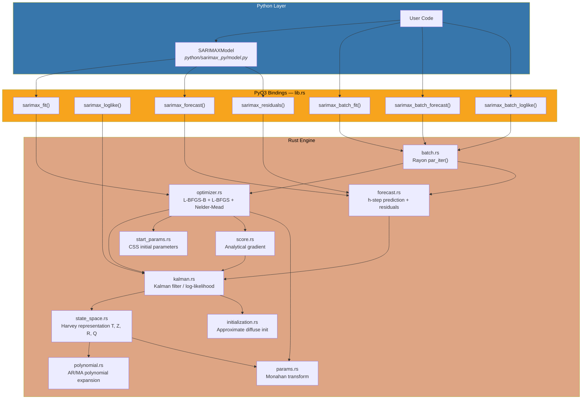
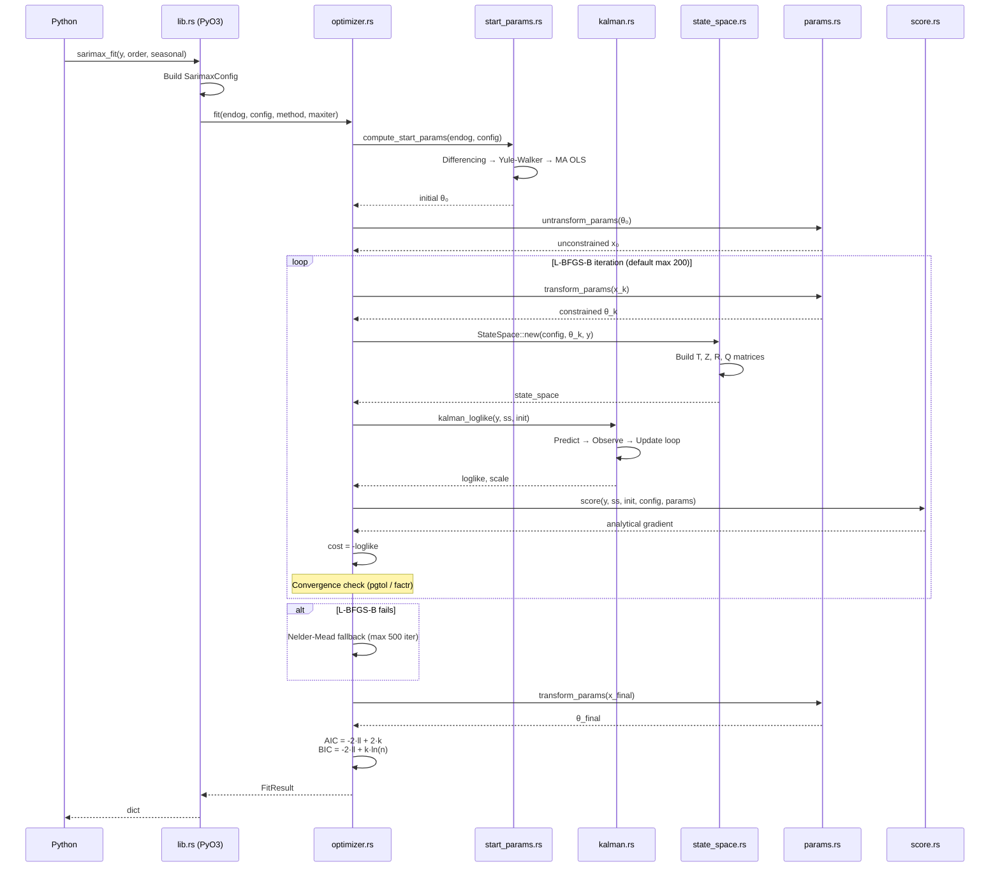
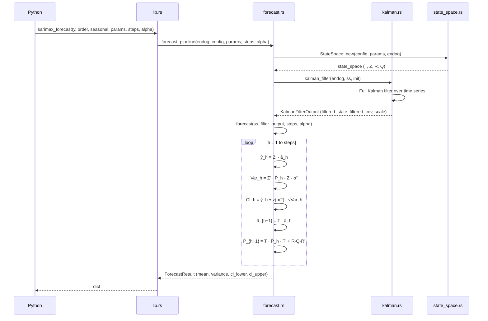
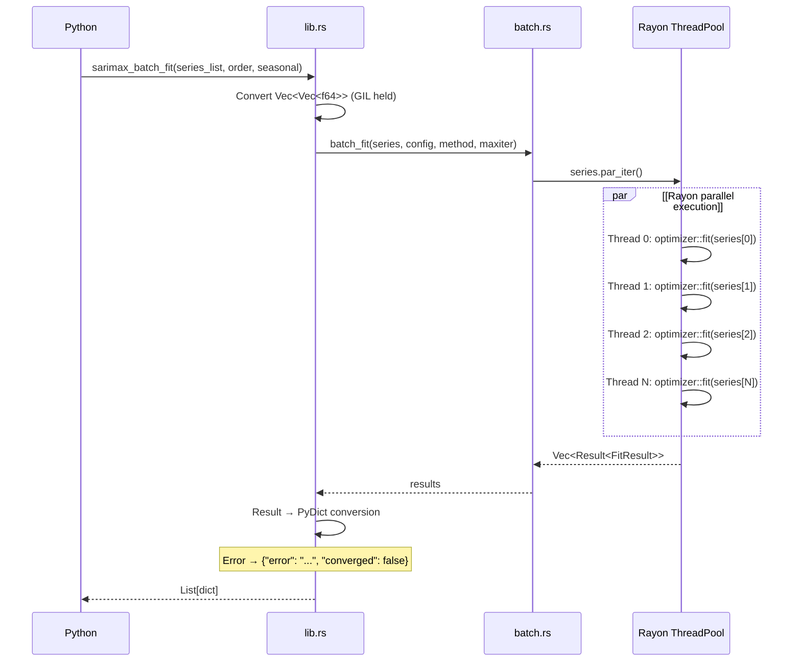
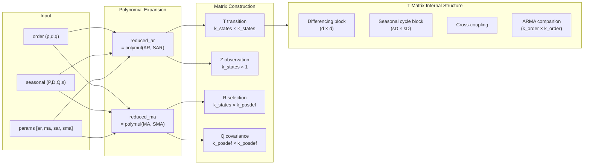

# sarimax-rs

A high-performance SARIMAX (Seasonal ARIMA with eXogenous regressors) engine written in Rust, callable from Python via PyO3. Achieves statsmodels-equivalent numerical accuracy at native compiled speed, with Rayon-based parallel batch processing for large-scale time series workloads.

## Motivation

Python's `statsmodels.tsa.SARIMAX` is the de facto standard for SARIMA modeling, but its pure Python + NumPy implementation has structural bottlenecks:

| Bottleneck | Root Cause | Impact |
|------------|-----------|--------|
| Slow Kalman filter loop | Python `for` loop over matrix ops | Seconds to tens of seconds on long series or high-order models |
| MLE optimization overhead | Python call stack on every iteration | Accumulated latency over hundreds of iterations |
| No true parallelism | GIL prevents multi-threaded batch fitting | Cannot simultaneously fit thousands of series |
| Memory fragmentation | Python object overhead per allocation | Unnecessary heap pressure in large state spaces |

**sarimax-rs** replaces these bottlenecks with native Rust:

- **Kalman filter**: Rust `for` + nalgebra dense matrices — zero interpreter overhead
- **Optimization**: L-BFGS-B (primary), L-BFGS, Nelder-Mead — entirely within Rust, with analytical score vector (tangent-linear Kalman filter)
- **Batch parallelism**: Rayon work-stealing thread pool — N series fitted/forecasted concurrently
- **Memory**: stack allocation + contiguous column-major layout — cache-friendly
- **Python interop**: PyO3 + numpy zero-copy bindings — `import sarimax_rs`

## Supported Models

```
SARIMA(p, d, q)(P, D, Q, s) + exogenous regressors
```

| Parameter | Meaning | Range |
|-----------|---------|-------|
| `p` | AR order (autoregressive) | 0–20 |
| `d` | Differencing order | 0–3 |
| `q` | MA order (moving average) | 0–20 |
| `P` | Seasonal AR order | 0–4 |
| `D` | Seasonal differencing order | 0–1 |
| `Q` | Seasonal MA order | 0–4 |
| `s` | Seasonal period (e.g., 12=monthly, 4=quarterly) | 2–365 |
| `exog` | Exogenous regressors | n_obs × n_exog matrix |

## Installation

```bash
# Requirements: Rust 1.83+, Python 3.10+, maturin 1.7+
cd sarimax_rs

# Option 1: maturin develop (development)
pip install maturin
maturin develop --release

# Option 2: uv (recommended)
uv sync --extra dev
CARGO_TARGET_DIR=target_wheel uv run maturin build --out /tmp/wheels
uv pip install --force-reinstall /tmp/wheels/sarimax_rs-*.whl
```

## Quick Start

### Low-level API (`sarimax_rs`)

```python
import numpy as np
import sarimax_rs

y = np.random.randn(200).cumsum()

# 1. Fit model
result = sarimax_rs.sarimax_fit(y, order=(1, 1, 1), seasonal=(0, 0, 0, 0))
print(f"Converged: {result['converged']}, AIC: {result['aic']:.2f}")

# 2. Forecast 10 steps ahead
fc = sarimax_rs.sarimax_forecast(
    y, order=(1, 1, 1), seasonal=(0, 0, 0, 0),
    params=np.array(result["params"]), steps=10
)
print(f"Forecast: {fc['mean'][:5]}")

# 3. Residual diagnostics
res = sarimax_rs.sarimax_residuals(
    y, order=(1, 1, 1), seasonal=(0, 0, 0, 0),
    params=np.array(result["params"])
)
```

### High-level API (`SARIMAXModel` — statsmodels compatible)

```python
import sys; sys.path.insert(0, "python")
from sarimax_py import SARIMAXModel

model = SARIMAXModel(y, order=(1, 1, 1), seasonal_order=(0, 0, 0, 0))
result = model.fit()

# Summary with parameter table (fast, no inference)
print(result.summary())

# Summary with inference statistics (std err, z, p-value, CI)
print(result.summary(include_inference=True))

# Machine-readable parameter summary
ps = result.parameter_summary(alpha=0.05)
print(ps["name"])       # ['ar.L1', 'ma.L1']
print(ps["std_err"])    # numerical Hessian-based standard errors
print(ps["p_value"])    # two-sided p-values

print(f"AIC: {result.aic:.2f}, BIC: {result.bic:.2f}")

# Forecast with confidence intervals
fcast = result.forecast(steps=10, alpha=0.05)
print(fcast.predicted_mean)
ci = fcast.conf_int()          # (10, 2) array [lower, upper]
ci_90 = fcast.conf_int(0.10)   # recompute at different alpha

# Standardized residuals
residuals = result.resid
```

### With Exogenous Regressors

```python
import numpy as np

X_train = np.column_stack([np.arange(200), np.random.randn(200)])  # (200, 2)
X_future = np.column_stack([np.arange(200, 210), np.random.randn(10)])  # (10, 2)

model = SARIMAXModel(y, order=(1, 0, 1), seasonal_order=(0, 0, 0, 0), exog=X_train)
result = model.fit()
fcast = result.forecast(steps=10, exog=X_future)
```

### Batch Parallel Processing

```python
# Fit 100 series simultaneously (Rayon multi-threaded)
series_list = [np.random.randn(200) for _ in range(100)]

results = sarimax_rs.sarimax_batch_fit(
    series_list, order=(1, 0, 0), seasonal=(0, 0, 0, 0)
)

for i, r in enumerate(results):
    print(f"Series {i}: converged={r['converged']}, AIC={r['aic']:.2f}")

# Batch forecast with per-series parameters
params_list = [np.array(r["params"]) for r in results]
forecasts = sarimax_rs.sarimax_batch_forecast(
    series_list, order=(1, 0, 0), seasonal=(0, 0, 0, 0),
    params_list=params_list, steps=10, alpha=0.05,
)
```

---

## Architecture

### System Overview



### Model Fitting Flow



### Forecast Flow



### Batch Parallel Processing Flow



### State Space Matrix Construction



---

## Python API Reference

### Low-level Functions (`sarimax_rs`)

#### `sarimax_rs.sarimax_loglike`

Compute the log-likelihood at given parameters.

```python
ll = sarimax_rs.sarimax_loglike(
    y,
    order=(1, 1, 1),           # (p, d, q)
    seasonal=(1, 1, 1, 12),    # (P, D, Q, s)
    params=np.array([0.5, 0.3, 0.2, -0.4]),  # [ar, ma, sar, sma]
    concentrate_scale=True,    # concentrate sigma2 out of likelihood
)
```

#### `sarimax_rs.sarimax_fit`

Fit model via MLE.

```python
result = sarimax_rs.sarimax_fit(
    y,
    order=(1, 0, 1),
    seasonal=(0, 0, 0, 0),
    enforce_stationarity=True,   # AR stationarity constraint
    enforce_invertibility=True,  # MA invertibility constraint
    method="lbfgsb",             # "lbfgsb" | "lbfgsb-multi" | "lbfgs" | "nelder-mead"
    maxiter=500,
)
```

**Return dict:**

| Key | Type | Description |
|-----|------|-------------|
| `params` | `list[float]` | Estimated parameters `[ar..., ma..., sar..., sma...]` |
| `loglike` | `float` | Final log-likelihood |
| `scale` | `float` | Estimated variance (sigma2) |
| `aic` | `float` | Akaike information criterion |
| `bic` | `float` | Bayesian information criterion |
| `n_obs` | `int` | Number of observations |
| `n_params` | `int` | Number of estimated parameters (incl. sigma2) |
| `n_iter` | `int` | Optimizer iterations (L-BFGS, NM) or function evaluations (L-BFGS-B) |
| `converged` | `bool` | Whether the optimizer converged (not just hit maxiter) |
| `method` | `str` | Optimization method used |

#### `sarimax_rs.sarimax_forecast`

H-step ahead forecast with confidence intervals.

```python
fc = sarimax_rs.sarimax_forecast(
    y,
    order=(1, 0, 0),
    seasonal=(0, 0, 0, 0),
    params=np.array([0.65]),
    steps=10,          # forecast horizon
    alpha=0.05,        # 95% confidence interval
    exog=X_train,      # historical exog (if model has exog)
    future_exog=X_future,  # future exog for forecast period
)

print(fc["mean"])       # point forecasts (list[float])
print(fc["ci_lower"])   # lower CI bounds
print(fc["ci_upper"])   # upper CI bounds
print(fc["variance"])   # forecast variance
```

#### `sarimax_rs.sarimax_residuals`

Compute residuals and standardized residuals.

```python
res = sarimax_rs.sarimax_residuals(
    y,
    order=(1, 0, 1),
    seasonal=(0, 0, 0, 0),
    params=np.array([0.5, 0.3]),
)

print(res["residuals"])                # innovations v_t
print(res["standardized_residuals"])   # v_t / sqrt(F_t * sigma2)
```

#### `sarimax_rs.sarimax_batch_fit`

Parallel fitting of N series via Rayon thread pool.

```python
results = sarimax_rs.sarimax_batch_fit(
    series_list,
    order=(1, 0, 0),
    seasonal=(0, 0, 0, 0),
    enforce_stationarity=True,
    method="lbfgsb",
    maxiter=500,
)
# returns: list[dict] — same keys as sarimax_fit
# failed series return {"error": "...", "converged": false}
```

#### `sarimax_rs.sarimax_batch_forecast`

Parallel forecasting of N series (each with its own parameters).

```python
params_list = [np.array(r["params"]) for r in results]

forecasts = sarimax_rs.sarimax_batch_forecast(
    series_list,
    order=(1, 0, 0),
    seasonal=(0, 0, 0, 0),
    params_list=params_list,
    steps=10,
    alpha=0.05,
)
# returns: list[dict] with mean, variance, ci_lower, ci_upper
```

### High-level Classes (`sarimax_py`)

statsmodels-compatible Python wrapper backed by the Rust engine.

#### `SARIMAXModel`

```python
from sarimax_py import SARIMAXModel

model = SARIMAXModel(
    endog=y,                        # time series data
    order=(1, 1, 1),                # ARIMA(p, d, q)
    seasonal_order=(1, 0, 0, 12),   # (P, D, Q, s)
    exog=X,                         # optional exogenous regressors
    enforce_stationarity=True,
    enforce_invertibility=True,
)
```

#### `SARIMAXResult`

Returned by `model.fit()`.

```python
result = model.fit(method="lbfgsb", maxiter=500)

# Attributes
result.params          # np.ndarray — estimated parameters
result.param_names     # list[str] — parameter names (e.g., ['ar.L1', 'ma.L1'])
result.llf             # float — log-likelihood
result.aic             # float — AIC
result.bic             # float — BIC
result.scale           # float — sigma2
result.nobs            # int — number of observations
result.converged       # bool — convergence status
result.method          # str — optimization method
result.resid           # np.ndarray — standardized residuals (lazy)

# Methods
result.forecast(steps=10, alpha=0.05)     # → ForecastResult
result.forecast(steps=10, exog=X_future)  # with future exog
result.get_forecast(steps=10, alpha=0.05) # alias (statsmodels compat)
result.summary()                          # → str (basic parameter table)
result.summary(include_inference=True)    # → str (with std err / z / p / CI)

# Parameter summary (machine-readable dict)
ps = result.parameter_summary(alpha=0.05, include_inference=True)
# Returns: dict with keys:
#   name: list[str]         — parameter names
#   coef: np.ndarray        — coefficient estimates
#   std_err: np.ndarray     — numerical Hessian-based standard errors
#   z: np.ndarray           — z-statistics (coef / std_err)
#   p_value: np.ndarray     — two-sided p-values
#   ci_lower: np.ndarray    — lower CI bound
#   ci_upper: np.ndarray    — upper CI bound
#   inference_status: str   — "ok" | "skipped" | "failed" | "partial"
#   inference_message: str  — diagnostic message (if status != "ok")
```

**Parameter naming convention** (matches statsmodels):

| Component | Names |
|-----------|-------|
| Exogenous | `x1`, `x2`, ..., `xk` |
| AR | `ar.L1`, `ar.L2`, ..., `ar.Lp` |
| MA | `ma.L1`, `ma.L2`, ..., `ma.Lq` |
| Seasonal AR | `ar.S.L{s}`, `ar.S.L{2s}`, ..., `ar.S.L{Ps}` |
| Seasonal MA | `ma.S.L{s}`, `ma.S.L{2s}`, ..., `ma.S.L{Qs}` |
| Variance | `sigma2` (only when `concentrate_scale=False`) |

**Inference statistics** are computed via numerical Hessian (central differences) of the concentrated log-likelihood. The observed information matrix `I = -H` is inverted to obtain the variance-covariance matrix. If inversion fails, `pinv()` is used as fallback; if that also fails, values are `NaN` with `inference_status="failed"`.

#### `ForecastResult`

```python
fcast = result.forecast(steps=10)

fcast.predicted_mean   # np.ndarray — point forecasts
fcast.variance         # np.ndarray — forecast variance
fcast.ci_lower         # np.ndarray — lower CI bounds
fcast.ci_upper         # np.ndarray — upper CI bounds

fcast.conf_int()       # np.ndarray (steps, 2) — [lower, upper] at original alpha
fcast.conf_int(0.10)   # recompute CI at different significance level
```

---

## Core Algorithms

### 1. State Space Representation (`state_space.rs`)

Transforms SARIMA(p,d,q)(P,D,Q,s) to Harvey (1989) representation.

**State equation:**
```
alpha_{t+1} = T * alpha_t + c_t + R * eta_t,    eta_t ~ N(0, Q)
y_t         = Z' * alpha_t + d_t + eps_t,        eps_t ~ N(0, H), H=0
```

State vector `alpha` has dimension `k_states = k_states_diff + k_order` where:
- `k_states_diff = d + s*D` (differencing states)
- `k_order = max(p + s*P, q + s*Q + 1)` (ARMA companion matrix dimension)

**Transition matrix T** (`k_states × k_states`) consists of 5 blocks:

```
T = ┌──────────────┬─────────────────┬────────────┐
    │ Diff block   │ Cross-coupling  │ 0          │
    │ (d × d)      │ (d → ARMA)      │            │
    ├──────────────┼─────────────────┤            │
    │ 0            │ Seasonal cycle  │ → ARMA     │
    │              │ (s*D × s*D)     │            │
    ├──────────────┼─────────────────┼────────────┤
    │ 0            │ 0               │ ARMA       │
    │              │                 │ companion  │
    └──────────────┴─────────────────┴────────────┘
```

Example — SARIMA(1,1,1)(1,1,1,12): `k_states = 27`, `k_states_diff = 13`, `k_order = 14`

### 2. Kalman Filter (`kalman.rs`)

Standard Harvey-form Kalman filter for log-likelihood evaluation.

```
For each t = 0, ..., n-1:
  1. Innovation:           v_t = y_t - Z' * a_{t|t-1} - d_t
  2. Innovation variance:  F_t = Z' * P_{t|t-1} * Z
  3. Kalman gain:          K_t = P_{t|t-1} * Z / F_t
  4. State update:         a_{t|t} = a_{t|t-1} + K_t * v_t
  5. Covariance update:    P_{t|t} = (I - K*Z') * P * (I - K*Z')'  [Joseph form]
  6. Prediction:           a_{t+1|t} = T * a_{t|t} + c_t
  7. Covariance prediction: P_{t+1|t} = T * P_{t|t} * T' + R*Q*R'
```

**Concentrated likelihood** (`concentrate_scale=true`, default):
```
σ²_hat = (1/n_eff) * Σ(v_t² / F_t)
loglike = -n_eff/2 * ln(2π) - n_eff/2 * ln(σ²_hat) - n_eff/2 - 0.5 * Σ ln(F_t)
```

Two modes:
- `kalman_loglike()` — optimization: no state history, returns loglike + scale only
- `kalman_filter()` — forecast/residuals: stores full filtered state + innovation sequence

Implementation details:
- **Initialization**: approximate diffuse `a_0 = 0, P_0 = κ·I` (κ = 1e6)
- **Burn-in**: first `k_states` observations excluded from likelihood accumulation
- **Numerical stability**: Joseph-form covariance update preserves positive definiteness

### 3. Analytical Score Vector (`score.rs`)

Computes ∂loglike/∂θ via the tangent-linear Kalman filter in a single forward pass, avoiding the O(n_params + 1) cost of numerical differentiation.

For each parameter θ_i, the derivative of system matrices (∂T/∂θ, ∂R·Q·R'/∂θ) is precomputed and propagated through the Kalman recursion to obtain ∂v_t/∂θ and ∂F_t/∂θ, which are then assembled into the score:

```
∂ll_c/∂θ_i = -(1/σ²)·Σ(v/F)·∂v/∂θ + (1/2σ²)·Σ(v²/F²)·∂F/∂θ - (1/2)·Σ(1/F)·∂F/∂θ
```

### 4. Parameter Transformations (`params.rs`)

Optimization is performed in unconstrained space; evaluation transforms back to constrained space.

**Stationarity constraint (AR)** — Monahan (1984) / Jones (1980):
```
Unconstrained → PACF:  r_k = x_k / sqrt(1 + x_k²)
PACF → AR coefficients: Levinson-Durbin recursion
```

All constrained AR coefficients are guaranteed within the stationarity region. MA invertibility uses the same algorithm with sign flip.

### 5. Optimization (`optimizer.rs`)

Minimizes negative log-likelihood.

```
Objective:  f(θ) = -loglike(transform(θ))
Gradient:   Analytical score (default) or center-difference (eps = 1e-7)
```

**Strategy:**
1. **Initial values**: CSS-based estimation or user-provided (`start_params.rs`)
2. **L-BFGS-B** (default): bounded optimization with analytical gradient, `pgtol=1e-5`, `factr=1e7`
3. **L-BFGS-B multi-start**: 3 restarts with perturbed initial values for robustness
4. **L-BFGS**: MoreThuente line search, `grad_tol=1e-8, cost_tol=1e-12`
5. **Nelder-Mead fallback**: automatic on L-BFGS failure, 5% scale simplex
6. **Information criteria**: `AIC = -2·ll + 2·k`, `BIC = -2·ll + k·ln(n)`

**Convergence reporting**: `converged=true` only when the optimizer's own convergence criteria are met (gradient tolerance or function value tolerance). Hitting `maxiter` reports `converged=false`.

### 6. Forecasting (`forecast.rs`)

H-step ahead prediction from the Kalman filter's final state.

```
For each forecast step h = 1, ..., steps:
  ŷ_h = Z' · â_h                   (point forecast)
  F_h = Z' · P̂_h · Z · σ²          (forecast variance)
  CI_h = ŷ_h ± z_{α/2} · √F_h      (confidence interval)
  â_{h+1} = T · â_h                 (state propagation)
  P̂_{h+1} = T · P̂_h · T' + R·Q·R'  (covariance propagation)
```

- `z_score()`: Abramowitz & Stegun 26.2.23 rational approximation for inverse normal CDF
- Forecast variance is monotonically non-decreasing; confidence intervals are symmetric

### 7. Batch Parallel Processing (`batch.rs`)

Uses Rayon `par_iter()` for work-stealing parallel processing of N series.

- All series share the same `SarimaxConfig` (Clone, Send + Sync)
- Each series independently executes `StateSpace::new()` → `fit()` / `forecast_pipeline()`
- Failed series do not affect others (`Vec<Result<T>>` return)
- Three batch operations: `batch_loglike`, `batch_fit`, `batch_forecast`

### 8. Initial Parameter Estimation (`start_params.rs`)

CSS (Conditional Sum of Squares) based estimation for optimizer initialization.

```
1. Apply differencing: d regular + D seasonal differences
2. Yule-Walker: sample autocovariance → Levinson-Durbin → AR coefficients
3. MA estimation: OLS regression on AR residuals → MA coefficients
4. Fallback: zero vector on estimation failure
```

---

## Numerical Validation

Validated against statsmodels SARIMAX reference outputs (ground truth).

### Latest Validation (2026-02-22)

Environment: macOS arm64, Python 3.14, `sarimax_rs 0.1.0`

```bash
.venv/bin/python -m pytest python_tests/test_multi_order_accuracy.py -q
.venv/bin/python -m pytest python_tests/test_multi_order_accuracy.py::test_comprehensive_accuracy_report -s -q
.venv/bin/python python_tests/bench_comparison.py
```

**Accuracy** (19 model configurations, excluding ARMA(2,2) — over-parameterized with multiple optima):

| Metric | Max Error |
|--------|-----------|
| Parameter | ≤ 0.0018 |
| Log-likelihood | ≤ 0.0029 |
| AIC | ≤ 0.0058 |

**Speed** (`bench_comparison.py`, best-of-repeat):

| Scenario | Rust (ms) | statsmodels (ms) | Speedup |
|----------|:---------:|:-----------------:|:-------:|
| AR(1) single fit (n=200) | 0.6 | 3.3 | **5.5x** |
| ARIMA(1,1,1) single fit (n=300) | 12.5 | 11.2 | 0.9x |
| SARIMA(1,1,1)(1,1,1,12) single fit (n=300) | 3496.6 | 343.1 | 0.1x |
| AR(1) batch fit (100 × n=200) | 6.3 | 314.3 | **50.1x** |

Note: Single-model speed depends heavily on order, data, constraints, and hardware. Batch processing is where Rust parallelism provides the largest gains.

---

## Project Structure

```
sarimax_rs/
├── Cargo.toml                      # Rust dependencies and build config
├── pyproject.toml                   # Python package config (maturin)
│
├── src/                             # Rust engine (13 modules, ~7,300 LOC)
│   ├── lib.rs                       # PyO3 module entry point (8 Python functions)
│   ├── types.rs                     # SarimaxOrder, SarimaxConfig, Trend, FitResult
│   ├── error.rs                     # SarimaxError (thiserror-based)
│   ├── params.rs                    # Parameter struct + Monahan/Jones transforms
│   ├── polynomial.rs                # AR/MA polynomial expansion (polymul, reduced_ar/ma)
│   ├── state_space.rs               # Harvey state space T, Z, R, Q construction
│   ├── initialization.rs            # Approximate diffuse init (a₀=0, P₀=κI)
│   ├── kalman.rs                    # Kalman filter (loglike + full filter)
│   ├── score.rs                     # Analytical gradient (tangent-linear Kalman)
│   ├── start_params.rs              # CSS-based initial parameter estimation
│   ├── optimizer.rs                 # L-BFGS-B + L-BFGS + Nelder-Mead MLE
│   ├── forecast.rs                  # h-step prediction + residuals + z_score
│   └── batch.rs                     # Rayon-based batch parallel processing
│
├── python/
│   └── sarimax_py/                  # Python Wrapper Layer
│       ├── __init__.py              # Package exports
│       └── model.py                 # SARIMAXModel, SARIMAXResult, ForecastResult
│
├── python_tests/                    # Python integration tests (176 tests)
│   ├── conftest.py                  # pytest fixtures
│   ├── generate_fixtures.py         # statsmodels reference data generator
│   ├── test_smoke.py                # import/version (2)
│   ├── test_loglike.py              # log-likelihood validation (4)
│   ├── test_fit.py                  # fitting validation (9)
│   ├── test_forecast.py             # forecast validation (9)
│   ├── test_input_validation.py     # input validation (39)
│   ├── test_batch.py                # batch processing (6)
│   ├── test_model.py                # Python model class (9)
│   ├── test_exog.py                 # exogenous regressors (14)
│   ├── test_api_contract.py         # API contract tests (37)
│   ├── test_multi_order_accuracy.py # cross-order accuracy (20)
│   ├── test_matrix_tier_a.py        # tier-A matrix tests (7)
│   ├── test_matrix_tier_b.py        # tier-B matrix tests (5)
│   ├── test_wheel_smoke.py          # wheel installation smoke (8)
│   └── test_perf_regression.py      # performance regression (7)
│
├── tests/fixtures/                  # statsmodels reference data (JSON)
│   ├── statsmodels_reference.json         # log-likelihood reference
│   ├── statsmodels_fit_reference.json     # fitting reference
│   └── statsmodels_forecast_reference.json # forecast reference
│
└── benches/                         # Criterion benchmarks
    ├── bench_kalman.rs              # Kalman loglike performance
    └── bench_fit.rs                 # Single/batch fit performance
```

## Dependencies

### Rust (`Cargo.toml`)

| Crate | Version | Purpose |
|-------|---------|---------|
| nalgebra | 0.34 | Dynamic-size matrix/vector ops (DMatrix, DVector) |
| argmin | 0.11 | L-BFGS, Nelder-Mead optimization framework |
| argmin-math | 0.5 | nalgebra integration for argmin |
| lbfgsb | 0.1 | L-BFGS-B (Fortran wrapper) for bounded optimization |
| statrs | 0.18 | Statistical distributions |
| rayon | 1.10 | Data parallelism (work-stealing thread pool) |
| pyo3 | 0.28 | Python C-API bindings |
| numpy | 0.28 | NumPy array zero-copy transfer |
| thiserror | 2 | Error type macros |
| serde / serde_json | 1 | Test fixture JSON serialization |
| anyhow | 1 | Error handling for lbfgsb integration |

### Python (`pyproject.toml`)

| Package | Purpose |
|---------|---------|
| numpy >= 1.24 | Array operations (runtime dependency) |
| pytest >= 7.0 | Test framework (dev) |
| statsmodels >= 0.14 | Reference result generation (dev) |
| scipy >= 1.10 | Statistical utilities (dev) |
| maturin >= 1.7 | Rust → Python wheel build (dev) |

## Development

```bash
# Rust unit tests (103 tests)
cargo test --all-targets

# Python integration tests (176 tests, requires wheel built first)
maturin develop --release
.venv/bin/python -m pytest python_tests/ -v

# Run a single Python test
.venv/bin/python -m pytest python_tests/test_fit.py::test_arima_111_fit -v

# Run a single Rust test
cargo test test_name

# Benchmarks
cargo bench

# Regenerate statsmodels reference fixtures
.venv/bin/python python_tests/generate_fixtures.py
```

## Test Summary

| Category | Tests | Coverage |
|----------|:-----:|---------|
| Rust unit tests | 103 | types, params, polynomial, state_space, initialization, kalman, score, start_params, optimizer, forecast, batch |
| Python smoke | 2 | import, version |
| Python loglike | 4 | AR(1), ARMA(1,1), ARIMA(1,1,1) vs statsmodels |
| Python fit | 9 | fitting, AIC/BIC, convergence, start_params, Nelder-Mead |
| Python forecast | 9 | forecast mean, CI, residuals vs statsmodels |
| Python validation | 39 | param length, seasonal D/s, bounds, exog, NaN/Inf |
| Python batch | 6 | batch fit/forecast, parallel perf, error isolation |
| Python model | 9 | SARIMAXModel, attributes, summary, conf_int |
| Python exog | 14 | exogenous regressors, future_exog, batch exog |
| Python API contract | 37 | API shape, edge cases, error messages |
| Python accuracy | 20 | multi-order cross-validation vs statsmodels |
| Python matrix | 12 | tier-A and tier-B convergence matrices |
| Python wheel smoke | 8 | installation, basic fit, model wrapper |
| Python perf regression | 7 | accuracy regression, iteration count, batch |
| **Total** | **279** | |

## Limitations

- Seasonal differencing `D > 1` not supported (`D = 0` or `1` only)
- Trend parameters supported internally but not exposed in Python API
- No information matrix (Hessian) — parameter standard errors not available
- Forecast steps capped at 10,000; `alpha` must be in (0, 1)
- State dimension capped at 1,024 (prevents OOM on extreme orders)

## License

MIT
