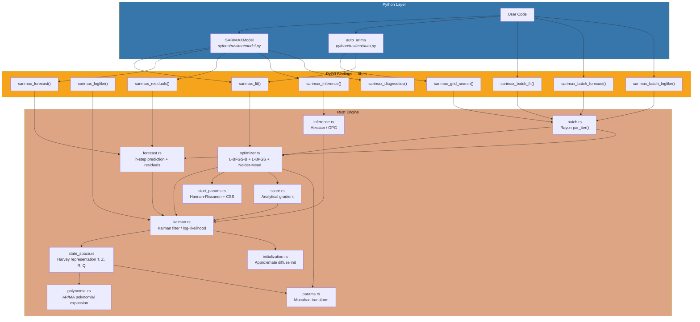
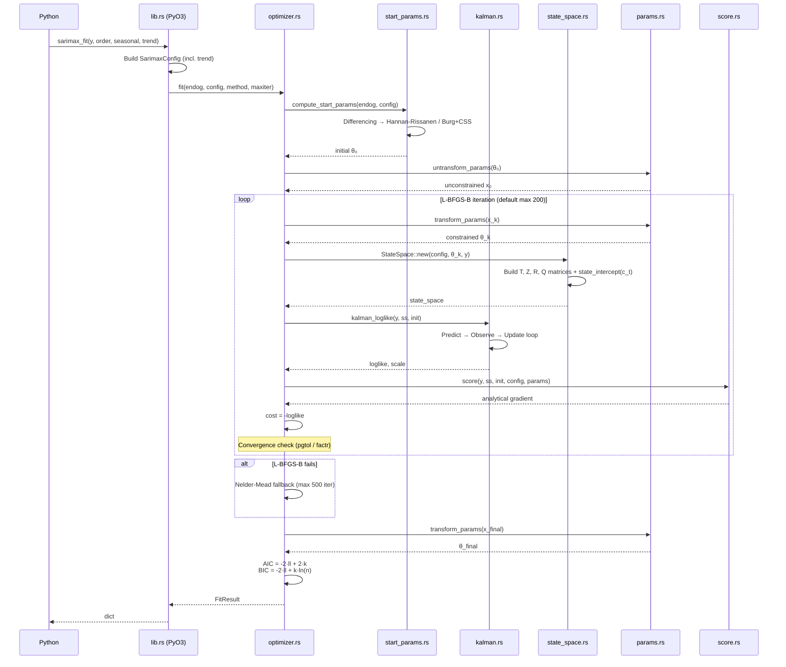
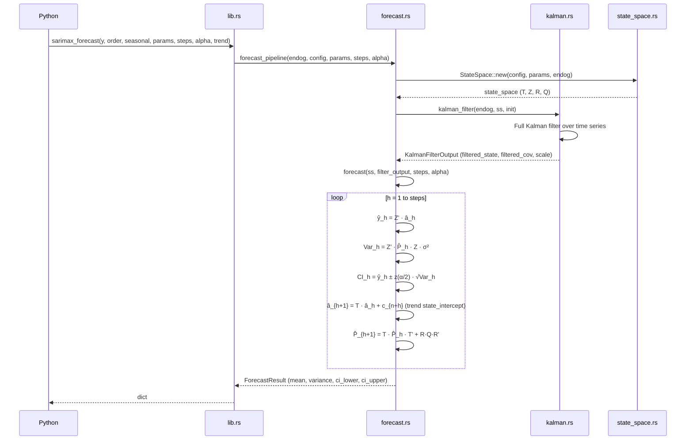
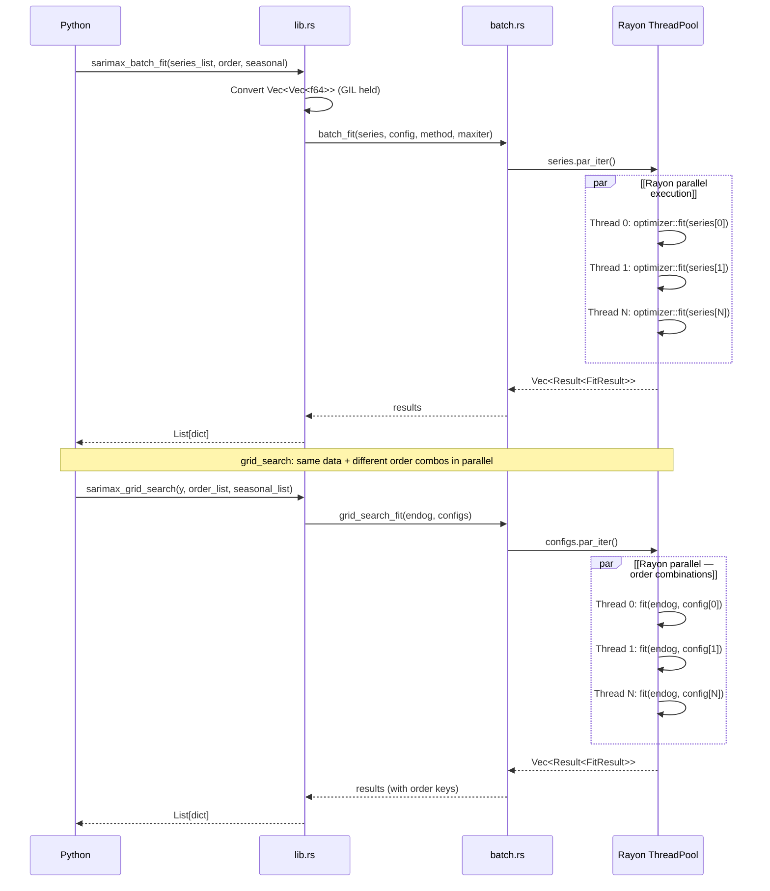

# rustima

[](https://www.rust-lang.org/)
[](https://www.python.org/)
[](LICENSE)

**[Korean / 한국어](README_ko.md)**

A high-performance SARIMAX (Seasonal ARIMA with eXogenous regressors) engine written in Rust with Python bindings via PyO3. It provides a statsmodels-compatible high-level API, native-compiled speed, numerical accuracy on par with statsmodels, and Rayon-based job-level parallel batch processing for large-scale time series workloads.

## Motivation

Python's `statsmodels.tsa.SARIMAX` is the de facto standard for SARIMA modeling, but its pure-Python + NumPy implementation has structural bottlenecks:

| Bottleneck | Root Cause | Impact |
|------------|-----------|--------|
| Slow Kalman filter loop | Python `for` loop over matrix ops | Seconds to tens of seconds on long series or high-order models |
| MLE optimization overhead | Python call stack on every iteration | Accumulated latency over hundreds of iterations |
| No real parallelism | GIL prevents multi-threaded batch fitting | Cannot simultaneously fit thousands of series |
| Memory fragmentation | Python object overhead per allocation | Unnecessary heap pressure on large state spaces |

**rustima** replaces these bottlenecks with native Rust:

- **Kalman filter**: Rust `for` + nalgebra dense matrix ops (zero interpreter overhead)
- **Optimization**: L-BFGS-B (default), L-BFGS, Nelder-Mead run entirely in Rust with analytical score vector (sparse tangent-linear Kalman + steady-state optimization)
- **Batch parallelism**: Rayon work-stealing thread pool that assigns one full fit/forecast job per series
- **Grid search parallelization**: `sarimax_grid_search` assigns one ARIMA order combination per worker via Rayon
- **auto_arima**: Hyndman-Khandakar stepwise + Rayon parallel grid search for automatic order selection
- **Memory**: Stack allocation + contiguous column-major layout for cache-friendliness
- **Python interop**: PyO3 + numpy bindings — `import rustima`

## What is SARIMAX? (For Beginners)

If you've never used SARIMAX before, here's a 30-second primer:

**SARIMAX = S + ARIMA + X**

- **AR** (AutoRegressive) — predict today's value from the past few days
- **I** (Integrated / differencing) — subtract today from yesterday to make a trending series stationary
- **MA** (Moving Average) — use past forecast errors to improve today's prediction
- **S** (Seasonal) — a repeating pattern (weekly=7, monthly=12, hourly=24)
- **X** (eXogenous) — extra columns that help explain `y` (e.g. temperature, price, promotions)

You describe the model with two tuples:

| Tuple | Meaning | Example |
|-------|---------|---------|
| `order=(p, d, q)` | Non-seasonal (AR, diff, MA) | `(1, 1, 1)` = 1 lag AR, 1 diff, 1 lag MA |
| `seasonal_order=(P, D, Q, s)` | Seasonal part + period | `(1, 0, 1, 12)` = monthly seasonality |

**Quick rules of thumb:**
- Has trend? → `d=1`
- Has yearly pattern in monthly data? → `s=12`
- Not sure about orders? → Use `auto_arima()` and it picks for you

**Recommended learning path:**
1. Try `auto_arima()` on your series first (it picks orders automatically)
2. Read [Forecasting: Principles and Practice, Ch. 9](https://otexts.com/fpp3/arima.html) (free textbook) for theory
3. Come back to tune `order`/`seasonal_order` manually

## Supported Models

```
SARIMA(p, d, q)(P, D, Q, s) + trend + exogenous regressors
```

| Parameter | Description | Range |
|-----------|------------|-------|
| `p` | AR order (autoregressive) | 0–20 |
| `d` | Differencing order | 0–3 |
| `q` | MA order (moving average) | 0–20 |
| `P` | Seasonal AR order | 0–4 |
| `D` | Seasonal differencing order | 0–1 |
| `Q` | Seasonal MA order | 0–4 |
| `s` | Seasonal period (e.g. 12=monthly, 7=daily, 24=hourly) | 2–365 |
| `trend` | Trend component (`'n'`, `'c'`, `'t'`, `'ct'`) | — |
| `exog` | Exogenous regressors | n_obs × n_exog matrix |

## Installation

### Prerequisites

Because rustima ships Rust source, **you must build it locally** (there is no pre-built wheel on PyPI yet). You need:

| Tool | Minimum | Why | Install |
|------|---------|-----|---------|
| **Rust** | 1.83+ | Compiles the engine | `curl --proto '=https' --tlsv1.2 -sSf https://sh.rustup.rs \| sh` |
| **Python** | 3.10+ | Hosts the extension | [python.org](https://www.python.org/) or `pyenv` |
| **uv** | latest | Fast Python package/env manager | `curl -LsSf https://astral.sh/uv/install.sh \| sh` |
| **maturin** | 1.7+ | Rust ↔ Python bridge (auto-installed by `uv sync --extra dev`) | — |

> **Windows users:** install [Microsoft C++ Build Tools](https://visualstudio.microsoft.com/visual-cpp-build-tools/) first (needed by Rust's MSVC toolchain).

### Option A — Development mode (recommended for most users)

Best for: testing, Jupyter notebooks, running examples. Fast rebuilds on code changes.

```bash
git clone https://github.com/<your-org>/rustima.git
cd rustima/        # the repo has an inner `rustima/` package directory

# 1) Create virtualenv + install Python deps (numpy, polars, pytest, etc.)
uv sync --extra dev

# 2) Compile Rust engine in release mode and link it in-place
uv run maturin develop --release
```

After this you can run:

```bash
uv run python -c "import rustima; print(rustima.version())"
```

### Option B — Build a redistributable wheel

Best for: deploying to another machine, CI, production.

```bash
cd rustima/
uv sync --extra dev
CARGO_TARGET_DIR=target_wheel uv run maturin build --release --out /tmp/wheels
uv pip install --force-reinstall /tmp/wheels/rustima-*.whl
```

Copy the `.whl` from `/tmp/wheels/` to the target machine and `pip install` it there (must have the same OS + Python version).

### Verifying the install

```python
import rustima
import numpy as np

print(rustima.version())                              # "0.1.0"
y = np.random.randn(100).cumsum()
r = rustima.sarimax_fit(y, order=(1, 1, 1), seasonal=(0, 0, 0, 0))
print(f"converged={r['converged']}, AIC={r['aic']:.2f}")
```

If this prints without error you're good to go. See **Troubleshooting** at the bottom if it fails.

### Using inside Jupyter Notebook

```bash
cd rustima/
uv sync --extra dev
uv run maturin develop --release

# Register the venv as a Jupyter kernel (run once)
uv run python -m ipykernel install --user --name rustima --display-name "rustima"

# Launch Jupyter
uv run jupyter notebook
```

In the notebook, select the kernel **"rustima"** from the top-right corner, then:

```python
import rustima
from rustima import SARIMAXModel, auto_arima
```

## Which API Should I Use?

rustima exposes **two layers**. Pick one based on what you're doing:

| You want to... | Use | Why |
|----------------|-----|-----|
| Replace `statsmodels.SARIMAX` with a faster drop-in | **`SARIMAXModel`** (high-level) | Same class/method names, same output format, statsmodels-style `.summary()` |
| Let the library pick the order for you | **`auto_arima()`** (high-level) | Automatic (p,d,q)(P,D,Q,s) search, like pmdarima |
| Fit **thousands** of series in parallel | **`rustima.sarimax_batch_fit`** (low-level) | Skips Python object overhead, releases GIL |
| Try many orders on one series | **`rustima.sarimax_grid_search`** (low-level) | Rayon-parallel over order combinations |
| Inspect raw log-likelihood / residuals for research | **`rustima.sarimax_loglike` / `sarimax_residuals`** | Direct access to Kalman filter output |

**Rule of thumb:** Start with `SARIMAXModel` or `auto_arima`. Drop to the low-level API only when you need to fit many series/orders at once.

## Your First Forecast (5-minute walkthrough)

A complete end-to-end example. Copy-paste into a Python file or notebook.

```python
import numpy as np
from rustima import SARIMAXModel, auto_arima

# ── 1. Simulate monthly sales data with trend + yearly seasonality ─────────
rng = np.random.default_rng(42)
n = 120  # 10 years of monthly data
trend = 0.5 * np.arange(n)                           # linear upward trend
season = 10 * np.sin(2 * np.pi * np.arange(n) / 12)  # yearly cycle (s=12)
noise = rng.normal(0, 1.0, n)
y = trend + season + noise

# ── 2. Let auto_arima pick the orders for you ─────────────────────────────
auto_result = auto_arima(y, s=12, trace=True)  # trace=True prints each try
print(auto_result.search_summary())
# >>> Best: SARIMA(0,1,1)(0,1,1)[12]  AIC=345.67  (evaluated 23 models)

# ── 3. Inspect the chosen model ───────────────────────────────────────────
model = auto_result.result              # a SARIMAXResult
print(model.summary())                  # statsmodels-style parameter table
print(f"AIC={model.aic:.2f}  BIC={model.bic:.2f}")

# ── 4. Forecast the next 12 months with 95% confidence intervals ──────────
forecast = model.forecast(steps=12, alpha=0.05)
df = forecast.to_dataframe()            # Polars DataFrame
print(df)
# shape (12, 5): step | mean | variance | ci_lower | ci_upper

# ── 5. Check residuals (should look like random noise) ────────────────────
diag = model.diagnostics()
print(f"Ljung-Box p-value: {diag['ljung_box_pvalue'][0]:.3f}  (>0.05 = good)")
```

**What to look at in the output:**
- **`converged=True`** → optimization succeeded
- **Low AIC / BIC** → better model fit (relative to other orders)
- **Ljung-Box p > 0.05** → residuals look like white noise (good)
- **`ci_lower` / `ci_upper`** → uncertainty band; wider = less confident

## Quick Start

### Low-Level API (`rustima`)

```python
import numpy as np
import rustima

y = np.random.randn(200).cumsum()

# 1. Fit model
result = rustima.sarimax_fit(y, order=(1, 1, 1), seasonal=(0, 0, 0, 0))
print(f"Converged: {result['converged']}, AIC: {result['aic']:.2f}")

# 2. 10-step ahead forecast
fc = rustima.sarimax_forecast(
    y, order=(1, 1, 1), seasonal=(0, 0, 0, 0),
    params=np.array(result["params"]), steps=10
)
print(f"Forecast: {fc['mean'][:5]}")

# 3. Residual diagnostics
res = rustima.sarimax_residuals(
    y, order=(1, 1, 1), seasonal=(0, 0, 0, 0),
    params=np.array(result["params"])
)
```

### High-Level API (`SARIMAXModel` — statsmodels compatible)

```python
from rustima import SARIMAXModel

model = SARIMAXModel(y, order=(1, 1, 1), seasonal_order=(0, 0, 0, 0), trend="c")
result = model.fit()

# Parameter summary (fast, no inference stats)
print(result.summary())

# With Hessian-based inference (std err, z, p-value, CI)
print(result.summary(inference="hessian"))

# Side-by-side Hessian vs statsmodels inference
print(result.summary(inference="both"))

# Parameter table as Polars DataFrame
pt = result.params_table(inference="hessian")
print(pt)  # shape: (k, 7) — name, coef, std_err, z, p_value, ci_lower, ci_upper

print(f"AIC: {result.aic:.2f}, BIC: {result.bic:.2f}, HQIC: {result.hqic:.2f}")

# Forecast with confidence intervals + Polars DataFrame
fcast = result.forecast(steps=10, alpha=0.05)
print(fcast.predicted_mean)
df = fcast.to_dataframe()  # Polars: step, mean, variance, ci_lower, ci_upper
ci = fcast.conf_int()          # (10, 2) array [lower, upper]
ci_90 = fcast.conf_int(0.10)   # recalculate with different alpha

# In-sample prediction
pred = result.get_prediction(start=0, end=210)
pred_df = pred.to_dataframe()  # Polars: index, predicted_mean

# Standardized residuals
residuals = result.resid

# Residual diagnostics (Ljung-Box, Jarque-Bera, heteroskedasticity)
diag = result.diagnostics()
```

### auto_arima — Automatic Order Selection

```python
from rustima import auto_arima

# Stepwise (Hyndman-Khandakar, default)
res = auto_arima(y, max_p=5, max_q=5, s=12, stepwise=True, trace=True)
print(res.summary())           # Full statsmodels-style summary with inference
print(res.search_summary())    # Short 3-line summary (order, IC, model count)
print(res.result.forecast(steps=12).to_dataframe())

# Grid Search (Rayon parallel — one fit job per order combination)
res = auto_arima(y, max_p=3, max_q=3, s=7, stepwise=False, criterion="bic")
print(res.summary())

# Search history (Polars DataFrame)
print(res.history_dataframe())
```

**auto_arima key parameters:**

| Parameter | Default | Description |
|-----------|---------|-------------|
| `max_p`, `max_q` | 5 | Max AR/MA order |
| `max_P`, `max_Q` | 2 | Max seasonal AR/MA order |
| `s` | 0 | Seasonal period (0=non-seasonal) |
| `d`, `D` | `None` | Differencing order (None=auto-detect) |
| `trend` | `"n"` | Trend: `'n'`, `'c'`, `'t'`, `'ct'` |
| `criterion` | `"aic"` | Information criterion: `"aic"`, `"bic"`, `"hqic"` |
| `stepwise` | `True` | False → exhaustive grid search (Rayon parallel) |
| `trace` | `False` | True → print each model evaluation result |

### Trend Support

```python
# Constant (intercept)
model = SARIMAXModel(y, order=(1, 1, 1), seasonal_order=(0, 0, 0, 0), trend="c")
# Linear trend (drift)
model = SARIMAXModel(y, order=(1, 1, 1), seasonal_order=(0, 0, 0, 0), trend="t")
# Constant + linear (intercept + drift)
model = SARIMAXModel(y, order=(1, 1, 1), seasonal_order=(0, 0, 0, 0), trend="ct")

result = model.fit()
print(result.param_names)  # ['intercept', 'drift', 'ar.L1', 'ma.L1'] (trend='ct')
```

### Exogenous Regressors

```python
import numpy as np

X_train = np.column_stack([np.arange(200), np.random.randn(200)])  # (200, 2)
X_future = np.column_stack([np.arange(200, 210), np.random.randn(10)])  # (10, 2)

model = SARIMAXModel(y, order=(1, 0, 1), seasonal_order=(0, 0, 0, 0), exog=X_train)
result = model.fit()
fcast = result.forecast(steps=10, exog=X_future)
```

**Profiled Kalman-GLS Trust-Region for weakly identified exog coefficients.**
When the exog block is weakly identified (flat likelihood in the β direction),
the default optimizer can leave β in a poor basin. The `profile-trust-region`
method (academic name: *Profiled Kalman-GLS Trust-Region*, equivalently
*innovations-form profile likelihood with trust-region BFGS*) removes β from
the nonlinear optimizer and solves it exactly via innovation-space GLS at
each likelihood evaluation. The optimizer only sees `[trend | AR | MA | sAR |
sMA | sigma2]`. On exogenous SARIMAX cases it tends to reproduce R
`stats::arima(method="CSS-ML")` β estimates in sign and magnitude:

```python
result = model.fit(method="profile-trust-region", maxiter=200)
```

If `n_exog == 0` the method falls back to the regular `trust-region` path.
When `simple_differencing=True`, the same differencing operator is now
applied to both `endog` and every `exog` column so that the regression
`Δy_t = (Δx_t) β + ARMA noise` is solved on a consistent pre-differenced
dataset. See [`rustima/docs/profiled_kalman_gls_plan.md`](rustima/docs/profiled_kalman_gls_plan.md)
for the algorithm, parameter-level comparison against statsmodels and R, and
init-scheme caveats.

**Batched Kalman filter inside PTR.** Each profiled-likelihood evaluation
runs the Kalman filter on `y` and once per exogenous column `x_j` at the
same `ψ`; the state-space matrices, predicted covariance, gain, and
innovation variance are bit-identical across these passes. `rustima`'s
`kalman_filter_batched` shares the O(k²) covariance recursion once and runs
only the cheap O(k) mean recursion per series. For `r=2` exog the
per-evaluation Kalman cost drops from `(1+r) = 3` full passes to `1` full
pass plus three cheap mean updates — about a 2× per-PTR-fit speedup.
Implementation: `rustima/src/kalman.rs::kalman_filter_batched`, called from
`ProfiledSarimaxObjective::profile_beta_and_loglike`.

**Parallel stepwise neighborhood search.** `auto_arima(stepwise=True)`
evaluates the 8–10 candidates around the current best in a single
Rayon-parallel `rustima.sarimax_grid_search` call rather than one-by-one.
On a 12-core machine the inner trust-region BFGS routines run concurrently,
so each Hyndman-Khandakar step finishes in roughly the time of the slowest
neighbour rather than the sum of all neighbours.

**Automatic CPU pinning on Apple Silicon (macOS).** On import,
`rustima/python/rustima/__init__.py` detects the P-core count via
`sysctl hw.perflevel0.physicalcpu` and exports
`RAYON_NUM_THREADS=<P-core count>` before the native extension loads.
This avoids E-cores becoming the per-step critical path on heterogeneous
chips (M-series), yielding a 20–35% wall-time reduction on compute-heavy
SARIMAX fits. The behaviour is a no-op on Linux/Windows and on macOS
systems where the user has already set `RAYON_NUM_THREADS` themselves.

### Batch Parallel Processing

```python
# Fit 100 series with job-level Rayon parallelism
series_list = [np.random.randn(200) for _ in range(100)]

results = rustima.sarimax_batch_fit(
    series_list, order=(1, 0, 0), seasonal=(0, 0, 0, 0)
)

for i, r in enumerate(results):
    print(f"Series {i}: converged={r['converged']}, AIC={r['aic']:.2f}")

# Batch forecast with per-series parameters
params_list = [np.array(r["params"]) for r in results]
forecasts = rustima.sarimax_batch_forecast(
    series_list, order=(1, 0, 0), seasonal=(0, 0, 0, 0),
    params_list=params_list, steps=10, alpha=0.05,
)
```

### Grid Search Parallel Processing

```python
# Fit multiple ARIMA orders via Rayon in one call
results = rustima.sarimax_grid_search(
    y,
    order_list=[(0,1,0), (1,1,0), (1,1,1), (2,1,1)],
    seasonal_list=[(0,0,0,0)] * 4,
    trend="c",
)
for r in results:
    if "error" not in r:
        print(f"{r['order']}: AIC={r['aic']:.3f}")
```

---

## Architecture

### System Overview


```mermaid
graph TB
    subgraph Python["Python Layer"]
        USER["User Code"]
        MODEL["SARIMAXModel<br/><i>python/rustima/model.py</i>"]
        AUTO["auto_arima<br/><i>python/rustima/auto.py</i>"]
        USER --> MODEL
        USER --> AUTO
    end

    subgraph PyO3["PyO3 Bindings — lib.rs"]
        FIT["sarimax_fit()"]
        LL["sarimax_loglike()"]
        FC["sarimax_forecast()"]
        RES["sarimax_residuals()"]
        BF["sarimax_batch_fit()"]
        BFC["sarimax_batch_forecast()"]
        BLL["sarimax_batch_loglike()"]
        GS["sarimax_grid_search()"]
        INF["sarimax_inference()"]
        DIAG["sarimax_diagnostics()"]
    end

    MODEL --> FIT
    MODEL --> FC
    MODEL --> RES
    MODEL --> INF
    MODEL --> DIAG
    AUTO --> GS
    AUTO --> FIT
    USER --> BF
    USER --> BFC
    USER --> BLL

    subgraph Rust["Rust Engine"]
        OPT["optimizer.rs<br/>L-BFGS-B + L-BFGS + Nelder-Mead"]
        KAL["kalman.rs<br/>Kalman filter / log-likelihood"]
        FCAST["forecast.rs<br/>h-step prediction + residuals"]
        BATCH["batch.rs<br/>Rayon par_iter()"]
        SS["state_space.rs<br/>Harvey representation T, Z, R, Q"]
        INIT["initialization.rs<br/>Approximate diffuse init"]
        SP["start_params.rs<br/>Hannan-Rissanen + CSS"]
        POLY["polynomial.rs<br/>AR/MA polynomial expansion"]
        PAR["params.rs<br/>Monahan transform"]
        SCR["score.rs<br/>Analytical gradient"]
        INFER["inference.rs<br/>Hessian / OPG"]
    end

    FIT --> OPT
    LL --> KAL
    FC --> FCAST
    RES --> FCAST
    BF --> BATCH
    BFC --> BATCH
    BLL --> BATCH
    GS --> BATCH
    INF --> INFER

    BATCH --> OPT
    BATCH --> FCAST
    OPT --> KAL
    OPT --> SP
    OPT --> SCR
    FCAST --> KAL
    KAL --> SS
    KAL --> INIT
    SS --> POLY
    SS --> PAR
    OPT --> PAR
    SCR --> KAL
    INFER --> KAL

    style Python fill:#3776ab,color:#fff
    style PyO3 fill:#f7a41d,color:#000
    style Rust fill:#dea584,color:#000
```

### Model Fitting Flow


```mermaid
sequenceDiagram
    participant P as Python
    participant L as lib.rs (PyO3)
    participant O as optimizer.rs
    participant S as start_params.rs
    participant K as kalman.rs
    participant SS as state_space.rs
    participant PR as params.rs
    participant SC as score.rs

    P->>L: sarimax_fit(y, order, seasonal, trend)
    L->>L: Build SarimaxConfig (incl. trend)
    L->>O: fit(endog, config, method, maxiter)

    O->>S: compute_start_params(endog, config)
    S->>S: Differencing → Hannan-Rissanen / Burg+CSS
    S-->>O: initial θ₀

    O->>PR: untransform_params(θ₀)
    PR-->>O: unconstrained x₀

    loop L-BFGS-B iteration (default max 200)
        O->>PR: transform_params(x_k)
        PR-->>O: constrained θ_k
        O->>SS: StateSpace::new(config, θ_k, y)
        SS->>SS: Build T, Z, R, Q matrices + state_intercept(c_t)
        SS-->>O: state_space
        O->>K: kalman_loglike(y, ss, init)
        K->>K: Predict → Observe → Update loop
        K-->>O: loglike, scale
        O->>SC: score(y, ss, init, config, params)
        SC-->>O: analytical gradient
        O->>O: cost = -loglike
        Note over O: Convergence check (pgtol / factr)
    end

    alt L-BFGS-B fails
        O->>O: Nelder-Mead fallback (max 500 iter)
    end

    O->>PR: transform_params(x_final)
    PR-->>O: θ_final
    O->>O: AIC = -2·ll + 2·k<br/>BIC = -2·ll + k·ln(n)
    O-->>L: FitResult
    L-->>P: dict
```

### Forecast Flow


```mermaid
sequenceDiagram
    participant P as Python
    participant L as lib.rs
    participant F as forecast.rs
    participant K as kalman.rs
    participant SS as state_space.rs

    P->>L: sarimax_forecast(y, order, seasonal, params, steps, alpha, trend)
    L->>F: forecast_pipeline(endog, config, params, steps, alpha)

    F->>SS: StateSpace::new(config, params, endog)
    SS-->>F: state_space (T, Z, R, Q)

    F->>K: kalman_filter(endog, ss, init)
    K->>K: Full Kalman filter over time series
    K-->>F: KalmanFilterOutput (filtered_state, filtered_cov, scale)

    F->>F: forecast(ss, filter_output, steps, alpha)

    loop h = 1 to steps
        F->>F: ŷ_h = Z' · â_h
        F->>F: Var_h = Z' · P̂_h · Z · σ²
        F->>F: CI_h = ŷ_h ± z(α/2) · √Var_h
        F->>F: â_{h+1} = T · â_h + c_{n+h}  (trend state_intercept)
        F->>F: P̂_{h+1} = T · P̂_h · T' + R·Q·R'
    end

    F-->>L: ForecastResult (mean, variance, ci_lower, ci_upper)
    L-->>P: dict
```

### Batch & Grid Search Parallel Processing Flow


```mermaid
sequenceDiagram
    participant P as Python
    participant L as lib.rs
    participant B as batch.rs
    participant R as Rayon ThreadPool

    P->>L: sarimax_batch_fit(series_list, order, seasonal)
    L->>L: Convert Vec<Vec<f64>> (GIL held)
    L->>B: batch_fit(series, config, method, maxiter)

    B->>R: series.par_iter()

    par [Rayon parallel execution]
        R->>R: Thread 0: optimizer::fit(series[0])
        R->>R: Thread 1: optimizer::fit(series[1])
        R->>R: Thread N: optimizer::fit(series[N])
    end

    R-->>B: Vec<Result<FitResult>>
    B-->>L: results
    L-->>P: List[dict]

    Note over P,R: grid_search: same data + different order combos in parallel

    P->>L: sarimax_grid_search(y, order_list, seasonal_list)
    L->>B: grid_search_fit(endog, configs)
    B->>R: configs.par_iter()

    par [Rayon parallel — order combinations]
        R->>R: Thread 0: fit(endog, config[0])
        R->>R: Thread 1: fit(endog, config[1])
        R->>R: Thread N: fit(endog, config[N])
    end

    R-->>B: Vec<Result<FitResult>>
    B-->>L: results (with order keys)
    L-->>P: List[dict]
```

---

## Python API Reference

### Low-Level Functions (`rustima`)

#### `rustima.sarimax_loglike`

Computes log-likelihood at given parameters.

```python
ll = rustima.sarimax_loglike(
    y,
    order=(1, 1, 1),           # (p, d, q)
    seasonal=(1, 1, 1, 12),    # (P, D, Q, s)
    params=np.array([0.5, 0.3, 0.2, -0.4]),  # [ar, ma, sar, sma]
    concentrate_scale=True,    # concentrate sigma2 in likelihood
    trend="c",                 # trend: "n", "c", "t", "ct"
)
```

#### `rustima.sarimax_fit`

Fits model via MLE.

```python
result = rustima.sarimax_fit(
    y,
    order=(1, 0, 1),
    seasonal=(0, 0, 0, 0),
    enforce_stationarity=True,   # AR stationarity constraint
    enforce_invertibility=True,  # MA invertibility constraint
    method="lbfgsb",             # "lbfgsb" | "lbfgsb-multi" | "lbfgs" | "bfgs"
                                 # | "trust-region" | "profile-trust-region"
                                 # | "nelder-mead"
    maxiter=500,
    trend="c",
)
```

**Return dict:**

| Key | Type | Description |
|-----|------|-------------|
| `params` | `list[float]` | Estimated parameters `[trend..., exog..., ar..., ma..., sar..., sma...]` |
| `loglike` | `float` | Final log-likelihood |
| `scale` | `float` | Estimated variance (sigma2) |
| `aic` | `float` | AIC |
| `bic` | `float` | BIC |
| `n_obs` | `int` | Number of observations |
| `n_params` | `int` | Number of estimated parameters (incl. sigma2) |
| `n_iter` | `int` | Optimizer iterations (L-BFGS, NM) or function evaluations (L-BFGS-B) |
| `converged` | `bool` | True convergence, not just maxiter reached |
| `method` | `str` | Optimization method used |

#### `rustima.sarimax_forecast`

Performs h-step ahead forecast with confidence intervals.

```python
fc = rustima.sarimax_forecast(
    y,
    order=(1, 0, 0),
    seasonal=(0, 0, 0, 0),
    params=np.array([0.65]),
    steps=10,
    alpha=0.05,        # 95% confidence interval
    exog=X_train,      # past exog if model uses exog
    future_exog=X_future,
    trend="c",
)

print(fc["mean"])       # point forecast (list[float])
print(fc["ci_lower"])   # lower bound
print(fc["ci_upper"])   # upper bound
print(fc["variance"])   # forecast variance
```

#### `rustima.sarimax_residuals`

Computes residuals and standardized residuals.

```python
res = rustima.sarimax_residuals(
    y,
    order=(1, 0, 1),
    seasonal=(0, 0, 0, 0),
    params=np.array([0.5, 0.3]),
    trend="c",
)

print(res["residuals"])                # innovations v_t
print(res["standardized_residuals"])   # v_t / sqrt(F_t * sigma2)
```

#### `rustima.sarimax_batch_fit`

Fits N series in parallel using a Rayon thread pool, with one complete fit job per series.

```python
results = rustima.sarimax_batch_fit(
    series_list,
    order=(1, 0, 0),
    seasonal=(0, 0, 0, 0),
    enforce_stationarity=True,
    method="lbfgsb",
    maxiter=500,
    trend="c",
)
# Returns: list[dict] — same keys as sarimax_fit
# Failed series: {"error": "...", "converged": false}
```

#### `rustima.sarimax_batch_forecast`

Forecasts N series (each with different params) in parallel, with one complete forecast job per series.

```python
params_list = [np.array(r["params"]) for r in results]

forecasts = rustima.sarimax_batch_forecast(
    series_list,
    order=(1, 0, 0),
    seasonal=(0, 0, 0, 0),
    params_list=params_list,
    steps=10,
    alpha=0.05,
)
# Returns: list[dict] with mean, variance, ci_lower, ci_upper
```

#### `rustima.sarimax_grid_search`

Fits a single series with multiple ARIMA order combinations in parallel via Rayon, with one complete fit job per configuration.

```python
results = rustima.sarimax_grid_search(
    y,
    order_list=[(1,0,0), (1,0,1), (2,0,0)],
    seasonal_list=[(0,0,0,0)] * 3,
    enforce_stationarity=True,
    enforce_invertibility=True,
    trend="c",
    method="lbfgsb",
    maxiter=500,
)
# Returns: list[dict] — same keys as sarimax_fit + "order", "seasonal_order"
```

#### `rustima.sarimax_inference`

Computes Hessian or OPG-based inference statistics on fitted parameters.

```python
inf = rustima.sarimax_inference(
    y, order=(1,0,1), seasonal=(0,0,0,0),
    params=np.array([0.5, 0.3]),
    method="hessian",   # "hessian" | "opg"
    alpha=0.05,
    trend="c",
)
print(inf["std_err"])   # standard errors
print(inf["z_stat"])    # z statistics
print(inf["p_value"])   # two-sided p-values
print(inf["ci_lower"])  # CI lower bound
print(inf["ci_upper"])  # CI upper bound
```

#### `rustima.sarimax_diagnostics`

Performs residual diagnostic tests.

```python
diag = rustima.sarimax_diagnostics(
    y, order=(1,0,1), seasonal=(0,0,0,0),
    params=np.array([0.5, 0.3]),
    trend="c",
)
print(diag["ljung_box_stat"])     # Ljung-Box Q statistic
print(diag["ljung_box_pvalue"])   # Ljung-Box p-value
print(diag["jarque_bera_stat"])   # Jarque-Bera normality
print(diag["het_stat"])           # Heteroskedasticity test
```

### High-Level Classes (`rustima`)

statsmodels-compatible Python wrapper using the Rust engine.

#### `SARIMAXModel`

```python
from rustima import SARIMAXModel

model = SARIMAXModel(
    endog=y,                        # time series data
    order=(1, 1, 1),                # ARIMA(p, d, q)
    seasonal_order=(1, 0, 0, 12),   # (P, D, Q, s)
    exog=X,                         # optional: exogenous regressors
    trend="c",                      # trend: 'n', 'c', 't', 'ct'
    enforce_stationarity=True,
    enforce_invertibility=True,
)
```

#### `SARIMAXResult`

Returned by `model.fit()`.

```python
result = model.fit(method="lbfgsb", maxiter=500)

# Attributes
result.params          # np.ndarray — estimated parameters
result.param_names     # list[str] — e.g. ['intercept', 'ar.L1', 'ma.L1']
result.llf             # float — log-likelihood
result.aic             # float — AIC
result.bic             # float — BIC
result.hqic            # float — HQIC (Hannan-Quinn)
result.scale           # float — sigma2
result.nobs            # int — number of observations
result.converged       # bool — convergence status
result.method          # str — optimization method
result.resid           # np.ndarray — standardized residuals (lazy computed)

# Methods
result.forecast(steps=10, alpha=0.05)     # → ForecastResult
result.forecast(steps=10, exog=X_future)  # with future exog
result.get_forecast(steps=10, alpha=0.05) # alias (statsmodels compat)
result.get_prediction(start=0, end=210)   # → PredictionResult (in-sample + OOS)
result.summary()                          # → str (default: parameter table)
result.summary(inference="hessian")       # → str (std err / z / p / CI)
result.summary(inference="statsmodels")   # → str (statsmodels inference values)
result.summary(inference="both")          # → str (side-by-side comparison)
result.params_table(inference="hessian")  # → Polars DataFrame
result.diagnostics()                      # → dict (Ljung-Box, Jarque-Bera, het)

# Machine-friendly parameter summary dict
ps = result.parameter_summary(alpha=0.05, inference="hessian")
```

**Parameter vector layout:**

```
[trend(kt) | exog(k) | ar(p) | ma(q) | sar(P) | sma(Q)]
```

**Parameter name convention** (consistent with statsmodels):

| Component | Name |
|-----------|------|
| Constant (trend='c') | `intercept` |
| Linear trend (trend='t') | `drift` |
| Constant + linear (trend='ct') | `intercept`, `drift` |
| Exogenous regressors | `x1`, `x2`, ..., `xk` |
| AR | `ar.L1`, `ar.L2`, ..., `ar.Lp` |
| MA | `ma.L1`, `ma.L2`, ..., `ma.Lq` |
| Seasonal AR | `ar.S.L{s}`, `ar.S.L{2s}`, ..., `ar.S.L{Ps}` |
| Seasonal MA | `ma.S.L{s}`, `ma.S.L{2s}`, ..., `ma.S.L{Qs}` |
| Variance | `sigma2` (only when `concentrate_scale=False`) |

#### `ForecastResult`

```python
fcast = result.forecast(steps=10)

fcast.predicted_mean   # np.ndarray — point forecasts
fcast.variance         # np.ndarray — forecast variance
fcast.ci_lower         # np.ndarray — CI lower bound
fcast.ci_upper         # np.ndarray — CI upper bound

fcast.conf_int()       # np.ndarray (steps, 2) — [lower, upper]
fcast.conf_int(0.10)   # recalculate with different alpha
fcast.to_dataframe()   # Polars DataFrame (step, mean, variance, ci_lower, ci_upper)
```

#### `PredictionResult`

```python
pred = result.get_prediction(start=0, end=210)

pred.predicted_mean    # np.ndarray — predictions (in-sample + OOS)
pred.to_dataframe()    # Polars DataFrame (index, predicted_mean)
```

#### `AutoARIMAResult`

```python
from rustima import auto_arima

res = auto_arima(y, max_p=5, max_q=5, s=12)

res.result             # SARIMAXResult — best model fit result
res.order              # tuple (p, d, q) — best order
res.seasonal_order     # tuple (P, D, Q, s)
res.best_ic            # float — best information criterion value
res.criterion          # str — criterion used ("aic", "bic", "hqic")
res.history            # list[dict] — search history
res.summary()          # str — full statsmodels-style summary with inference
res.search_summary()   # str — short 3-line search summary
res.history_dataframe()  # Polars DataFrame — search history table
```

---

## Core Algorithms

### 1. State-Space Representation (`state_space.rs`)

Converts SARIMA(p,d,q)(P,D,Q,s) to the Harvey (1989) representation.

**State equation:**
```
alpha_{t+1} = T * alpha_t + c_t + R * eta_t,    eta_t ~ N(0, Q)
y_t         = Z' * alpha_t + d_t + eps_t,        eps_t ~ N(0, H), H=0
```

State vector `alpha` dimension: `k_states = k_states_diff + k_order`, where
- `k_states_diff = d + s*D` (differencing states)
- `k_order = max(p + s*P, q + s*Q + 1)` (ARMA companion matrix dimension)

### 2. Kalman Filter (`kalman.rs`)

Standard Harvey-form Kalman filter for log-likelihood evaluation.

```
For each t = 0, ..., n-1:
  1. Innovation:           v_t = y_t - Z' * a_{t|t-1} - d_t
  2. Innovation variance:  F_t = Z' * P_{t|t-1} * Z
  3. Kalman gain:          K_t = P_{t|t-1} * Z / F_t
  4. State update:         a_{t|t} = a_{t|t-1} + K_t * v_t
  5. Covariance update:    P_{t|t} = (I - K*Z') * P * (I - K*Z')'  [Joseph form]
  6. Prediction:           a_{t+1|t} = T * a_{t|t} + c_t
  7. Covariance prediction: P_{t+1|t} = T * P_{t|t} * T' + R*Q*R'
```

**Concentrated log-likelihood** (`concentrate_scale=true`, default):
```
σ²_hat = (1/n_eff) * Σ(v_t² / F_t)
loglike = -n_eff/2 * ln(2π) - n_eff/2 * ln(σ²_hat) - n_eff/2 - 0.5 * Σ ln(F_t)
```

### 3. Analytical Score Vector (`score.rs`)

Computes ∂loglike/∂θ via tangent-linear Kalman filter (Koopman & Shephard, 1992; Harvey, 1989) in a single forward pass, avoiding the O(n_params + 1) cost of numerical differentiation. To our knowledge, this is the first Rust implementation of the analytical exact score for state-space models.

**Performance optimizations:**
- **Sparse T**: Exploits companion matrix T sparsity to reduce O(k³) → O(nnz×k) (~23x speedup at k=27)
- **Steady-state detection**: Once P converges, freezes dP/dz/dF and updates only da/dv, skipping O(k³×np) ops for all subsequent timesteps

### 4. Parameter Transform (`params.rs`)

Optimization in unconstrained space, evaluation in constrained space.

**Stationarity constraint (AR)** — Monahan (1984) / Jones (1980):
```
Unconstrained → PACF:  r_k = x_k / sqrt(1 + x_k²)
PACF → AR coefficients: Levinson-Durbin recursion
```

### 5. Optimizer (`optimizer.rs`)

Minimizes negative log-likelihood.

**Strategy:**
1. **Starting values**: Hannan-Rissanen (seasonal) or CSS-based estimation (`start_params.rs`)
2. **L-BFGS-B** (default): Bounded + analytical gradient, `pgtol=1e-5`, `factr=1e7`
3. **L-BFGS-B multi-start**: 3 perturbed restarts for robustness
4. **L-BFGS**: MoreThuente line search, `grad_tol=1e-8, cost_tol=1e-12`
5. **Nelder-Mead fallback**: Auto-switch on L-BFGS failure, 5% scale simplex
6. **Information criteria**: `AIC = -2·ll + 2·k`, `BIC = -2·ll + k·ln(n)`, `HQIC = -2·ll + 2·k·ln(ln(n))`

### 6. Forecast (`forecast.rs`)

h-step ahead prediction from the Kalman filter's final state.

```
For each forecast step h = 1, ..., steps:
  ŷ_h = Z' · â_h                   (point forecast)
  F_h = Z' · P̂_h · Z · σ²          (forecast variance)
  CI_h = ŷ_h ± z_{α/2} · √F_h      (confidence interval)
  â_{h+1} = T · â_h + c_{n+h}       (state propagation + trend)
  P̂_{h+1} = T · P̂_h · T' + R·Q·R'  (covariance propagation)
```

### 7. Batch & Grid Search Parallelism (`batch.rs`)

Uses Rayon `par_iter()` for work-stealing parallelism at the independent-job level.

**Batch processing** (same order + different series):
- All series share the same `SarimaxConfig` (Clone, Send + Sync)
- Each worker independently runs one full `StateSpace::new()` → `fit()` / `forecast_pipeline()` pipeline for one series
- Failed series do not affect others (`Vec<Result<T>>`)

**Grid search** (same series + different orders):
- `grid_search_fit(endog, configs)` — parallel over order combinations via `configs.par_iter()`, one full fit per config

---

## Benchmarks

All benchmarks run on macOS 15.1 (Apple Silicon arm64), Python 3.14, rustima 0.1.0 vs statsmodels 0.14.6.

### Accuracy vs statsmodels

Both engines fitted with `enforce_stationarity=True`, `enforce_invertibility=True`, `concentrate_scale=True`, `trend='n'` on identical data.

| Model | n | k | Max \|Δparam\| | \|Δloglike\| | \|ΔAIC\| |
|-------|:-:|:-:|:-----------:|:----------:|:------:|
| AR(1) | 200 | 1 | 0.000124 | 0.0000 | 0.0000 |
| AR(2) | 300 | 2 | 0.001902 | 0.0007 | 0.0013 |
| MA(1) | 200 | 1 | 0.003862 | 0.0015 | 0.0031 |
| ARMA(1,1) | 300 | 2 | 0.004170 | 0.0048 | 0.0096 |
| ARIMA(1,1,1) | 300 | 2 | 0.026525 | 0.0011 | 0.0022 |
| ARIMA(2,1,1) | 400 | 3 | 0.833380 | 0.4884 | 0.9768 |
| SARIMA(1,0,0)(1,0,0,4) | 200 | 2 | 0.002865 | 0.0014 | 0.0028 |
| SARIMA(0,1,1)(0,1,1,12) | 300 | 2 | 0.054174 | 1.1886 | 2.3771 |
| SARIMA(1,1,1)(1,1,1,12) | 300 | 4 | 0.006335 | 0.0012 | 0.0025 |

Parameter accuracy within 0.006 and log-likelihood difference within 0.005 for most models.

### High-Order Models — Accuracy vs statsmodels

16 models from non-seasonal ARIMA(4–5) to hourly (s=24) high-order SARIMA. `rs_worse_by` shows how much lower the rustima log-likelihood is versus statsmodels; negative (★) means rustima found a better optimum.

| Model | k_states | rs_worse_by | Result |
|------|:--------:|:-----------:|:------:|
| ARIMA(4,1,1) | 5 | +0.002 | Pass |
| ARIMA(4,1,4) | 6 | **-2.07** | Pass ★ |
| ARIMA(3,1,3) | 5 | +0.004 | Pass |
| ARIMA(5,1,1) | 6 | ~0 | Pass |
| ARIMA(1,1,5) | 7 | ~0 | Pass |
| SARIMA(3,1,2)(2,1,1,4) | 16 | +0.86 | Pass |
| SARIMA(2,1,1)(2,1,1,4) | 15 | +2.40 | Pass |
| SARIMA(2,1,2)(1,1,1,7) | 18 | +0.003 | Pass |
| SARIMA(3,1,1)(1,1,1,7) | 18 | +0.04 | Pass |
| SARIMA(4,1,1)(2,1,1,12) | 41 | +0.07 | Pass |
| SARIMA(4,1,4)(2,1,2,12) | 42 | +5.90 | Pass |
| SARIMA(2,1,2)(2,1,1,12) | 39 | **-2.46** | Pass ★ |
| SARIMA(3,1,1)(2,1,1,12) | 40 | +0.05 | Pass |
| SARIMA(2,1,1)(2,1,1,24) | 75 | +1.35 | Pass |
| SARIMA(2,1,2)(1,1,1,24) | 52 | +1.01 | Pass |
| SARIMA(1,1,1)(2,1,1,24) | 74 | +0.32 | Pass |

**16/16 pass.** ★ models: statsmodels issued ConvergenceWarning and failed to converge, while rustima found a better solution.

---

### Speed — Single Fit

Best-of-5 wall clock time (lower is better):

| Model | rustima | statsmodels | Speedup |
|-------|:----------:|:-----------:|:-------:|
| AR(1) n=200 | 0.0 ms | 2.9 ms | **66.8x** |
| ARMA(1,1) n=300 | 0.1 ms | 6.1 ms | **41.6x** |
| ARIMA(1,1,1) n=300 | 0.4 ms | 7.6 ms | **17.9x** |
| ARIMA(2,1,2) n=400 | 1.5 ms | 31.4 ms | **20.4x** |
| SARIMA(1,1,1)(1,1,1,12) n=300 | 122.6 ms | 928.7 ms | **7.6x** |
| SARIMA(1,0,0)(1,0,0,7) n=365 | 0.5 ms | 19.9 ms | **38.0x** |
| SARIMA(1,1,1)(1,1,1,24) n=2160 | 2547.8 ms | 7364.5 ms | **2.9x** |

**Average 27.9x, max 66.8x.** Non-seasonal models: 17–67x faster; high-order seasonal SARIMA: 2.9–7.6x faster.

### Speed — Batch Fit (Rayon Parallel)

AR(1) n=200/series:

| Batch Size | rustima | statsmodels | Speedup |
|:----------:|:----------:|:-----------:|:-------:|
| 10 series | 0.2 ms | 32.2 ms | **165.7x** |
| 50 series | 0.7 ms | 157.3 ms | **232.4x** |
| 100 series | 1.2 ms | 312.2 ms | **269.8x** |

### Speed — Grid Search Parallel vs Sequential

| Scenario | Parallel (ms) | Sequential (ms) | Speedup |
|---------|---------|---------|:-------:|
| n=200, 9 combos | 1.2 | 1.8 | **1.53x** |
| n=500, 9 combos | 2.0 | 4.3 | **2.16x** |
| n=500, 25 combos | 0.9 | 4.3 | **4.59x** |
| n=2000, 9 combos | 2.5 | 11.2 | **4.53x** |

### Speed — auto_arima

| Scenario | n | Mode | Time | Models | AIC |
|---------|---|------|------|--------|-----|
| Daily s=7 (2yr) | 730 | stepwise | 5.68s | 23 | 1099.16 |
| Daily s=7 (2yr) | 730 | grid (parallel) | 4.52s | 81 | 1099.16 |
| Hourly s=24 (90d) | 2160 | stepwise | 19.21s | 17 | 3222.21 |
| Hourly s=24 (90d) | 2160 | grid (parallel) | **2.59s** | 16 | 3222.21 |
| Hourly s=24 (30d) | 720 | stepwise | 20.04s | 17 | 1099.85 |
| Hourly s=24 (30d) | 720 | grid (parallel) | **1.66s** | 16 | 1246.49 |

Grid search with Rayon parallelization is **up to 12x faster** than stepwise on hourly (s=24) data.

---

## Project Structure

```
rustima/
├── Cargo.toml                      # Rust dependencies and build config
├── pyproject.toml                   # Python package config (maturin)
├── build.rs                         # cc build script (compiles lbfgsb_c/)
│
├── src/                             # Rust engine (19 modules, ~11,960 LOC)
│   ├── lib.rs                       # PyO3 module entry point (11 Python functions)
│   ├── types.rs                     # SarimaxOrder, SarimaxConfig, Trend, FitResult
│   ├── error.rs                     # SarimaxError (thiserror-based)
│   ├── params.rs                    # Parameter struct + Monahan/Jones transform
│   ├── polynomial.rs                # AR/MA polynomial expansion (polymul, reduced_ar/ma)
│   ├── state_space.rs               # Harvey state-space T, Z, R, Q, c_t construction
│   ├── initialization.rs            # Approximate diffuse / DARE initialization
│   ├── kalman.rs                    # Kalman filter (loglike + full filter)
│   ├── score.rs                     # Analytical gradient (sparse tangent-linear + steady-state)
│   ├── css.rs                       # Conditional sum-of-squares log-likelihood
│   ├── inference.rs                 # Numerical Hessian / OPG inference
│   ├── start_params.rs              # Hannan-Rissanen + CSS initial parameter estimation
│   ├── optimizer.rs                 # L-BFGS-B + L-BFGS + Nelder-Mead MLE
│   ├── forecast.rs                  # h-step prediction + residuals + z_score
│   ├── batch.rs                     # Rayon-based batch/grid search parallel processing
│   ├── pipeline.rs                  # Shared helpers (kalman_eval, kalman_filter_full)
│   ├── lbfgsb_ffi.rs                # L-BFGS-B C FFI bindings (unsafe extern)
│   ├── lbfgsb_wrapper.rs            # Safe Rust wrapper around L-BFGS-B C solver
│   └── test_helpers.rs              # Shared test utilities (cfg(test) only)
│
├── python/
│   └── rustima/                     # Python package (native ext + high-level API)
│       ├── __init__.py              # Package exports (low-level + high-level API)
│       ├── model.py                 # SARIMAXModel, SARIMAXResult, ForecastResult, PredictionResult
│       ├── auto.py                  # auto_arima, AutoARIMAResult
│       └── rustima.*.so             # Compiled Rust extension (built by maturin)
│
├── python_tests/                    # Python integration tests (371 tests, 16 modules)
│   ├── conftest.py                  # pytest fixtures
│   ├── generate_fixtures.py         # statsmodels reference data generator
│   └── test_*.py                    # test_fit, test_forecast, test_batch, test_exog, etc.
│
├── lbfgsb_c/                        # L-BFGS-B C source (compiled via cc build-dep)
│   ├── lbfgsb.c                     # Main L-BFGS-B solver
│   ├── lbfgsb.h                     # Header
│   ├── linesearch.c                 # Line search subroutine
│   ├── linpack.c                    # LINPACK routines
│   └── miniCBLAS.c                  # Minimal CBLAS routines
│
├── tests/fixtures/                  # statsmodels reference data (JSON)
│
└── benches/                         # Criterion benchmarks
    ├── bench_kalman.rs              # Kalman loglike performance
    └── bench_fit.rs                 # Single/batch fit performance
```

## Dependencies

### Rust (`Cargo.toml`)

| Crate | Version | Purpose |
|-------|---------|---------|
| nalgebra | 0.34 | Dynamic matrix/vector operations (DMatrix, DVector) |
| argmin | 0.11 | L-BFGS, Nelder-Mead optimization framework |
| argmin-math | 0.5 | nalgebra integration for argmin |
| anyhow | 1 | Error context propagation |
| statrs | 0.18 | Statistical distributions |
| rayon | 1.10 | Data parallelism (work-stealing thread pool) |
| pyo3 | 0.28 | Python C-API bindings |
| numpy | 0.28 | NumPy array zero-copy interop |
| thiserror | 2 | Error type macros |
| serde / serde_json | 1 | Test fixture serialization |
| cc | 1 | C compiler driver (build-dep, compiles `lbfgsb_c/`) |

> **Note:** L-BFGS-B is not a crate dependency — it is compiled from vendored C source (`lbfgsb_c/`) via `cc` and called through a safe Rust FFI wrapper (`lbfgsb_ffi.rs` + `lbfgsb_wrapper.rs`).

### Python (`pyproject.toml`)

| Package | Purpose |
|---------|---------|
| numpy >= 1.24 | Array operations (runtime) |
| polars >= 1.0 | DataFrame output (runtime) |
| ipykernel >= 7.2 | Jupyter notebook integration (runtime) |
| pytest >= 7.0 | Test framework (dev) |
| statsmodels >= 0.14 | Reference result generation (dev) |
| scipy >= 1.10 | Statistical utilities (dev) |
| pandas >= 2.0 | Benchmark comparison utilities (dev) |
| matplotlib >= 3.7 | Visualization for benchmarks/reports (dev) |
| maturin >= 1.7 | Rust → Python wheel build (dev) |

## Development

```bash
# Rust unit tests (155 tests)
cargo test --all-targets

# Python integration tests (371 tests, wheel build required first)
uv run maturin develop --release
uv run python -m pytest python_tests/ -v

# Run a single Python test
uv run python -m pytest python_tests/test_fit.py::test_arima_111_fit -v

# Run a single Rust test
cargo test test_name

# Benchmarks
cargo bench

# Regenerate statsmodels reference fixtures
uv run python python_tests/generate_fixtures.py
```

## Test Summary

| Category | Tests | Coverage |
|----------|:-----:|---------|
| Rust unit tests | 155 | types, params, polynomial, state_space, initialization, kalman, score, css, inference, start_params, optimizer, forecast, batch |
| Python smoke | 14 | import, version, basic API checks |
| Python fit | 13 | fitting, AIC/BIC, convergence, start_params, Nelder-Mead |
| Python forecast | 9 | forecast mean, CI, residuals vs statsmodels |
| Python input validation | 64 | param length, seasonal D/s, bounds, exog, NaN/Inf |
| Python batch | 6 | batch fit/forecast, parallel perf, error isolation |
| Python exog | 14 | exogenous regressors, future_exog, batch exog |
| Python multi-order accuracy | 27 | multi-order cross-validation vs statsmodels |
| Python high-order accuracy | 20 | ARIMA(4–5), SARIMA(4,1,4)(2,1,2,12), s=24 |
| Python inference | 70 | Rust Hessian/OPG inference, statsmodels parity |
| Python trend | 16 | trend='n','c','t','ct' fit/forecast/residuals/summary |
| Python Polars | 14 | to_dataframe(), params_table(), PredictionResult, HQIC |
| Python auto_arima | 19 | stepwise, grid, history, criterion, summary |
| Python safety guards | 44 | edge case safety, bounds checking |
| Python simple differencing | 22 | simple_differencing=True path |
| Python matrix tier A | 12 | state-space matrix construction validation |
| Python prediction quality | 7 | in-sample/out-of-sample prediction accuracy |
| **Total** | **526** | 155 Rust + 371 Python |

## Troubleshooting & FAQ

### Install / Build problems

**`error: linker 'cc' not found` / `failed to run custom build command for 'rustima'`**
You don't have a C compiler. On macOS run `xcode-select --install`; on Ubuntu `sudo apt install build-essential`; on Windows install [MSVC Build Tools](https://visualstudio.microsoft.com/visual-cpp-build-tools/).

**`ModuleNotFoundError: No module named 'rustima'` after `maturin develop`**
The Rust extension was built but Python can't find it. Check you are running Python *inside* the same venv:
```bash
uv run python -c "import sys; print(sys.executable)"
# Should point to .venv/bin/python inside the rustima/ folder
```
If you're in Jupyter, make sure you selected the **"rustima"** kernel (see Installation).

**Jupyter notebook says `rustima` is missing even though `uv run python` works**
Your notebook kernel is pointing to a different Python. Re-register it:
```bash
uv run python -m ipykernel install --user --name rustima --display-name "rustima"
```
Then restart the kernel and pick "rustima" from the kernel menu.

**`error: can't find Rust compiler`**
Install Rust: `curl --proto '=https' --tlsv1.2 -sSf https://sh.rustup.rs | sh`, then `source ~/.cargo/env`.

### Modeling questions

**My model didn't converge (`converged=False`). What now?**
1. If the model has exogenous regressors, try `method="profile-trust-region"`
   — it eliminates β from the nonlinear search by Kalman-GLS profiling and
   often matches R `stats::arima` β estimates more closely.
2. Try `method="nelder-mead"` (slower but more robust)
3. Increase `maxiter=1000`
4. Reduce the orders — high `p`, `q`, `P`, `Q` often fail to identify
5. Check your data has no NaN/Inf: `np.isfinite(y).all()` should be `True`

**`auto_arima` takes forever on my hourly data (s=24)**
Use `stepwise=False` to switch to the Rayon-parallel grid search. On hourly data it's often **10x faster** than stepwise (see benchmarks).

**My forecast looks like a flat line**
Usually means `d=0` on a trending series, or the model decided the best prediction is the mean. Try setting `d=1` manually, or add `trend='c'` / `trend='t'`.

**Results are slightly different from statsmodels**
Expected. rustima uses L-BFGS-B with analytical gradients (statsmodels uses L-BFGS with numerical gradients). Differences within `|ΔAIC| < 2` are normal. See the accuracy benchmarks above.

**How do I know which `order` / `seasonal_order` to use?**
1. Easy path: just call `auto_arima(y, s=<period>)` and use what it picks
2. Theory path: ACF/PACF plots + unit-root tests — see [FPP3 Ch. 9](https://otexts.com/fpp3/arima.html)

**When should I use `simple_differencing=True`?**
Only when you want to match R's default behavior or reproduce results with R-style AIC/BIC on a pre-differenced series. Default (`False`) matches statsmodels.
When `True`, the same differencing operator is applied to both `endog` and
every `exog` column (so the regression `Δy_t = (Δx_t) β + noise` is fitted on
a consistently pre-differenced dataset). LL/AIC on this path uses
n = n_obs − d − s·D effective observations.

**Why does my exog SARIMAX LL differ from statsmodels on the
`simple_differencing=True` path?**
Under matched `enforce_stationarity=False, enforce_invertibility=False`,
rustima's Kalman log-likelihood at the same parameter vector is **bit-
identical** to statsmodels. Under `enforce=True`, the two engines initialize
the stationary state covariance with different schemes, which accumulates a
likelihood-scale offset over n. Parameter estimates remain close. For
like-for-like LL comparisons across engines on exogenous models, prefer the
exact path (`simple_differencing=False`) where this divergence does not
appear.

### Performance

**Why is the first fit slow but subsequent ones fast?**
Python imports, Rust JIT-friendly compilation of specialized monomorphizations, and Rayon thread-pool warmup. Warm up once before benchmarking.

**Debug build is slower than statsmodels!**
Always build with `--release`. Without it, Rust runs with no optimizations and is ~10× slower than a release build.

## Limitations

- Seasonal differencing `D > 1` not supported (only `D = 0` or `1`)
- Maximum forecast steps: 10,000; `alpha` must be in (0, 1)
- State dimension capped at 1,024 (bounds memory and compute blow-up on extreme orders, but does not eliminate OOM risk in the absolute sense)
- `auto_arima` automatic differencing detection uses ADF test (scipy) or variance-reduction heuristic

## License

GPL-3.0-or-later. See [LICENSE](LICENSE) for details.
