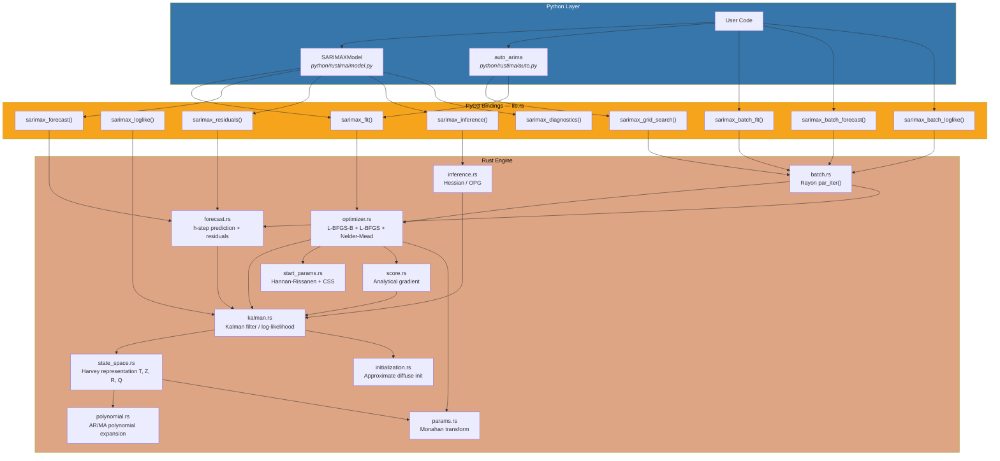
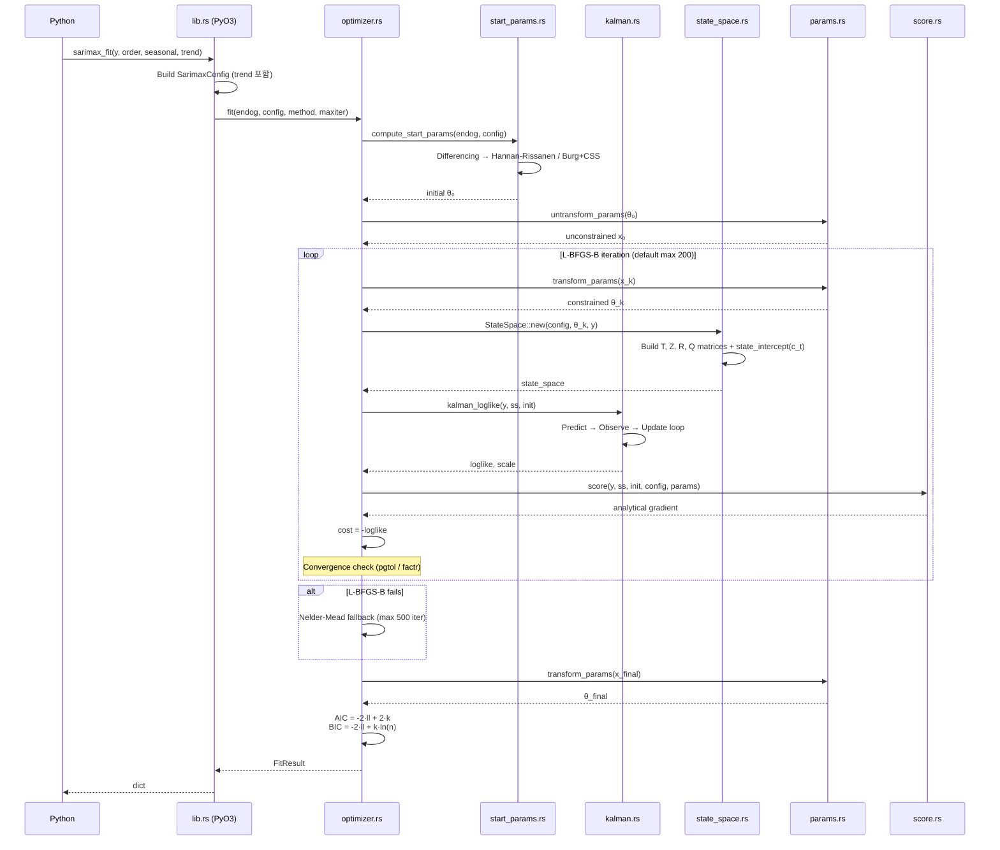

# rustima

[](https://www.rust-lang.org/)
[](https://www.python.org/)
[](LICENSE)

**[English / 영어](README.md)**

PyO3를 통해 Python에서 호출할 수 있도록 Rust로 작성한 고성능 SARIMAX(외생 회귀변수를 포함한 계절 ARIMA) 엔진입니다. statsmodels 호환 고수준 API를 제공하면서 네이티브 컴파일 속도와 statsmodels 수준의 수치 정확도를 유지하고, 대규모 시계열 워크로드를 위해 Rayon 기반 job 단위 병렬 배치 처리를 지원합니다.

## 개발 동기

Python의 `statsmodels.tsa.SARIMAX`는 SARIMA 모델링의 사실상 표준이지만, 순수 Python + NumPy 구현 특성상 구조적 병목이 있습니다.

| 병목 | 근본 원인 | 영향 |
|------------|-----------|--------|
| 느린 칼만 필터 루프 | 행렬 연산 위의 Python `for` 루프 | 긴 시계열 또는 고차 모델에서 수초~수십초 소요 |
| MLE 최적화 오버헤드 | 매 반복마다 Python 호출 스택 경유 | 수백 회 반복 시 지연 누적 |
| 실질적 병렬성 부재 | GIL로 인해 배치 적합 멀티스레딩 제한 | 수천 개 시계열 동시 적합 불가 |
| 메모리 단편화 | 할당마다 Python 객체 오버헤드 | 큰 상태공간에서 불필요한 힙 압박 |

**rustima**는 이 병목을 네이티브 Rust로 대체합니다.

- **칼만 필터**: Rust `for` + nalgebra 밀집 행렬 연산(인터프리터 오버헤드 없음)
- **최적화**: L-BFGS-B(기본), L-BFGS, Nelder-Mead를 Rust 내부에서 수행하며 analytical score vector(sparse 탄젠트-선형 칼만 필터 + steady-state 최적화) 지원
- **배치 병렬성**: Rayon work-stealing 스레드 풀이 시계열별로 하나의 전체 적합/예측 작업을 분배
- **Grid Search 병렬화**: `sarimax_grid_search`가 차수 조합별로 하나의 전체 적합 작업을 Rayon 워커에 분배
- **auto_arima**: Hyndman-Khandakar stepwise + Rayon 병렬 grid search 기반 자동 차수 선택
- **메모리**: 스택 할당 + 연속적인 column-major 레이아웃으로 캐시 친화적
- **Python 연동**: PyO3 + numpy 바인딩으로 `import rustima`

## SARIMAX란? (입문자용)

SARIMAX를 처음 접한다면, 30초 요약입니다:

**SARIMAX = S + ARIMA + X**

- **AR** (자기회귀) — 과거 값으로 오늘 값을 예측
- **I** (차분) — 트렌드를 제거해 정상 시계열로 만들기 위해 "어제 - 오늘" 계산
- **MA** (이동평균) — 과거 예측 오차를 활용해 오늘 예측 개선
- **S** (계절성) — 반복되는 패턴 (주=7, 월=12, 시간=24)
- **X** (외생변수) — `y`를 설명하는 추가 변수 (예: 기온, 가격, 프로모션)

모델은 두 개의 튜플로 정의합니다.

| 튜플 | 의미 | 예시 |
|-------|---------|---------|
| `order=(p, d, q)` | 비계절 (AR, 차분, MA) | `(1, 1, 1)` = AR lag 1, 차분 1회, MA lag 1 |
| `seasonal_order=(P, D, Q, s)` | 계절 파트 + 주기 | `(1, 0, 1, 12)` = 월별 계절성 |

**빠른 팁:**
- 트렌드가 있나? → `d=1`
- 월별 데이터에 1년 주기 패턴? → `s=12`
- 차수 고르기 어렵나? → `auto_arima()`가 자동으로 선택

**추천 학습 경로:**
1. 일단 내 시계열에 `auto_arima()` 돌려보기 (차수 자동 선택)
2. 이론 공부는 [Forecasting: Principles and Practice, Ch. 9](https://otexts.com/fpp3/arima.html) (무료 원서)
3. 그 후에 `order` / `seasonal_order`를 수동으로 튜닝

## 지원 모델

```
SARIMA(p, d, q)(P, D, Q, s) + trend + 외생 회귀변수
```

| 파라미터 | 의미 | 범위 |
|-----------|---------|-------|
| `p` | AR 차수(자기회귀) | 0–20 |
| `d` | 차분 차수 | 0–3 |
| `q` | MA 차수(이동평균) | 0–20 |
| `P` | 계절 AR 차수 | 0–4 |
| `D` | 계절 차분 차수 | 0–1 |
| `Q` | 계절 MA 차수 | 0–4 |
| `s` | 계절 주기(예: 12=월별, 7=일별, 24=시간별) | 2–365 |
| `trend` | 추세 (`'n'`, `'c'`, `'t'`, `'ct'`) | — |
| `exog` | 외생 회귀변수 | n_obs × n_exog 행렬 |

## 설치

### 사전 요구사항

rustima는 Rust 소스를 포함하므로 **로컬 빌드가 필요합니다** (아직 PyPI에 사전 빌드된 wheel 없음).

| 도구 | 최소 버전 | 용도 | 설치 |
|------|---------|-----|---------|
| **Rust** | 1.83+ | 엔진 컴파일 | `curl --proto '=https' --tlsv1.2 -sSf https://sh.rustup.rs \| sh` |
| **Python** | 3.10+ | 확장 모듈 호스팅 | [python.org](https://www.python.org/) 또는 `pyenv` |
| **uv** | 최신 | 빠른 Python 패키지/환경 관리 | `curl -LsSf https://astral.sh/uv/install.sh \| sh` |
| **maturin** | 1.7+ | Rust ↔ Python 브리지 (`uv sync --extra dev` 시 자동 설치) | — |

> **Windows 사용자:** [Microsoft C++ Build Tools](https://visualstudio.microsoft.com/visual-cpp-build-tools/)를 먼저 설치하세요 (Rust MSVC 툴체인에 필요).

### 방법 A — 개발 모드 (대부분의 사용자에게 권장)

적합한 상황: 테스트, Jupyter 노트북, 예제 실행. 코드 수정 시 빠른 재빌드.

```bash
git clone https://github.com/<your-org>/rustima.git
cd rustima/      # 저장소 안에 `rustima/` 패키지 디렉터리가 있음

# 1) 가상환경 생성 + Python 의존성 설치 (numpy, polars, pytest 등)
uv sync --extra dev

# 2) Rust 엔진 release 모드 컴파일 + in-place 연결
uv run maturin develop --release
```

동작 확인:

```bash
uv run python -c "import rustima; print(rustima.version())"
```

### 방법 B — 재배포 가능한 wheel 빌드

적합한 상황: 다른 머신 배포, CI, 프로덕션.

```bash
cd rustima/
uv sync --extra dev
CARGO_TARGET_DIR=target_wheel uv run maturin build --release --out /tmp/wheels
uv pip install --force-reinstall /tmp/wheels/rustima-*.whl
```

`/tmp/wheels/`의 `.whl` 파일을 대상 머신으로 복사해서 `pip install` 하세요 (동일 OS + Python 버전 필요).

### 설치 검증

```python
import rustima
import numpy as np

print(rustima.version())                              # "0.1.0"
y = np.random.randn(100).cumsum()
r = rustima.sarimax_fit(y, order=(1, 1, 1), seasonal=(0, 0, 0, 0))
print(f"converged={r['converged']}, AIC={r['aic']:.2f}")
```

에러 없이 출력되면 완료입니다. 실패 시 하단 **문제 해결 & FAQ** 참조.

### Jupyter 노트북에서 사용

```bash
cd rustima/
uv sync --extra dev
uv run maturin develop --release

# 가상환경을 Jupyter 커널로 등록 (1회만)
uv run python -m ipykernel install --user --name rustima --display-name "rustima"

# Jupyter 실행
uv run jupyter notebook
```

노트북 우상단에서 **"rustima"** 커널을 선택한 후:

```python
import rustima
from rustima import SARIMAXModel, auto_arima
```

## 어떤 API를 써야 하나?

rustima는 **두 개의 레이어**를 제공합니다. 용도에 맞게 선택하세요.

| 하고 싶은 일 | 사용할 API | 이유 |
|----------------|-----|-----|
| `statsmodels.SARIMAX`를 더 빠른 것으로 드롭인 교체 | **`SARIMAXModel`** (고수준) | 동일한 클래스/메서드 이름, 동일한 출력 포맷, statsmodels 스타일 `.summary()` |
| 라이브러리가 차수를 자동 선택 | **`auto_arima()`** (고수준) | pmdarima 같은 자동 (p,d,q)(P,D,Q,s) 탐색 |
| **수천 개** 시계열을 병렬로 적합 | **`rustima.sarimax_batch_fit`** (저수준) | Python 객체 오버헤드 스킵, GIL 해제 |
| 한 시계열에 여러 차수 시도 | **`rustima.sarimax_grid_search`** (저수준) | 차수 조합을 Rayon으로 병렬 처리 |
| 연구용 raw log-likelihood/잔차 조회 | **`rustima.sarimax_loglike` / `sarimax_residuals`** | 칼만 필터 출력에 직접 접근 |

**일반 규칙:** `SARIMAXModel` 또는 `auto_arima`부터 시작하세요. 다량의 시계열/차수를 동시에 적합해야 할 때만 저수준 API로 내려가면 됩니다.

## 첫 예측 (5분 워크스루)

완전한 엔드투엔드 예제. Python 파일이나 노트북에 복사하세요.

```python
import numpy as np
from rustima import SARIMAXModel, auto_arima

# ── 1. 트렌드 + 1년 계절성이 있는 월별 매출 데이터 시뮬레이션 ────────────
rng = np.random.default_rng(42)
n = 120  # 10년치 월별
trend = 0.5 * np.arange(n)                           # 선형 상승 트렌드
season = 10 * np.sin(2 * np.pi * np.arange(n) / 12)  # 1년 주기 (s=12)
noise = rng.normal(0, 1.0, n)
y = trend + season + noise

# ── 2. auto_arima가 차수를 알아서 선택 ────────────────────────────────────
auto_result = auto_arima(y, s=12, trace=True)  # trace=True → 시도한 모델 출력
print(auto_result.search_summary())
# >>> Best: SARIMA(0,1,1)(0,1,1)[12]  AIC=345.67  (evaluated 23 models)

# ── 3. 선택된 모델 살펴보기 ────────────────────────────────────────────────
model = auto_result.result              # SARIMAXResult 객체
print(model.summary())                  # statsmodels 스타일 파라미터 테이블
print(f"AIC={model.aic:.2f}  BIC={model.bic:.2f}")

# ── 4. 다음 12개월 95% 신뢰구간으로 예측 ──────────────────────────────────
forecast = model.forecast(steps=12, alpha=0.05)
df = forecast.to_dataframe()            # Polars DataFrame
print(df)
# 형태 (12, 5): step | mean | variance | ci_lower | ci_upper

# ── 5. 잔차 검사 (랜덤 노이즈처럼 보여야 함) ──────────────────────────────
diag = model.diagnostics()
print(f"Ljung-Box p-value: {diag['ljung_box_pvalue']:.3f}  (>0.05 이면 good)")
```

**출력에서 봐야 할 것들:**
- **`converged=True`** → 최적화 성공
- **낮은 AIC / BIC** → 더 나은 모델 적합 (다른 차수 대비 상대적으로)
- **Ljung-Box p > 0.05** → 잔차가 백색잡음처럼 보임 (good)
- **`ci_lower` / `ci_upper`** → 불확실성 밴드; 넓을수록 덜 확신

## 빠른 시작

### 저수준 API (`rustima`)

```python
import numpy as np
import rustima

y = np.random.randn(200).cumsum()

# 1. 모델 적합
result = rustima.sarimax_fit(y, order=(1, 1, 1), seasonal=(0, 0, 0, 0))
print(f"Converged: {result['converged']}, AIC: {result['aic']:.2f}")

# 2. 10스텝 앞 예측
fc = rustima.sarimax_forecast(
    y, order=(1, 1, 1), seasonal=(0, 0, 0, 0),
    params=np.array(result["params"]), steps=10
)
print(f"Forecast: {fc['mean'][:5]}")

# 3. 잔차 진단
res = rustima.sarimax_residuals(
    y, order=(1, 1, 1), seasonal=(0, 0, 0, 0),
    params=np.array(result["params"])
)
```

### 고수준 API (`SARIMAXModel` — statsmodels 호환)

```python
from rustima import SARIMAXModel

model = SARIMAXModel(y, order=(1, 1, 1), seasonal_order=(0, 0, 0, 0), trend="c")
result = model.fit()

# 파라미터 테이블 요약 (빠름, 추론 통계 없음)
print(result.summary())

# Hessian 기반 추론 포함 요약 (std err, z, p-value, CI)
print(result.summary(inference="hessian"))

# Hessian vs statsmodels 추론을 나란히 비교
print(result.summary(inference="both"))

# Polars DataFrame으로 파라미터 테이블
pt = result.params_table(inference="hessian")
print(pt)  # shape: (k, 7) — name, coef, std_err, z, p_value, ci_lower, ci_upper

print(f"AIC: {result.aic:.2f}, BIC: {result.bic:.2f}, HQIC: {result.hqic:.2f}")

# 신뢰구간 포함 예측 + Polars DataFrame
fcast = result.forecast(steps=10, alpha=0.05)
print(fcast.predicted_mean)
df = fcast.to_dataframe()  # Polars: step, mean, variance, ci_lower, ci_upper
ci = fcast.conf_int()          # (10, 2) 배열 [lower, upper]
ci_90 = fcast.conf_int(0.10)   # 다른 alpha로 재계산

# In-sample 예측
pred = result.get_prediction(start=0, end=210)
pred_df = pred.to_dataframe()  # Polars: index, predicted_mean

# 표준화 잔차
residuals = result.resid

# 잔차 진단 (Ljung-Box, Jarque-Bera, 이분산)
diag = result.diagnostics()
```

### auto_arima — 자동 차수 선택

```python
from rustima import auto_arima

# Stepwise (Hyndman-Khandakar, 기본)
res = auto_arima(y, max_p=5, max_q=5, s=12, stepwise=True, trace=True)
print(res.summary())           # statsmodels 스타일 전체 요약 + 추론 통계
print(res.search_summary())    # 짧은 3줄 요약 (차수, IC, 모델 수)
print(res.result.forecast(steps=12).to_dataframe())

# Grid Search (Rayon 병렬 — 차수 조합별 fit job 분산)
res = auto_arima(y, max_p=3, max_q=3, s=7, stepwise=False, criterion="bic")
print(res.summary())

# 탐색 이력 (Polars DataFrame)
print(res.history_dataframe())
```

**auto_arima 주요 파라미터:**

| 파라미터 | 기본값 | 설명 |
|----------|--------|------|
| `max_p`, `max_q` | 5 | 최대 AR/MA 차수 |
| `max_P`, `max_Q` | 2 | 최대 계절 AR/MA 차수 |
| `s` | 0 | 계절 주기 (0=비계절) |
| `d`, `D` | `None` | 차분 차수 (None=자동 탐지) |
| `trend` | `"n"` | 추세: `'n'`, `'c'`, `'t'`, `'ct'` |
| `criterion` | `"aic"` | 정보 기준: `"aic"`, `"bic"`, `"hqic"` |
| `stepwise` | `True` | False면 exhaustive grid search (Rayon 병렬) |
| `trace` | `False` | True면 각 모델 평가 결과 출력 |

### Trend (추세) 지원

```python
# 상수항 (intercept)
model = SARIMAXModel(y, order=(1, 1, 1), seasonal_order=(0, 0, 0, 0), trend="c")
# 선형 추세 (drift)
model = SARIMAXModel(y, order=(1, 1, 1), seasonal_order=(0, 0, 0, 0), trend="t")
# 상수 + 선형 (intercept + drift)
model = SARIMAXModel(y, order=(1, 1, 1), seasonal_order=(0, 0, 0, 0), trend="ct")

result = model.fit()
print(result.param_names)  # ['intercept', 'drift', 'ar.L1', 'ma.L1'] (trend='ct')
```

### 외생 회귀변수 사용

```python
import numpy as np

X_train = np.column_stack([np.arange(200), np.random.randn(200)])  # (200, 2)
X_future = np.column_stack([np.arange(200, 210), np.random.randn(10)])  # (10, 2)

model = SARIMAXModel(y, order=(1, 0, 1), seasonal_order=(0, 0, 0, 0), exog=X_train)
result = model.fit()
fcast = result.forecast(steps=10, exog=X_future)
```

### 배치 병렬 처리

```python
# 100개 시계열을 job 단위로 병렬 적합 (Rayon 멀티스레드)
series_list = [np.random.randn(200) for _ in range(100)]

results = rustima.sarimax_batch_fit(
    series_list, order=(1, 0, 0), seasonal=(0, 0, 0, 0)
)

for i, r in enumerate(results):
    print(f"Series {i}: converged={r['converged']}, AIC={r['aic']:.2f}")

# 시계열별 파라미터로 배치 예측
params_list = [np.array(r["params"]) for r in results]
forecasts = rustima.sarimax_batch_forecast(
    series_list, order=(1, 0, 0), seasonal=(0, 0, 0, 0),
    params_list=params_list, steps=10, alpha=0.05,
)
```

### Grid Search 병렬 처리

```python
# 여러 ARIMA 차수를 Rayon으로 한꺼번에 적합
results = rustima.sarimax_grid_search(
    y,
    order_list=[(0,1,0), (1,1,0), (1,1,1), (2,1,1)],
    seasonal_list=[(0,0,0,0)] * 4,
    trend="c",
)
for r in results:
    if "error" not in r:
        print(f"{r['order']}: AIC={r['aic']:.3f}")
```

---

## 아키텍처

### 시스템 개요



### 모델 적합 흐름



---

## Python API 레퍼런스

### 저수준 함수 (`rustima`)

#### `rustima.sarimax_loglike`

주어진 파라미터에서 로그우도를 계산합니다.

```python
ll = rustima.sarimax_loglike(
    y,
    order=(1, 1, 1),           # (p, d, q)
    seasonal=(1, 1, 1, 12),    # (P, D, Q, s)
    params=np.array([0.5, 0.3, 0.2, -0.4]),  # [ar, ma, sar, sma]
    concentrate_scale=True,    # 우도에서 sigma2를 집중화
    trend="c",                 # 추세: "n", "c", "t", "ct"
)
```

#### `rustima.sarimax_fit`

MLE로 모델을 적합합니다.

```python
result = rustima.sarimax_fit(
    y,
    order=(1, 0, 1),
    seasonal=(0, 0, 0, 0),
    enforce_stationarity=True,   # AR 정상성 제약
    enforce_invertibility=True,  # MA 가역성 제약
    method="lbfgsb",             # "lbfgsb" | "lbfgsb-multi" | "lbfgs" | "nelder-mead"
    maxiter=500,
    trend="c",                   # 추세
)
```

**반환 dict:**

| Key | Type | 설명 |
|-----|------|-------------|
| `params` | `list[float]` | 추정 파라미터 `[trend..., exog..., ar..., ma..., sar..., sma...]` |
| `loglike` | `float` | 최종 로그우도 |
| `scale` | `float` | 추정 분산(sigma2) |
| `aic` | `float` | AIC |
| `bic` | `float` | BIC |
| `n_obs` | `int` | 관측치 개수 |
| `n_params` | `int` | 추정 파라미터 개수(sigma2 포함) |
| `n_iter` | `int` | 옵티마이저 반복 수(L-BFGS, NM) 또는 함수 평가 수(L-BFGS-B) |
| `converged` | `bool` | maxiter 도달이 아니라 실제 수렴 여부 |
| `method` | `str` | 사용된 최적화 방법 |

#### `rustima.sarimax_forecast`

신뢰구간과 함께 h-step 앞 예측을 수행합니다.

```python
fc = rustima.sarimax_forecast(
    y,
    order=(1, 0, 0),
    seasonal=(0, 0, 0, 0),
    params=np.array([0.65]),
    steps=10,          # 예측 구간
    alpha=0.05,        # 95% 신뢰구간
    exog=X_train,      # 모델이 exog를 쓰는 경우 과거 exog
    future_exog=X_future,  # 예측 기간 미래 exog
    trend="c",
)

print(fc["mean"])       # 점예측 (list[float])
print(fc["ci_lower"])   # 하한
print(fc["ci_upper"])   # 상한
print(fc["variance"])   # 예측 분산
```

#### `rustima.sarimax_residuals`

잔차와 표준화 잔차를 계산합니다.

```python
res = rustima.sarimax_residuals(
    y,
    order=(1, 0, 1),
    seasonal=(0, 0, 0, 0),
    params=np.array([0.5, 0.3]),
    trend="c",
)

print(res["residuals"])                # 혁신항 v_t
print(res["standardized_residuals"])   # v_t / sqrt(F_t * sigma2)
```

#### `rustima.sarimax_batch_fit`

Rayon 스레드 풀을 이용해 N개 시계열을 병렬 적합합니다. 각 워커는 시계열 하나에 대한 전체 적합 작업을 수행합니다.

```python
results = rustima.sarimax_batch_fit(
    series_list,
    order=(1, 0, 0),
    seasonal=(0, 0, 0, 0),
    enforce_stationarity=True,
    method="lbfgsb",
    maxiter=500,
    trend="c",
)
# 반환: list[dict] — sarimax_fit과 동일 키
# 실패한 시계열: {"error": "...", "converged": false}
```

#### `rustima.sarimax_batch_forecast`

N개 시계열(각기 다른 파라미터)을 병렬 예측합니다. 각 워커는 시계열 하나에 대한 전체 예측 작업을 수행합니다.

```python
params_list = [np.array(r["params"]) for r in results]

forecasts = rustima.sarimax_batch_forecast(
    series_list,
    order=(1, 0, 0),
    seasonal=(0, 0, 0, 0),
    params_list=params_list,
    steps=10,
    alpha=0.05,
)
# 반환: mean, variance, ci_lower, ci_upper를 포함한 list[dict]
```

#### `rustima.sarimax_grid_search`

단일 시계열에 여러 ARIMA 차수 조합을 Rayon 병렬로 적합합니다. 각 워커는 차수 조합 하나에 대한 전체 적합 작업을 수행합니다.

```python
results = rustima.sarimax_grid_search(
    y,
    order_list=[(1,0,0), (1,0,1), (2,0,0)],
    seasonal_list=[(0,0,0,0)] * 3,
    enforce_stationarity=True,
    enforce_invertibility=True,
    trend="c",
    method="lbfgsb",
    maxiter=500,
)
# 반환: list[dict] — sarimax_fit과 동일 키 + "order", "seasonal_order"
```

#### `rustima.sarimax_inference`

적합된 파라미터에서 Hessian 또는 OPG 기반 추론 통계를 계산합니다.

```python
inf = rustima.sarimax_inference(
    y, order=(1,0,1), seasonal=(0,0,0,0),
    params=np.array([0.5, 0.3]),
    method="hessian",   # "hessian" | "opg"
    alpha=0.05,
    trend="c",
)
print(inf["std_err"])   # 표준오차
print(inf["z_stat"])    # z 통계량
print(inf["p_value"])   # 양측 p-value
print(inf["ci_lower"])  # 신뢰구간 하한
print(inf["ci_upper"])  # 신뢰구간 상한
```

#### `rustima.sarimax_diagnostics`

잔차 진단 검정을 수행합니다.

```python
diag = rustima.sarimax_diagnostics(
    y, order=(1,0,1), seasonal=(0,0,0,0),
    params=np.array([0.5, 0.3]),
    trend="c",
)
print(diag["ljung_box_stat"])     # Ljung-Box Q 통계량
print(diag["ljung_box_pvalue"])   # Ljung-Box p-value
print(diag["jarque_bera_stat"])   # Jarque-Bera 정규성
print(diag["het_stat"])           # 이분산 검정
```

### 고수준 클래스 (`rustima`)

Rust 엔진을 사용하는 statsmodels 호환 Python 래퍼입니다.

#### `SARIMAXModel`

```python
from rustima import SARIMAXModel

model = SARIMAXModel(
    endog=y,                        # 시계열 데이터
    order=(1, 1, 1),                # ARIMA(p, d, q)
    seasonal_order=(1, 0, 0, 12),   # (P, D, Q, s)
    exog=X,                         # 선택: 외생 회귀변수
    trend="c",                      # 추세: 'n', 'c', 't', 'ct'
    enforce_stationarity=True,
    enforce_invertibility=True,
)
```

#### `SARIMAXResult`

`model.fit()`의 반환 객체입니다.

```python
result = model.fit(method="lbfgsb", maxiter=500)

# 속성
result.params          # np.ndarray — 추정 파라미터
result.param_names     # list[str] — 파라미터 이름 (예: ['intercept', 'ar.L1', 'ma.L1'])
result.llf             # float — 로그우도
result.aic             # float — AIC
result.bic             # float — BIC
result.hqic            # float — HQIC (Hannan-Quinn)
result.scale           # float — sigma2
result.nobs            # int — 관측치 개수
result.converged       # bool — 수렴 상태
result.method          # str — 최적화 방법
result.resid           # np.ndarray — 표준화 잔차(지연 계산)

# 메서드
result.forecast(steps=10, alpha=0.05)     # → ForecastResult
result.forecast(steps=10, exog=X_future)  # 미래 exog 포함
result.get_forecast(steps=10, alpha=0.05) # alias (statsmodels 호환)
result.get_prediction(start=0, end=210)   # → PredictionResult (in-sample + out-of-sample)
result.summary()                          # → str (기본 파라미터 테이블)
result.summary(inference="hessian")       # → str (std err / z / p / CI 포함)
result.summary(inference="statsmodels")   # → str (statsmodels 추론값 차용)
result.summary(inference="both")          # → str (양쪽 비교)
result.params_table(inference="hessian")  # → Polars DataFrame
result.diagnostics()                      # → dict (Ljung-Box, Jarque-Bera, 이분산)
```

**파라미터 벡터 레이아웃:**

```
[trend(kt) | exog(k) | ar(p) | ma(q) | sar(P) | sma(Q)]
```

**파라미터 이름 규칙** (statsmodels와 일치):

| 구성 요소 | 이름 |
|-----------|-------|
| 상수항 (trend='c') | `intercept` |
| 선형 추세 (trend='t') | `drift` |
| 상수+선형 (trend='ct') | `intercept`, `drift` |
| 외생 회귀변수 | `x1`, `x2`, ..., `xk` |
| AR | `ar.L1`, `ar.L2`, ..., `ar.Lp` |
| MA | `ma.L1`, `ma.L2`, ..., `ma.Lq` |
| 계절 AR | `ar.S.L{s}`, `ar.S.L{2s}`, ..., `ar.S.L{Ps}` |
| 계절 MA | `ma.S.L{s}`, `ma.S.L{2s}`, ..., `ma.S.L{Qs}` |
| 분산 | `sigma2` (`concentrate_scale=False`인 경우에만) |

#### `ForecastResult`

```python
fcast = result.forecast(steps=10)

fcast.predicted_mean   # np.ndarray — 점예측
fcast.variance         # np.ndarray — 예측 분산
fcast.ci_lower         # np.ndarray — 신뢰구간 하한
fcast.ci_upper         # np.ndarray — 신뢰구간 상한

fcast.conf_int()       # np.ndarray (steps, 2) — 원래 alpha 기준 [lower, upper]
fcast.conf_int(0.10)   # 다른 유의수준으로 재계산
fcast.to_dataframe()   # Polars DataFrame (step, mean, variance, ci_lower, ci_upper)
```

#### `PredictionResult`

```python
pred = result.get_prediction(start=0, end=210)

pred.predicted_mean    # np.ndarray — 예측값 (in-sample + out-of-sample)
pred.to_dataframe()    # Polars DataFrame (index, predicted_mean)
```

#### `AutoARIMAResult`

```python
from rustima import auto_arima

res = auto_arima(y, max_p=5, max_q=5, s=12)

res.result             # SARIMAXResult — 최적 모델 적합 결과
res.order              # tuple (p, d, q) — 최적 차수
res.seasonal_order     # tuple (P, D, Q, s)
res.best_ic            # float — 최적 정보기준 값
res.criterion          # str — 사용된 기준 ("aic", "bic", "hqic")
res.history            # list[dict] — 탐색 이력
res.summary()          # str — statsmodels 스타일 전체 요약 + 추론 통계
res.search_summary()   # str — 짧은 3줄 요약 (차수, IC, 모델 수)
res.history_dataframe()  # Polars DataFrame — 탐색 이력 테이블
```

---

## 핵심 알고리즘

### 1. 상태공간 표현 (`state_space.rs`)

SARIMA(p,d,q)(P,D,Q,s)를 Harvey (1989) 표현으로 변환합니다.

**상태 방정식:**
```
alpha_{t+1} = T * alpha_t + c_t + R * eta_t,    eta_t ~ N(0, Q)
y_t         = Z' * alpha_t + d_t + eps_t,        eps_t ~ N(0, H), H=0
```

상태벡터 `alpha`의 차원은 `k_states = k_states_diff + k_order`이며,
- `k_states_diff = d + s*D` (차분 상태)
- `k_order = max(p + s*P, q + s*Q + 1)` (ARMA companion 행렬 차원)

### 2. 칼만 필터 (`kalman.rs`)

로그우도 평가를 위한 표준 Harvey-form 칼만 필터입니다.

```
For each t = 0, ..., n-1:
  1. Innovation:           v_t = y_t - Z' * a_{t|t-1} - d_t
  2. Innovation variance:  F_t = Z' * P_{t|t-1} * Z
  3. Kalman gain:          K_t = P_{t|t-1} * Z / F_t
  4. State update:         a_{t|t} = a_{t|t-1} + K_t * v_t
  5. Covariance update:    P_{t|t} = (I - K*Z') * P * (I - K*Z')'  [Joseph form]
  6. Prediction:           a_{t+1|t} = T * a_{t|t} + c_t
  7. Covariance prediction: P_{t+1|t} = T * P_{t|t} * T' + R*Q*R'
```

**집중 로그우도** (`concentrate_scale=true`, 기본):
```
σ²_hat = (1/n_eff) * Σ(v_t² / F_t)
loglike = -n_eff/2 * ln(2π) - n_eff/2 * ln(σ²_hat) - n_eff/2 - 0.5 * Σ ln(F_t)
```

### 3. 해석적 Score 벡터 (`score.rs`)

탄젠트-선형 칼만 필터(Koopman & Shephard, 1992; Harvey, 1989)를 통해 ∂loglike/∂θ를 한 번의 전방 패스로 계산하여 수치 미분의 O(n_params + 1) 비용을 피합니다. 현재까지 확인된 바로는, 상태공간 모형의 해석적 정확 스코어를 Rust로 구현한 최초의 사례입니다.

**성능 최적화:**
- **Sparse T**: `dP_{t+1|t} = T·dP·T'` 연산에서 companion matrix T의 sparsity를 활용해 O(k³) → O(nnz×k)로 감소 (k=27에서 ~23x 가속)
- **Steady-state 감지**: P가 수렴하면 dP/dpz/dF를 동결하고 da/dv만 업데이트하여 수렴 이후 timestep에서 O(k³×np) 연산을 완전 스킵

### 4. 파라미터 변환 (`params.rs`)

최적화는 unconstrained 공간에서 수행하고, 평가 시 constrained 공간으로 변환합니다.

**정상성 제약(AR)** — Monahan (1984) / Jones (1980):
```
Unconstrained → PACF:  r_k = x_k / sqrt(1 + x_k²)
PACF → AR coefficients: Levinson-Durbin recursion
```

### 5. 최적화 (`optimizer.rs`)

음의 로그우도를 최소화합니다.

**전략:**
1. **초기값**: Hannan-Rissanen(계절) 또는 CSS 기반 추정, 또는 사용자 제공값(`start_params.rs`)
2. **L-BFGS-B**(기본): 경계 제약 + analytical gradient, `pgtol=1e-5`, `factr=1e7`
3. **L-BFGS-B multi-start**: 강건성 확보를 위해 초기값 섭동 3회 재시작
4. **L-BFGS**: MoreThuente line search, `grad_tol=1e-8, cost_tol=1e-12`
5. **Nelder-Mead fallback**: L-BFGS 실패 시 자동 전환, 5% 스케일 simplex
6. **정보 기준**: `AIC = -2·ll + 2·k`, `BIC = -2·ll + k·ln(n)`, `HQIC = -2·ll + 2·k·ln(ln(n))`

### 6. 예측 (`forecast.rs`)

칼만 필터의 최종 상태에서 h-step 앞 예측을 수행합니다.

```
For each forecast step h = 1, ..., steps:
  ŷ_h = Z' · â_h                   (point forecast)
  F_h = Z' · P̂_h · Z · σ²          (forecast variance)
  CI_h = ŷ_h ± z_{α/2} · √F_h      (confidence interval)
  â_{h+1} = T · â_h + c_{n+h}       (state propagation + trend)
  P̂_{h+1} = T · P̂_h · T' + R·Q·R'  (covariance propagation)
```

### 7. 배치 & Grid Search 병렬 처리 (`batch.rs`)

Rayon `par_iter()`를 사용해 독립 job 단위의 work-stealing 병렬 처리를 수행합니다.

**배치 처리** (같은 order + 다른 시계열):
- 모든 시계열은 동일한 `SarimaxConfig`를 공유(Clone, Send + Sync)
- 각 워커는 시계열 하나에 대해 `StateSpace::new()` → `fit()` / `forecast_pipeline()` 전체 파이프라인을 독립 수행
- 실패한 시계열이 다른 시계열에 영향 주지 않음(`Vec<Result<T>>`)

**Grid Search** (같은 시계열 + 다른 order):
- `grid_search_fit(endog, configs)` — `configs.par_iter()`로 order 조합 병렬 처리, config 하나당 전체 fit 1회 수행

---

## 벤치마크

모든 벤치마크는 macOS 15.1 (Apple Silicon arm64), Python 3.14, rustima 0.1.0 vs statsmodels 0.14.6 기준입니다.

### statsmodels 대비 정확도

두 엔진 모두 `enforce_stationarity=True`, `enforce_invertibility=True`, `concentrate_scale=True`, `trend='n'` 조건에서 동일 데이터에 적합했습니다.

| Model | n | k | Max \|Δparam\| | \|Δloglike\| | \|ΔAIC\| |
|-------|:-:|:-:|:-----------:|:----------:|:------:|
| AR(1) | 200 | 1 | 0.000124 | 0.0000 | 0.0000 |
| AR(2) | 300 | 2 | 0.001902 | 0.0007 | 0.0013 |
| MA(1) | 200 | 1 | 0.003862 | 0.0015 | 0.0031 |
| ARMA(1,1) | 300 | 2 | 0.004170 | 0.0048 | 0.0096 |
| ARIMA(1,1,1) | 300 | 2 | 0.026525 | 0.0011 | 0.0022 |
| ARIMA(2,1,1) | 400 | 3 | 0.833380 | 0.4884 | 0.9768 |
| SARIMA(1,0,0)(1,0,0,4) | 200 | 2 | 0.002865 | 0.0014 | 0.0028 |
| SARIMA(0,1,1)(0,1,1,12) | 300 | 2 | 0.054174 | 1.1886 | 2.3771 |
| SARIMA(1,1,1)(1,1,1,12) | 300 | 4 | 0.006335 | 0.0012 | 0.0025 |

대부분 모델에서 파라미터 정확도는 0.006 이내, 로그우도 차이는 0.005 이내입니다.

### 실무 고차 모델 — statsmodels 대비 정확도

비계절 ARIMA(4~5차)부터 시간별(s=24) 고차 SARIMA까지 16개 모델을 검증했습니다. `rs_worse_by`는 rustima 로그우도가 statsmodels보다 얼마나 낮은지를 나타내며, 음수(★)는 rustima가 더 좋은 최적점을 찾았음을 의미합니다.

| 모델 | k_states | rs_worse_by | 결과 |
|------|:--------:|:-----------:|:----:|
| ARIMA(4,1,1) | 5 | +0.002 | Pass |
| ARIMA(4,1,4) | 6 | **-2.07** | Pass ★ |
| ARIMA(3,1,3) | 5 | +0.004 | Pass |
| ARIMA(5,1,1) | 6 | ~0 | Pass |
| ARIMA(1,1,5) | 7 | ~0 | Pass |
| SARIMA(3,1,2)(2,1,1,4) | 16 | +0.86 | Pass |
| SARIMA(2,1,1)(2,1,1,4) | 15 | +2.40 | Pass |
| SARIMA(2,1,2)(1,1,1,7) | 18 | +0.003 | Pass |
| SARIMA(3,1,1)(1,1,1,7) | 18 | +0.04 | Pass |
| SARIMA(4,1,1)(2,1,1,12) | 41 | +0.07 | Pass |
| SARIMA(4,1,4)(2,1,2,12) | 42 | +5.90 | Pass |
| SARIMA(2,1,2)(2,1,1,12) | 39 | **-2.46** | Pass ★ |
| SARIMA(3,1,1)(2,1,1,12) | 40 | +0.05 | Pass |
| SARIMA(2,1,1)(2,1,1,24) | 75 | +1.35 | Pass |
| SARIMA(2,1,2)(1,1,1,24) | 52 | +1.01 | Pass |
| SARIMA(1,1,1)(2,1,1,24) | 74 | +0.32 | Pass |

**16/16 통과.** ★ 표시 모델에서는 statsmodels가 ConvergenceWarning을 내고 수렴 실패한 반면 rustima는 더 좋은 해를 찾았습니다.

---

### 속도 — 단일 적합

best-of-5 wall clock 시간(작을수록 좋음):

| Model | rustima | statsmodels | Speedup |
|-------|:----------:|:-----------:|:-------:|
| AR(1) n=200 | 0.0 ms | 2.9 ms | **66.8x** |
| ARMA(1,1) n=300 | 0.1 ms | 6.1 ms | **41.6x** |
| ARIMA(1,1,1) n=300 | 0.4 ms | 7.6 ms | **17.9x** |
| ARIMA(2,1,2) n=400 | 1.5 ms | 31.4 ms | **20.4x** |
| SARIMA(1,1,1)(1,1,1,12) n=300 | 122.6 ms | 928.7 ms | **7.6x** |
| SARIMA(1,0,0)(1,0,0,7) n=365 | 0.5 ms | 19.9 ms | **38.0x** |
| SARIMA(1,1,1)(1,1,1,24) n=2160 | 2547.8 ms | 7364.5 ms | **2.9x** |

**평균 27.9x, 최대 66.8x.** 비계절 모델은 17~67배, 고차 계절 SARIMA도 2.9~7.6배 빠릅니다.

### 속도 — 배치 적합 (Rayon 병렬)

AR(1) n=200/series:

| Batch Size | rustima | statsmodels | Speedup |
|:----------:|:----------:|:-----------:|:-------:|
| 10 series | 0.2 ms | 32.2 ms | **165.7x** |
| 50 series | 0.7 ms | 157.3 ms | **232.4x** |
| 100 series | 1.2 ms | 312.2 ms | **269.8x** |

배치 처리에서는 Rust + Rayon 병렬화 이점이 극대화됩니다.

### 속도 — Grid Search 병렬 vs 순차

| 시나리오 | 병렬(ms) | 순차(ms) | Speedup |
|---------|---------|---------|:-------:|
| n=200, 9 combos | 1.2 | 1.8 | **1.53x** |
| n=500, 9 combos | 2.0 | 4.3 | **2.16x** |
| n=500, 25 combos | 0.9 | 4.3 | **4.59x** |
| n=2000, 9 combos | 2.5 | 11.2 | **4.53x** |

### 속도 — auto_arima

| 시나리오 | n | 모드 | 시간 | 탐색 모델 | AIC |
|---------|---|-----|------|----------|-----|
| 일단위 s=7 (2년) | 730 | stepwise | 5.68s | 23 | 1099.16 |
| 일단위 s=7 (2년) | 730 | grid (병렬) | 4.52s | 81 | 1099.16 |
| 시간단위 s=24 (90일) | 2160 | stepwise | 19.21s | 17 | 3222.21 |
| 시간단위 s=24 (90일) | 2160 | grid (병렬) | **2.59s** | 16 | 3222.21 |
| 시간단위 s=24 (30일) | 720 | stepwise | 20.04s | 17 | 1099.85 |
| 시간단위 s=24 (30일) | 720 | grid (병렬) | **1.66s** | 16 | 1246.49 |

Grid search의 Rayon 병렬화로 시간단위(s=24) 데이터에서 stepwise 대비 **최대 12x 빠른** 결과를 보입니다.

---

## 프로젝트 구조

```
rustima/
├── Cargo.toml                      # Rust 의존성 및 빌드 설정
├── pyproject.toml                   # Python 패키지 설정(maturin)
├── build.rs                         # cc 빌드 스크립트 (lbfgsb_c/ 컴파일)
│
├── src/                             # Rust 엔진 (19 모듈, ~11,960 LOC)
│   ├── lib.rs                       # PyO3 모듈 진입점 (Python 함수 11개)
│   ├── types.rs                     # SarimaxOrder, SarimaxConfig, Trend, FitResult
│   ├── error.rs                     # SarimaxError (thiserror 기반)
│   ├── params.rs                    # 파라미터 struct + Monahan/Jones 변환
│   ├── polynomial.rs                # AR/MA 다항식 확장 (polymul, reduced_ar/ma)
│   ├── state_space.rs               # Harvey 상태공간 T, Z, R, Q, c_t 구성
│   ├── initialization.rs            # 근사 diffuse / DARE 초기화
│   ├── kalman.rs                    # 칼만 필터 (loglike + full filter)
│   ├── score.rs                     # 해석적 gradient (sparse tangent-linear + steady-state)
│   ├── css.rs                       # 조건부 최소 제곱 로그우도
│   ├── inference.rs                 # 수치 Hessian / OPG 추론
│   ├── start_params.rs              # Hannan-Rissanen + CSS 초기 파라미터 추정
│   ├── optimizer.rs                 # L-BFGS-B + L-BFGS + Nelder-Mead MLE
│   ├── forecast.rs                  # h-step 예측 + 잔차 + z_score
│   ├── batch.rs                     # Rayon 기반 배치/grid search 병렬 처리
│   ├── pipeline.rs                  # 공유 헬퍼 (kalman_eval, kalman_filter_full)
│   ├── lbfgsb_ffi.rs                # L-BFGS-B C FFI 바인딩 (unsafe extern)
│   ├── lbfgsb_wrapper.rs            # L-BFGS-B C solver의 안전한 Rust 래퍼
│   └── test_helpers.rs              # 공유 테스트 유틸리티 (cfg(test) 전용)
│
├── python/
│   └── rustima/                     # Python 패키지 (네이티브 확장 + 고수준 API)
│       ├── __init__.py              # 패키지 export (저수준 + 고수준 API 통합)
│       ├── model.py                 # SARIMAXModel, SARIMAXResult, ForecastResult, PredictionResult
│       ├── auto.py                  # auto_arima, AutoARIMAResult
│       └── rustima.*.so             # 컴파일된 Rust 확장 모듈 (maturin 빌드 산출물)
│
├── python_tests/                    # Python 통합 테스트 (371 tests, 16개 모듈)
│   ├── conftest.py                  # pytest fixture
│   ├── generate_fixtures.py         # statsmodels 레퍼런스 데이터 생성기
│   └── test_*.py                    # test_fit, test_forecast, test_batch, test_exog 등
│
├── lbfgsb_c/                        # L-BFGS-B C 소스 (cc build-dep으로 컴파일)
│   ├── lbfgsb.c                     # 메인 L-BFGS-B solver
│   ├── lbfgsb.h                     # 헤더
│   ├── linesearch.c                 # 라인 서치 서브루틴
│   ├── linpack.c                    # LINPACK 루틴
│   └── miniCBLAS.c                  # 최소 CBLAS 루틴
│
├── tests/fixtures/                  # statsmodels 레퍼런스 데이터(JSON)
│
└── benches/                         # Criterion 벤치마크
    ├── bench_kalman.rs              # Kalman loglike 성능
    └── bench_fit.rs                 # 단일/배치 fit 성능
```

## 의존성

### Rust (`Cargo.toml`)

| Crate | Version | 용도 |
|-------|---------|---------|
| nalgebra | 0.34 | 동적 크기 행렬/벡터 연산(DMatrix, DVector) |
| argmin | 0.11 | L-BFGS, Nelder-Mead 최적화 프레임워크 |
| argmin-math | 0.5 | argmin용 nalgebra 통합 |
| anyhow | 1 | 에러 컨텍스트 전파 |
| statrs | 0.18 | 통계 분포 |
| rayon | 1.10 | 데이터 병렬 처리(work-stealing thread pool) |
| pyo3 | 0.28 | Python C-API 바인딩 |
| numpy | 0.28 | NumPy 배열 zero-copy 전달 |
| thiserror | 2 | 에러 타입 매크로 |
| serde / serde_json | 1 | 테스트 fixture 직렬화 |
| cc | 1 | C 컴파일러 드라이버(build-dep, `lbfgsb_c/` 컴파일) |

> **참고:** L-BFGS-B는 crate 의존성이 아닙니다. 벤더링된 C 소스(`lbfgsb_c/`)를 `cc`로 컴파일하고 안전한 Rust FFI 래퍼(`lbfgsb_ffi.rs` + `lbfgsb_wrapper.rs`)를 통해 호출합니다.

### Python (`pyproject.toml`)

| Package | 용도 |
|---------|---------|
| numpy >= 1.24 | 배열 연산(런타임 의존성) |
| polars >= 1.0 | DataFrame 반환(런타임 의존성) |
| ipykernel >= 7.2 | Jupyter notebook 연동(런타임 의존성) |
| pytest >= 7.0 | 테스트 프레임워크(dev) |
| statsmodels >= 0.14 | 레퍼런스 결과 생성(dev) |
| scipy >= 1.10 | 통계 유틸리티(dev) |
| pandas >= 2.0 | 벤치마크 비교 유틸리티(dev) |
| matplotlib >= 3.7 | 벤치마크/리포트 시각화(dev) |
| maturin >= 1.7 | Rust → Python wheel 빌드(dev) |

## 개발

```bash
# Rust 단위 테스트 (155 tests)
cargo test --all-targets

# Python 통합 테스트 (371 tests, wheel 빌드 필요)
uv run maturin develop --release
uv run python -m pytest python_tests/ -v

# Python 테스트 1개 실행
uv run python -m pytest python_tests/test_fit.py::test_arima_111_fit -v

# Rust 테스트 1개 실행
cargo test test_name

# 벤치마크
cargo bench

# statsmodels 레퍼런스 fixture 재생성
uv run python python_tests/generate_fixtures.py
```

## 테스트 요약

| 카테고리 | 테스트 수 | 범위 |
|----------|:-----:|---------|
| Rust 단위 테스트 | 155 | types, params, polynomial, state_space, initialization, kalman, score, css, inference, start_params, optimizer, forecast, batch |
| Python smoke | 14 | import, version, 기본 API 검증 |
| Python fit | 13 | 적합, AIC/BIC, 수렴, start_params, Nelder-Mead |
| Python forecast | 9 | 예측 평균, CI, 잔차 vs statsmodels |
| Python input validation | 64 | 파라미터 길이, 계절 D/s, 범위, exog, NaN/Inf |
| Python batch | 6 | 배치 fit/forecast, 병렬 성능, 에러 격리 |
| Python exog | 14 | 외생 회귀변수, future_exog, 배치 exog |
| Python multi-order accuracy | 27 | 다차수 교차 검증 vs statsmodels |
| Python high-order accuracy | 20 | ARIMA(4~5차), SARIMA(4,1,4)(2,1,2,12), s=24 고차 모델 |
| Python inference | 70 | Rust Hessian/OPG 추론, statsmodels 패리티 |
| Python trend | 16 | trend='n','c','t','ct' 적합/예측/잔차/요약 |
| Python Polars | 14 | to_dataframe(), params_table(), PredictionResult, HQIC |
| Python auto_arima | 19 | stepwise, grid, history, criterion, summary |
| Python safety guards | 44 | 엣지 케이스 안전성, 범위 검사 |
| Python simple differencing | 22 | simple_differencing=True 경로 |
| Python matrix tier A | 12 | 상태공간 행렬 구성 검증 |
| Python prediction quality | 7 | in-sample/out-of-sample 예측 정확도 |
| **합계** | **526** | Rust 155 + Python 371 |

## 문제 해결 & FAQ

### 설치/빌드 문제

**`error: linker 'cc' not found` / `failed to run custom build command for 'rustima'`**
C 컴파일러가 없습니다. macOS는 `xcode-select --install`, Ubuntu는 `sudo apt install build-essential`, Windows는 [MSVC Build Tools](https://visualstudio.microsoft.com/visual-cpp-build-tools/) 설치.

**`maturin develop` 후에도 `ModuleNotFoundError: No module named 'rustima'`**
Rust 확장은 빌드됐는데 Python이 못 찾는 상황. 같은 venv 안에서 실행 중인지 확인:
```bash
uv run python -c "import sys; print(sys.executable)"
# rustima/ 폴더 안 .venv/bin/python을 가리켜야 함
```
Jupyter라면 **"rustima"** 커널을 선택했는지 확인 (설치 섹션 참조).

**Jupyter 노트북에서 `rustima`가 없다고 나옴, 근데 `uv run python`은 잘 됨**
커널이 다른 Python을 가리키는 상황. 재등록:
```bash
uv run python -m ipykernel install --user --name rustima --display-name "rustima"
```
이후 커널 재시작 + "rustima" 선택.

**`error: can't find Rust compiler`**
Rust 설치: `curl --proto '=https' --tlsv1.2 -sSf https://sh.rustup.rs | sh` 후 `source ~/.cargo/env`.

### 모델링 질문

**수렴 실패 (`converged=False`) 입니다. 어떻게 해야 하나요?**
1. `method="nelder-mead"` 시도 (느리지만 더 강건)
2. `maxiter=1000` 로 늘리기
3. 차수 낮추기 — `p`, `q`, `P`, `Q` 너무 크면 식별 실패 빈번
4. NaN/Inf 확인: `np.isfinite(y).all()` 이 `True` 여야 함

**`auto_arima`가 hourly 데이터(s=24)에서 너무 오래 걸림**
`stepwise=False` 로 전환해 Rayon 병렬 grid search 사용. Hourly 데이터에서는 stepwise보다 **10배 빠른** 경우가 많음 (벤치마크 참조).

**예측이 거의 일직선으로 나와요**
보통 트렌드 있는 시계열에 `d=0`을 썼거나, 모델이 "평균 예측이 최선"이라 판단한 경우. `d=1` 로 수동 지정하거나 `trend='c'` / `trend='t'` 추가.

**결과가 statsmodels와 살짝 달라요**
예상된 현상입니다. rustima는 analytical gradient + L-BFGS-B, statsmodels는 수치 gradient + L-BFGS 사용. `|ΔAIC| < 2` 이내 차이는 정상 범위 (위 정확도 벤치마크 참조).

**어떤 `order` / `seasonal_order` 를 써야 할지 모르겠어요**
1. 쉬운 방법: `auto_arima(y, s=<주기>)` 로 자동 선택
2. 이론 방법: ACF/PACF 플롯 + 단위근 검정 — [FPP3 Ch. 9](https://otexts.com/fpp3/arima.html) 참조

**`simple_differencing=True`는 언제 써야 하나요?**
R의 기본 동작을 재현하거나 사전 차분된 시계열에 R-스타일 AIC/BIC를 맞출 때만. 기본값 (`False`) 은 statsmodels와 매칭.

### 성능

**첫 fit은 느리고 다음부터 빨라지는 이유가?**
Python import, Rust의 specialized monomorphization 컴파일, Rayon 스레드 풀 웜업 때문. 벤치마크 전 한번 웜업 필요.

**Debug 빌드가 statsmodels보다 느려요!**
반드시 `--release` 로 빌드하세요. 이 플래그 없이는 최적화 없이 컴파일되어 release 대비 ~10배 느림.

## 제한 사항

- 계절 차분 `D > 1` 미지원(`D = 0` 또는 `1`만 지원)
- 예측 스텝은 최대 10,000, `alpha`는 (0, 1) 범위여야 함
- 상태 차원은 1,024로 제한(극단 차수에서 메모리·계산 폭주를 억제하지만, 절대적인 의미의 OOM 제거를 보장하지는 않음)
- `auto_arima`의 자동 차분 탐지는 ADF test(scipy) 또는 분산 감소 휴리스틱 기반

## 라이선스

GPL-3.0-or-later. 자세한 내용은 [LICENSE](LICENSE)를 참조하세요.
